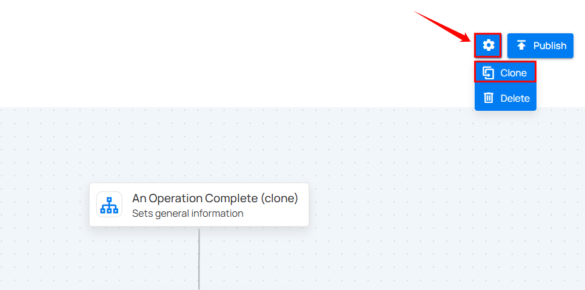

# Clone a Flow

Users can duplicate existing flows to simplify the reuse and modification of flow configurations for similar scenarios.

**Step 1**: Click on the existing flow you want to clone.

**Step 2**: A new window will open displaying the flow's detailed configuration. Click the settings icon and select **Clone**.

**Step 3:** After selecting the clone button, click the **Publish** button to publish it.

!!! important
    Users with the **Manager Role** can create, edit, clone, or publish Flows. For details, see the [Team Permission ](../settings/security/team-permissions.md){target="_blank"}.

After clicking the **Publish** button, a success notification appears confirming that the flow has been successfully added.
