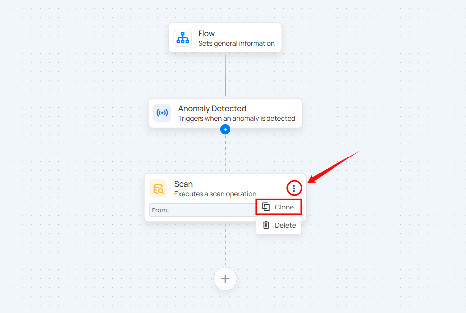

# Clone an Action

Users can duplicate an existing action in just a few clicks. Cloning an action allows you to quickly replicate its configuration without manually setting it up again.

**Step 1:** Click the vertical ellipsis (**⋮**) on the action you want to clone, then select the **Clone** option from the menu.

**Step 2:** After clicking the Clone option, a cloned action will be created.

