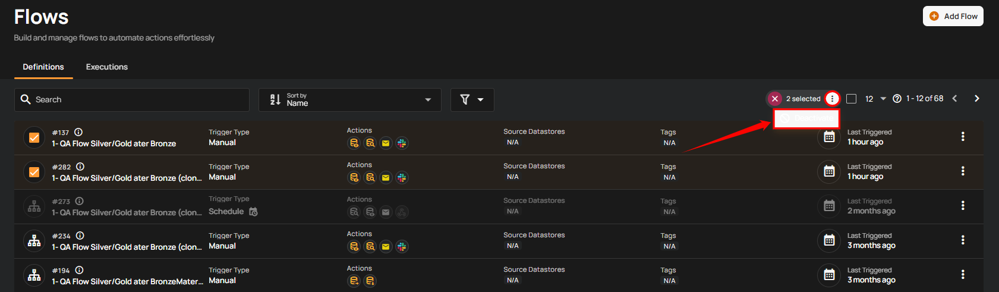

# Deactivate Flow

Users can deactivate a flow to pause its triggers by disabling it. This prevents the flow from being executed until it is reactivated.

!!! info
    To deactivate a Flow, you must have **Manager** role. Only users with this role can perform the deactivation action.  
    For more details about permissions, refer to the [permissions documentation](../settings/security/team-permissions.md){target="_blank"}.

## Deactivate Specific Flow

Deactivating a specific flow allows you to pause its triggers without deleting it. The flow will not run again until it is reactivated.

**Step 1**: Click the **vertical ellipsis (⋮)** next to the flow that you want to deactivate, then click on **Deactivate** from the dropdown menu.

!!! note
    If you accidentally deactivate a flow, you can easily reactivate it by following the steps in the [Activate Flow guide](../flows/activate-flow.md){target="_blank"}.

After clicking the **Deactivate** button, a success notification appears confirming the deactivation.

!!! warning
    Deactivating a flow only pauses its triggers — not deletes it. You can reactivate it anytime, or see the [Delete Flow](../flows/delete-flow.md){target="_blank"} guide to remove it permanently.

## Deactivate Flow in Bulk

Deactivating flows in bulk allows you to pause triggers for multiple flows at once.

**Step 1**: Hover over the flows list and select the **checkbox** next to the flows you want to deactivate.

When multiple flows are selected, an action toolbar appears showing the total number of selected flows along with available bulk actions.

**Step 2**: Click **Deactivate** from the action toolbar.

After clicking **Deactivate**, a success notification appears confirming that the selected flows have been deactivated.
    
## FAQ

**1.** What happens if I deactivate a Flow?

Once deactivated, the Flow’s triggers stop executing until you reactivate it. Existing executions will not be affected.