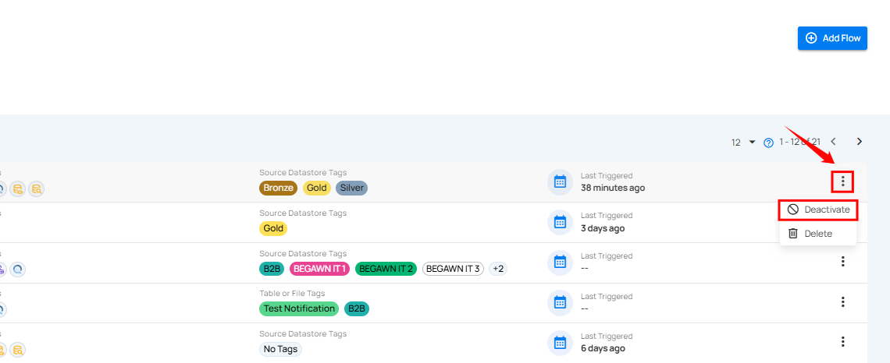

# Deactivate Flow

Users can deactivate a flow to pause its triggers by disabling it. This prevents the flow from being executed until it is reactivated.

**Step 1**: Click the **vertical ellipsis (⋮)** next to the flow that you want to deactivate, then click on **Deactivate** from the dropdown menu.

After clicking the **Deactivate** button, a success notification appears confirming the deactivation.
