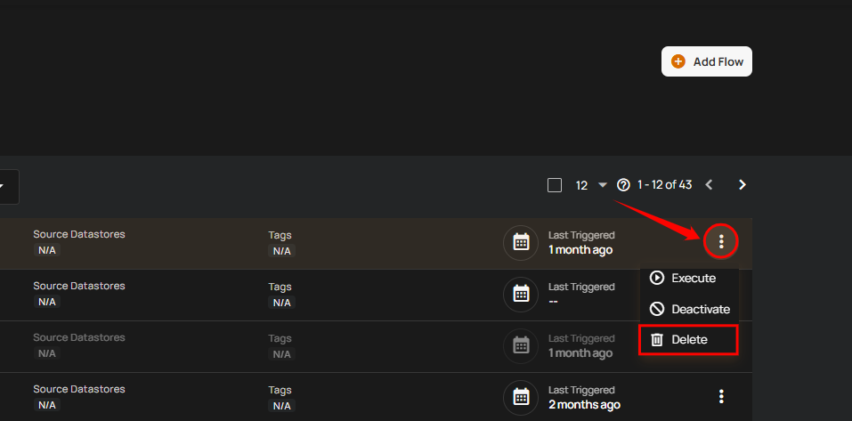
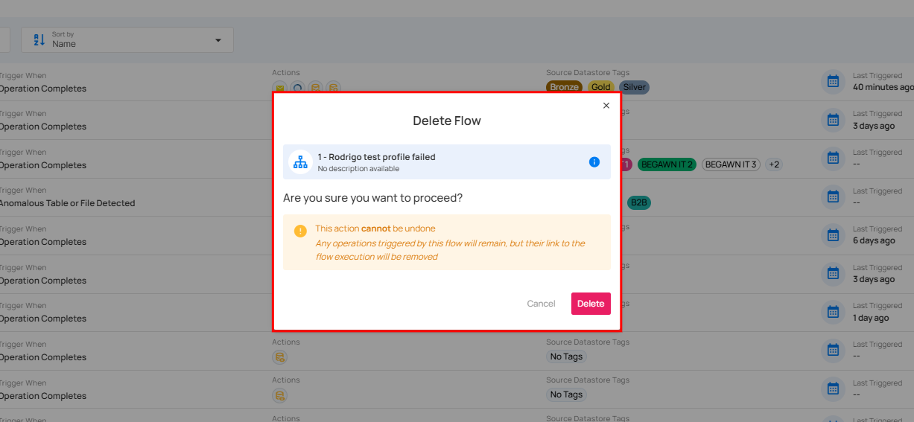
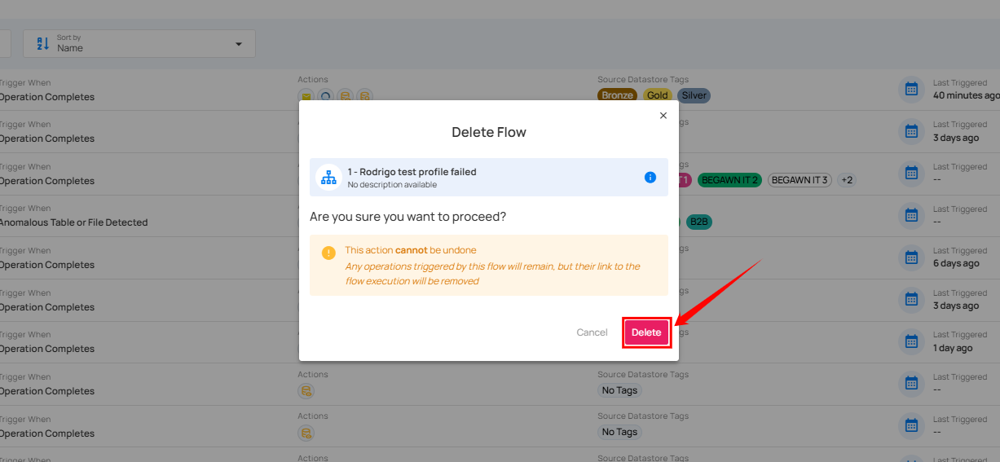

# Delete Flow

**Delete Flow** feature allows you to permanently remove unwanted or outdated flows from the system. This helps in maintaining a clean and organized list of active flows.

!!! info
    To delete a Flow, you must have **Manager** role. Only users with this role can perform the deletion action.  
    For more details about permissions, refer to the [permissions documentation](../settings/security/team-permissions.md){target="_blank"}.

**Step 1**: Click the **vertical ellipsis (⋮)** next to the flow that you want to delete, then click on **Delete** from the dropdown menu.

After clicking the delete button, a confirmation modal window **Delete Flow** will appear.

**Step 2**: Click on the **Delete** button to delete the flow.

After clicking the **Delete** button, a success notification appears confirming the deletion.

!!! warning
    This action cannot be undone. If you only want to pause the flow instead of deleting it, see the [Deactivate Flow guide](../flows/deactivate-flow.md){target="_blank"}.