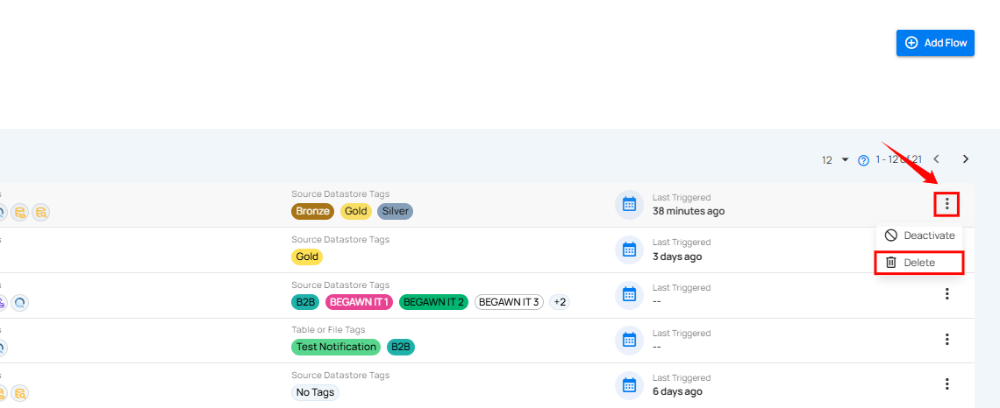

# Delete Flow

**Delete Flow** feature allows you to permanently remove unwanted or outdated flows from the system. This helps in maintaining a clean and organized list of active flows.

!!! info
    To delete a Flow, you must have **Manager** role. Only users with this role can perform the deletion action.  
    For more details about permissions, refer to the [permissions documentation](../settings/security/team-permissions.md){target="_blank"}.

## Delete Specific Flow

Deleting a specific flow allows you to permanently remove an individual flow that is no longer needed. This helps keep your list of flows clean and up to date.

**Step 1**: Click the **vertical ellipsis (⋮)** next to the flow that you want to delete, then click on **Delete** from the dropdown menu.

After clicking the delete button, a confirmation modal window **Delete Flow** will appear.

**Step 2**: Click on the **Delete** button to delete the flow.

After clicking the **Delete** button, a success notification appears confirming the deletion.

!!! warning
    This action cannot be undone. If you only want to pause the flow instead of deleting it, see the [Deactivate Flow guide](../flows/deactivate-flow.md){target="_blank"}.

## Delete Flow in Bulk

Deleting flows in bulk allows you to permanently remove multiple flows at once. This is useful for quickly cleaning up outdated or unused flows.

**Step 1**: Hover over the flows list and select the checkbox next to the flows you want to delete.

When multiple flows are selected, an action toolbar appears showing the total number of selected flows along with a vertical ellipsis (⋮) for additional actions.

**Step 2**: Click on the vertical ellipsis (⋮) and select Delete from the dropdown menu.

**Step 3**: A confirmation modal window appear, click on the **Delete** button to delete the selected flows.

After clicking the Delete button, a success notification appears confirming the deletion.
