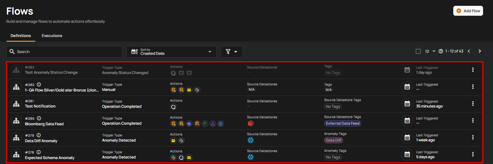
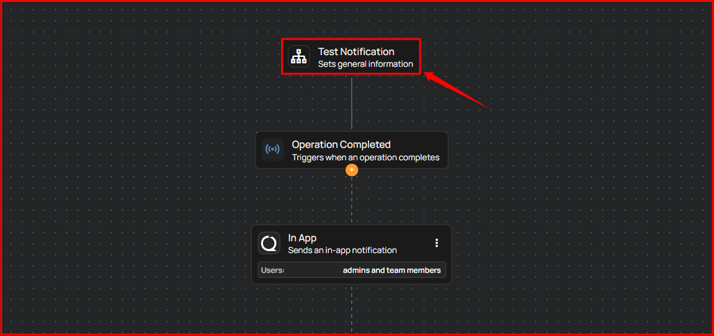
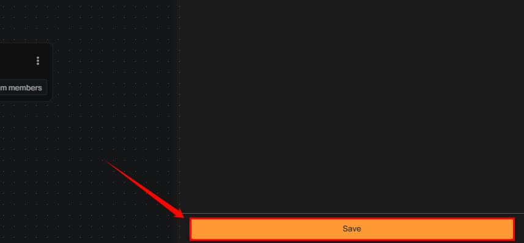
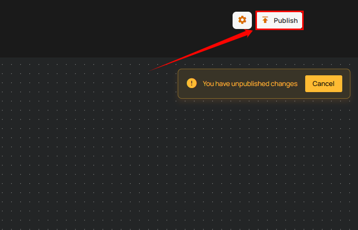

# Edit Flow

**Edit Flow** feature lets users update existing flows by modifying configurations or adding actions.

!!! info
    To edit a Flow, you must have **Manager** role. Only users with this role can perform the edit action.  
    For more details about permissions, refer to the [permissions documentation](../settings/security/team-permissions.md){target="_blank"}.

**Step 1:** Click the flow you want to edit.

**Step 2:** After clicking the flow, a new window will open displaying the flow's detailed configuration. Click on the boxes you want to edit.

For demonstration purposes we have selected the Flow node.

!!! tip
    If you make changes that you don’t want to keep, you can undo them by discarding the unsaved configuration or refreshing the page before publishing.

**Step 3:** Click the **`Save`** button to apply the updates.

**Step 4:** After clicking the **`Save`** button, click the **`Publish`** button located in the top right corner to finalize and publish the changes.

!!! warning
    If the flow is not published, the setup will not be saved. Always publish the flow after editing to ensure your changes are retained.

