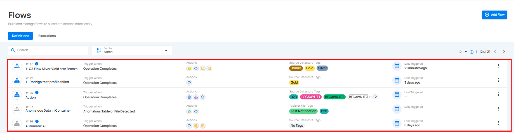
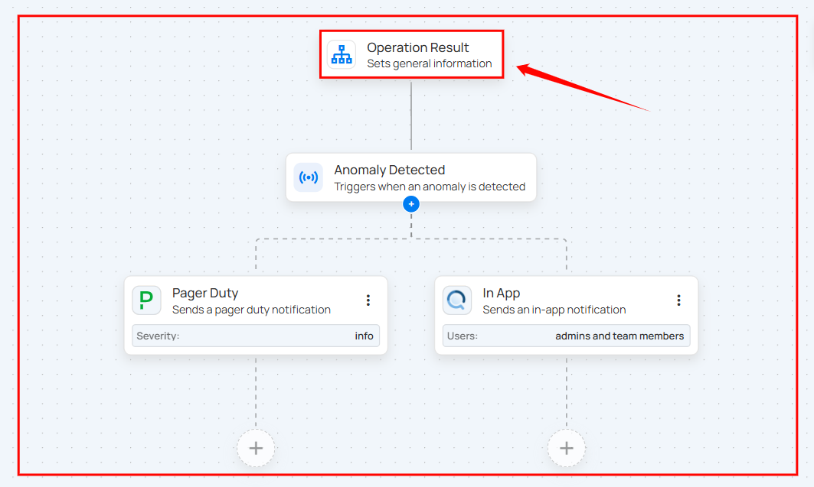
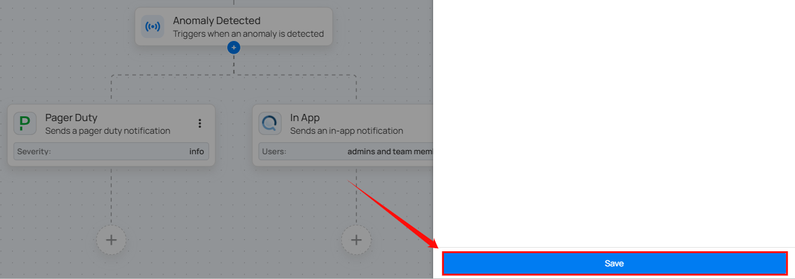
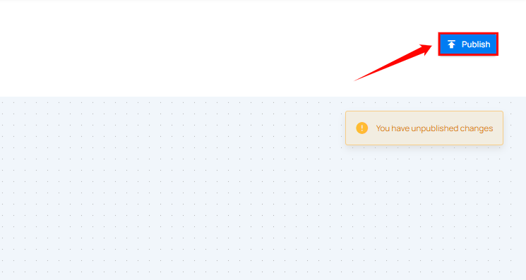

# Edit Flow

**Edit Flow** feature lets users update existing flows by modifying configurations or adding actions.

**Step 1:** Click the flow you want to edit.

**Step 2:** After clicking the flow, a new window will open displaying the flow's detailed configuration. Click on the boxes you want to edit.

For demonstration purposes we have selected the Flow node.

**Step 3:** Click the **`Save`** button to apply the updates.

**Step 4:** After clicking the **`Save`** button, click the **`Publish`** button located in the top right corner to finalize and publish the changes.

