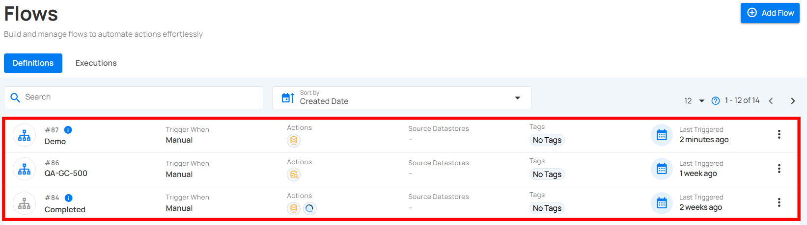
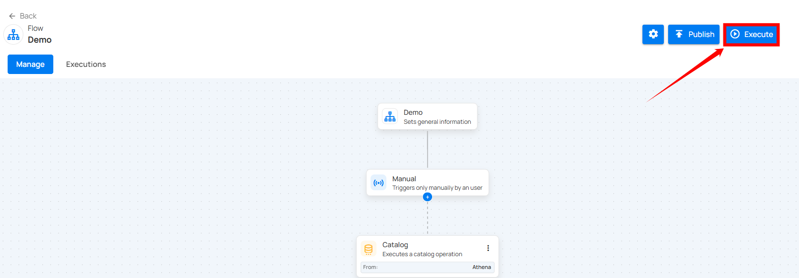

# Execute Manual Flows

Manual execution gives you complete control over when a Flow should run. You can start a manual Flow directly from the Flows list or from inside the Flow editor.

## Method 1: Execute From the Flows List

**Step 1:** Locate the manual flow in your list of flows.

**Step 2:** Click the **vertical ellipsis (⋮)** next to the manual flow you wish to execute, then select **"Execute"** from the dropdown menu to trigger the flow.

After clicking the **Execute** button, a success notification appears confirming that the flow has been successfully executed.

## Method 2: Execute From Inside the Flow Editor

You can also run a manual Flow directly from its editor page.

**Step 1:** Click on the manual flow in your list to open it.

**Step 2:** You will be navigated to the Flow editor page; click the **Execute** button.

After clicking the **Execute** button, a success notification appears confirming that the flow has been successfully executed.