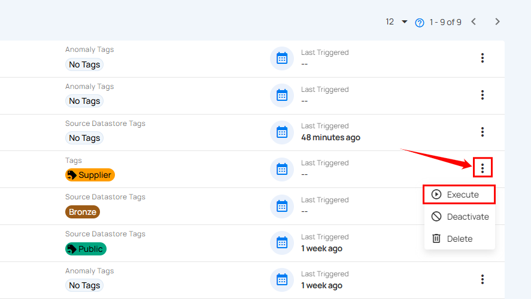

# Execute Manual Flows

Users can start a manual flow from the vertical ellipsis menu for greater flexibility in executing flows.

**Step 1:** Locate the manual flow in your list of flows.

**Step 2:** Click the **vertical ellipsis (⋮)** next to the manual flow you wish to execute, then select **"Execute"** from the dropdown menu to trigger the flow.

After clicking the **Execute** button, a success notification appears confirming that the flow has been successfully executed.
