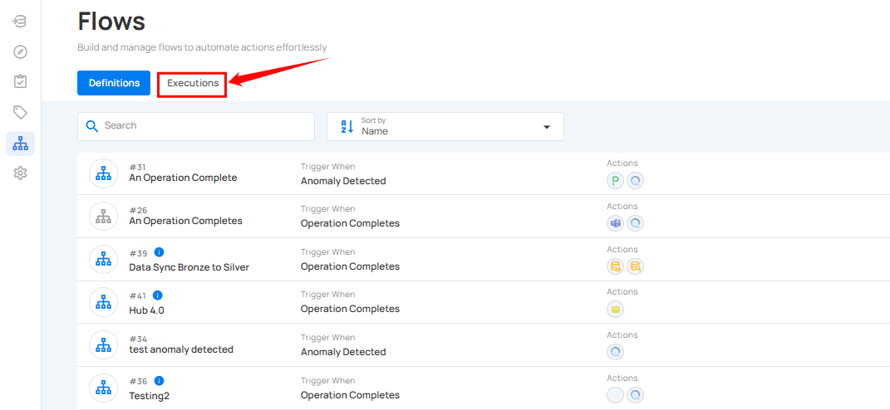
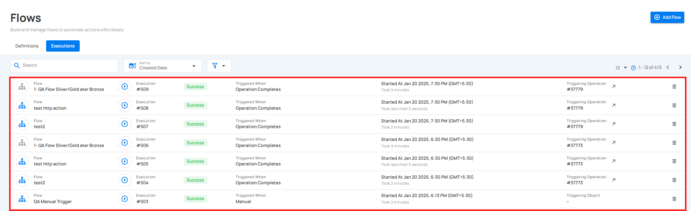

# Flows Execution

Execution tab allows users to view the execution history and current status of a flow. It provides detailed timestamps, status updates, and a comprehensive record of flow executions for efficient tracking and analysis.

Click on the **Execution** tab.

You will be navigated to the **Execution** tab, where you can view the complete execution history of all created flows.

