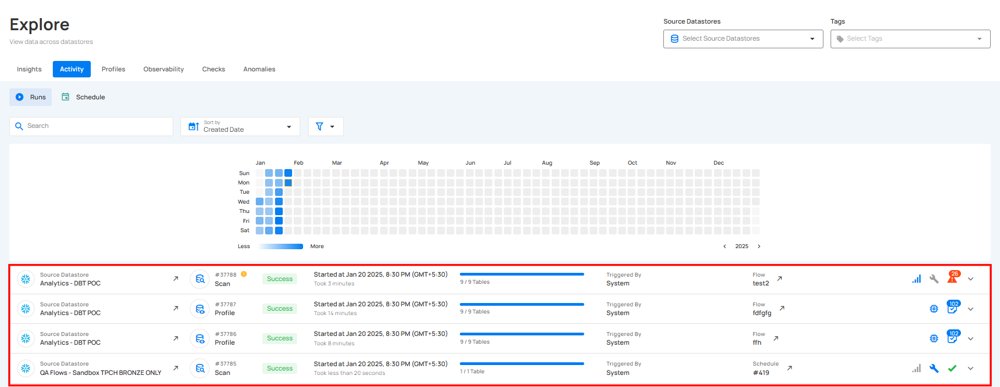

# Flow Execution

In the Activity tab, users can easily identify flow executions. The **`Flow`** column shows the flow name and includes a button to redirect users to the flow's operation. This feature is available in **Explore Activities, Datastore Activity,** and **Container Activity**.

