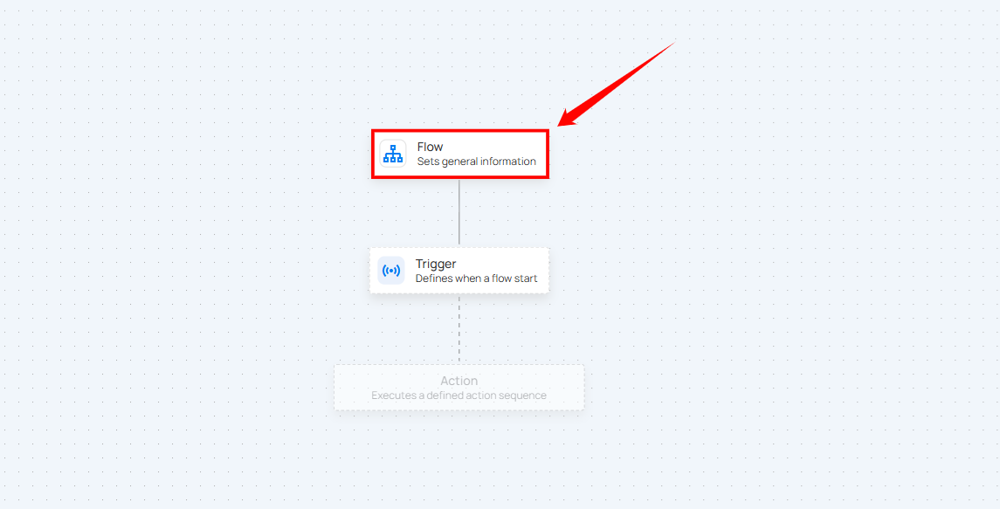

# Flow Node

**Step 1:** Click on the **Flow** node.  

A panel will appear on the right-hand side, allowing you to:

| No. |             Field Name |                         Description |
| :---- | :---- | :---- |
| 1. |              **Name** | Enter the name for the flow. |
| 2. |            **Description** | Provide a brief description of the flow (optional) to clarify its purpose or functionality. |
| 3. |            **Deactivated** | Check the box to deactivate the flow. If selected, the flow won't start even if the trigger conditions are met. |

**Step 2:** Once the details are filled in, click the **Save** button to save the flow settings.  

