# Flows

Flows enable users to create pipelines by chaining actions and configuring how they are triggered. Triggers can be set based on predefined events and filters, offering a flexible and efficient way to automate processes. These actions can be notifications or operations, allowing users to inform various notification channels or execute tasks based on specific operations.

## Navigation to Flows

**Step 1**: Log in to your Qualytics account and click on **Flows** on the left side panel of the interface.  

You will navigate to the Flows interface, where you can add and manage flows. At the top, you will see two tabs:

* **Definitions:** Displays a list of all flows along with details like triggers, actions, tags, and the last triggered time.

* **Executions:** Provides the execution history of flows, including their status and timestamps.

## Add Flow

**Step 1**: Click on the **Add Flow** button from the top right corner.

A modal window, **Add Flow**, will appear, providing options to create a flow. Each flow starts by default with two nodes: **Flow** and **Trigger**.

### Flow

**Step 1:** Click on the **Flow** node.  

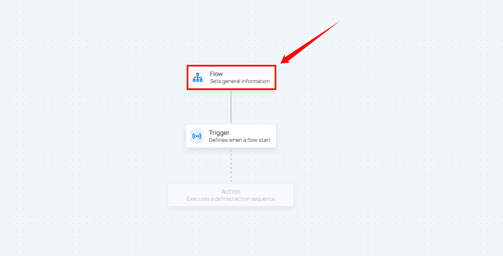

A panel will appear on the right-hand side, allowing you to:

| No. |             Field Name |                         Description |
| :---- | :---- | :---- |
| 1. |              **Name** | Enter the name for the flow. |
| 2. |            **Description** | Provide a brief description of the flow (optional) to clarify its purpose or functionality. |
| 3. |            **Deactivated** | Check the box to deactivate the flow. If selected, the flow won't start even if the trigger conditions are met. |

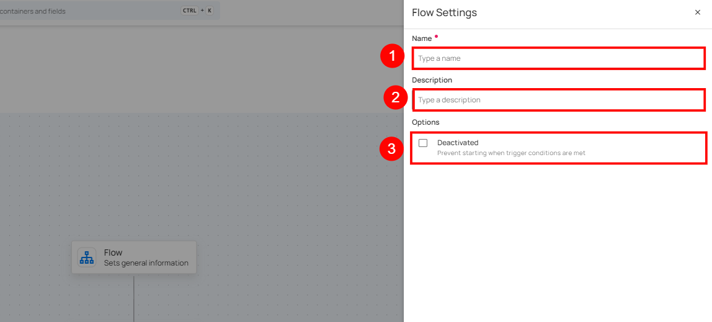

**Step 2:** Once the details are filled in, click the **Save** button to save the flow settings.  

### Trigger

**Step 1:** After completing the **"Flow"** node setup, users can click on the **"Trigger"** node.

A panel will appear on the right-hand side, enabling users to define when the flow should start. The panel provides four options for initiating the flow. Users can choose one of the following options:

* Operation Completes.

* Anomalous Table and File Detection.

* Anomaly Detected.

* Manual

#### Operation Completes

This type of flow is triggered whenever an operation, such as a catalog, profile, or scan, is completed on a source datastore. Upon completion, teams are promptly notified through in-app messages and, if configured, via external notification channels such as email, Slack, Microsoft Teams, and others. For example, the team is notified whenever the catalog operation is completed, helping them proceed with the profile operation on the datastore.

**Filter Conditions**

Filters can be set to narrow down which operations should trigger the flow execution:

1. **Source Datastore Tags**: The flow is triggered only for source datastores that have all the selected tags assigned.

2. **Source Datastores**: The flow is triggered only for the selected source datastores.

3. **Operation Types**: The flow is triggered only for operations that match one or more of the selected types.

4. **Operation Status**: The flow is triggered for operations with a status of either Success or Failure.

After defining the conditions, users must click the **Save** button to finalize the trigger configuration.

#### Anomalous Table and File Detected

This flow is triggered when anomalies are detected within a specific table, file and check rule types. It includes information about the number of anomalies found and the specific scan target within the datastore. This is useful for assessing the overall health of a particular datastore.  

**Filter Conditions**

Users can optionally set filters to specify which tables or files should trigger the flow execution.

1. **Tables / Files Tags**: Only tables or files with all the selected tags assigned will trigger the flow.

2. **Source Datastores**: The flow is triggered only for the selected source datastores.

3. **Check Rule Types**: Only anomalies identified by one or more of the selected check rule types will initiate the flow.

After defining the conditions, users must click the **Save** button to finalize the trigger configuration.  

#### Anomaly Detected

This type of flow is triggered when any single anomaly is identified in the data. The flow message typically includes the type of anomaly detected and the datastore where it was found. It provides specific information about the anomaly type, which helps quickly understand the issue's nature.

**Filter Condition**

Users can define specific conditions to determine when the flow should be initiated.

1. **Anomaly’s Tags**: Only anomalies with all selected tags assigned will trigger the flow.

2. **Source Datastores**: Only triggered when anomalies are detected in the selected datastores.

3. **Check Rule Types**: Only anomalies identified by one or more of the selected check rule types will initiate the flow.

4. **Anomaly Weight (Min)**: Only anomalies with a weight equal to or greater than the specified value will trigger the flow.

**Step 2:** Once the filter conditions are set, users must click the **Save** button to finalize the configuration.

#### Manual

The flow starts only when the user manually triggers it. It doesn’t depend on any automatic conditions or detections, giving the user full control.  

Once selected, users must click the **Save** button to confirm the manual trigger configuration.

Hover over the **filter tooltip** in trigger nodes to view the applied conditions such as tags, datastores, and operation types. This provides quick visibility into how each trigger is configured.

### Actions

Actions define the specific steps the system will execute after a flow is triggered. They allow users to automate tasks, send notifications, or interact with external systems.

**Step 1:** After completing the **"Trigger"** node setup, users can click on the **"Actions"** node.  

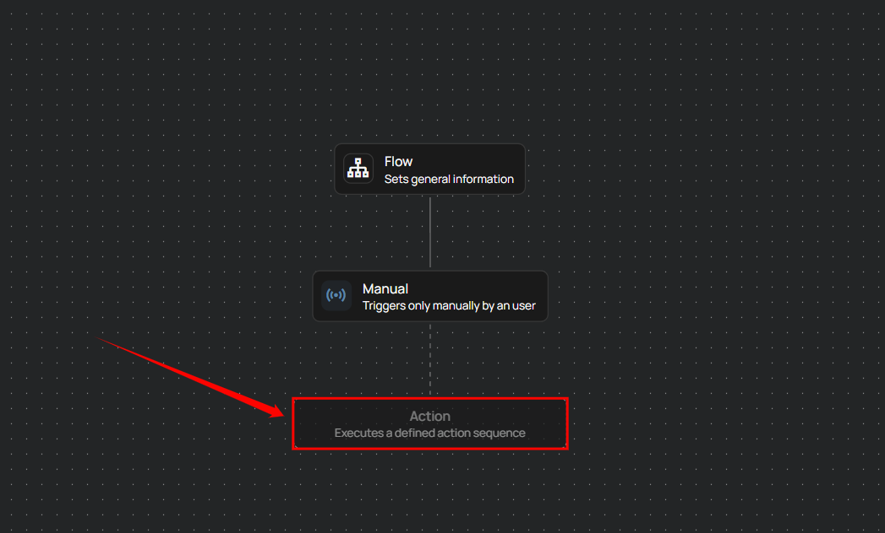

A panel will appear on the right-hand side displaying the list of available actions. These actions define what the system will execute after the flow is triggered. The actions are categorized into three groups:

* Operations.

* Notifications.

* HTTP.

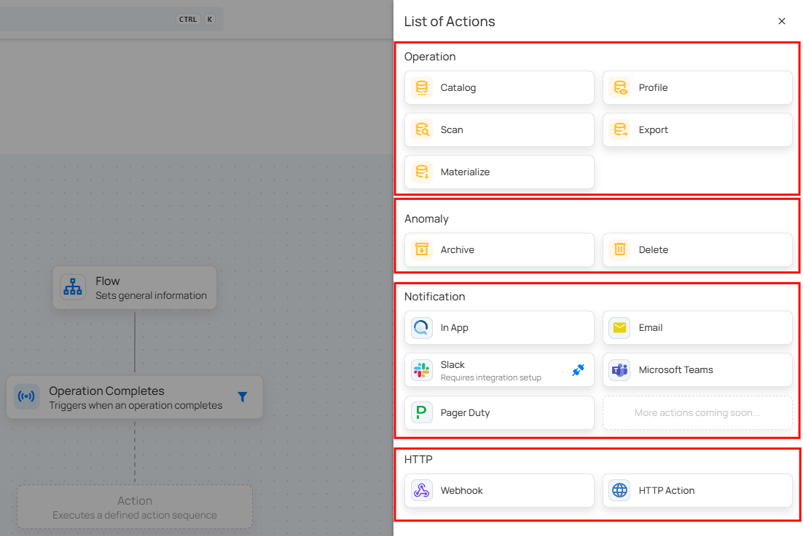

!!! info
    Inline summaries are shown within action nodes, displaying key details based on the action type—for example, datastore names for operations, Slack or Teams channels for notifications, and webhook URLs for HTTP actions. This enhancement provides quick clarity during flow configuration.

#### Operation

Users can execute specific operations when the trigger activates. They can choose from the following options:

* Catalog.

* Profile.

* Scan.

* Export.

* Materialize.

**Catalog**

**Step 1:** Click on **Catalog.**  

A panel **Catalog Settings** will appear on the right-hand side. This window allows you to configure the catalog operation.

| No. |                 Field |                 Description |
| :---- | :---- | :---- |
| 1. | Source Datastore | Select the source datastore to catalog. |
| 2. | Prune | Checkbox to enable or disable the removal of named collections (tables, views, files, etc.) that no longer exist in the datastore. |
| 3. | Recreate | Checkbox to enable or disable the recreation of previously deleted named collections in Qualytics for the catalog. |
| 4. | Include | Checkboxes to select Tables, Views, or both, specifying the resources to include in the catalog. |

**Step 2:** After configuring the settings, click Save to apply and proceed with the catalog operation.

**Profile**

**Step 1:** Click on **Profile.**  

A panel **Profile Settings** will appear on the right-hand side. This window allows you to configure the Profile operation.

| No. |                    Field |    Description |
| :---- | :---- | :---- |
| 1. | Source Datastore | Select the source datastore to profile. |
| 2. | Select Tables | Allows users to select all tables, specific tables, or tables associated with selected tags to profile. |
| 3. | Read Settings | Configure the starting point for profiling and set a maximum record limit per table for profiling. |
| 4. | Inference Settings | Set the level of automated checks and decide whether inferred checks should be saved in draft mode. |

**Step 2:** Click Save to finalize the profile configuration.

**Scan**

**Step 1:** Click on **Scan.**

A panel **Scan Settings** will appear on the right-hand side. This window allows you to configure the Scan operation.  

**Source Datastore:** Select the datastore to be scanned.

**Select Tables:** Choose all tables, specific tables, or tables associated with selected tags to include in the scan.

**Select Check Categories:** Select categories of checks to include, such as table properties (Metadata) or value checks (Data Integrity).

**Read Settings:** Define the scan strategy: incremental scans updated records; full scans process all records.

**Starting Threshold:** Set a starting point for scanning based on an incremental identifier.

**Record Limit:** Specify the maximum number of records to scan per table.

**Scan Settings:** Choose how to manage duplicate or recurring anomalies by archiving overlaps or reactivating previously archived anomalies with fingerprint tracking.

**Anomaly Rollup Threshold:** Set the Rollup Threshold to limit how many anomalies are created per check. When the limit is reached, anomalies will be merged into one for easier management.

**Enrichment Source Record Limit:** Define the number of source records to include in the enrichment operation.

**Step 2:** Click Save to finalize the scan configuration.

**Export**

**Step 1:** Click on **Export.**

A panel **Export Settings** will appear on the right-hand side. This window allows you to configure the Export settings.

**Source Datastore:** Select the datastore to export data from.

**Select file patterns to export:** **All** (all file patterns, including future ones), **Specific** (manually chosen file patterns), or **Tag** (file patterns based on selected tags).

**Select Metadata:** Choose metadata to export **anomalies**, **quality checks**, or **field profiles**. Anomalies detect data issues, quality checks validate data, and field profiles store field metadata.

**Step 2:** Click Save to finalize the export configuration.

Export nodes display the asset type in their titles (e.g., “Export Anomalies”) to help you identify the exported content easily.

**Materialize**

**Step 1:** Click on **Materialize.**

A panel **Materialize Settings** will appear on the right-hand side. This window allows you to configure the Materialize settings.

**Source Datastore:** Select the datastore to materialize data from.

**Select Tables:** Choose which tables (all, specific, or tagged) to extract from your source datastore and export to the enrichment datastore.

**Read Settings:** Select the record limit to control how much data is materialized per table.

**Step 2:** Click Save to finalize the materialize configuration.

#### Notification

Users can configure the application to send notifications through various channels. The available notification options include:

* In App.

* Email.

* Slack.

* Microsoft Teams.

* PagerDuty.

**In App**

This will send an app notification to all users that use Qualytics. Users can set a custom message using variables and modify the standard text.

**Step 1:** Click on **In App.**

A panel **In App Settings** will appear on the right-hand side, allowing you to configure the notification message.

**Message:** Enter your custom message using variables in the Message field, where you can specify the content of the notification that will be sent out.

!!! tip
    You can write your custom notification message by utilizing the autocomplete feature. This feature allows you to easily insert internal variables such as `{{ flow_name }}`, `{{ container_name }}`, and `{{ datastore_name }}`. As you start typing, the autocomplete will suggest and recommend relevant variables in the dropdown.

**Step 2:** After configuring the message, click **Save** to finalize the settings.

**Email**

Adding email notifications allows users to receive timely updates or alerts directly in their inbox. By setting up notifications with specific triggers and channels, you can ensure that you are promptly informed about critical events, such as operation completions or detected anomalies. This proactive approach allows you to take immediate action when necessary, helping to address issues quickly and maintain the smooth and efficient operation of your processes.

**Step 1:** Click on **Email.**

A panel **Email Settings** will appear on the right-hand side, allowing you to add email addresses, specify an email subject, and configure the notification message.

| No. |                  Field  |                         Description |
| :---- | :---- | :---- |
| 1. | Email Address | Enter the email address where the notification should be sent.  |
| 2. | Email Subject | Enter the subject line of the notification email to help recipients identify its purpose.  |
| 3. | Message | Text area to customize the notification message content with dynamic placeholders like **`{{flow_name}}`**, **`{{operation_type}}`**, and **`{{operation_result}}`**. |

**Step 2:** Click the Test Notification button to send a test email to the provided address. If the email is successfully sent, you will receive a confirmation message indicating **Notification successfully sent.**

**Step 3:** Once all fields are configured, click the **Save** button to finalize the email notification setup.

**Slack**

Qualytics integrates with Slack to deliver real-time notifications on scan completions, anomalies, and operational statuses, ensuring teams stay informed and can act quickly. With this integration, users receive instant alerts for system events, monitor scan results, and manage data anomalies directly within Slack. They can view notifications, acknowledge issues, and take necessary actions without switching platforms.

**Step 1**: Click on **Slack.**

A **Slack Settings** panel appears on the right side of the screen.

| No. |       Field | Description |
| :---- | :---- | :---- |
| **1.** |    Channel | Choose the channel where notifications should be sent using the **Channel** dropdown. For demonstration purposes, the channel **#demo** is selected. |
| **2.** |    Preview | Shows a preview of the Slack notification that will be sent when the flow runs. |

**Step 2:** Click the **Test Notification** button to send a sample notification to the selected Slack channel.

A prompt appears stating **Notification successfully sent** once the notification is successfully delivered.

**Step 3:** Once the notification is successfully sent, check your connected Slack workspace to ensure it is linked to Qualytics. You will see the test notification in the selected Slack channel.

!!! note
    Each trigger generates a different type of Slack notification message. The content and format of the message vary based on the specific trigger event.

**Step 4:** After confirming that the notification was received successfully, return and click the Save button.

#### Examples of Trigger Messages

Trigger messages in Slack provide real-time notifications for various system events, ensuring timely awareness and action. Each trigger message follows a unique format and conveys different types of information based on the operation performed. Below are examples highlighting distinct scenarios:

**Scenario 1: Scan Completion Notification**

When a data cataloging or scan operation completes successfully, a notification is sent to Slack. The message includes details such as the dataset name, operation type (e.g., Catalog Operation), and the result of the operation. 

**Scenario 2: Anomalous Table or File Detected**

When a scan detects a critical data anomaly, Slack sends a detailed notification highlighting the issue. The notification includes the dataset name, flow (such as Quality Monitor), and source datastore. It also provides a summary of the anomaly, specifying the number of records that differ between datasets and the container where the discrepancy was found. Additionally, the message offers an option to view detailed results.

**Scenario 3: Anomaly Detected**

When a scan detects record anomalies, Slack sends a notification highlighting the affected container, flow, and source datastore. It specifies the number of records that differ between datasets and provides options to view or acknowledge the anomaly.

#### Managing Qualytics Alerts in Slack

Qualytics Slack integration enables real-time monitoring and quick action on data quality issues directly from Slack. This guide outlines the different types of alerts and the actions you can take without leaving Slack.

**When an Operation Success or failure** 

**Step 1:** A Slack notification confirms the scan completion with a **Success/failure** status.

For demonstration purposes we are using Success operation.

**Step 2:** Click **View Operation** to be redirected automatically to the result section in Qualytics.

**When an Anomalous File or Table is Detected** 

**Step 1:** A Slack alert notifies about anomalies in a dataset.

**Step 2:** Click **View Results** to examine the identified discrepancies directly in Qualytics.

**When a Record Anomaly is Detected**

If a **shape or record anomaly** is found, you'll receive a Slack notification. You can take the following actions:

* **View Anomaly** –  Click on view anomaly to open the details in Qualytics to investigate further.  

* **Acknowledge** – Click on Acknowledge to mark it as reviewed to avoid duplicate alerts.  

  

* **Horizontal ellipsis(⋯)**  – Click on horizontal ellipsis.

  A dropdown will open with option **comment** and **archive** :  

| No. |                Action |              Description |
| :---- | :---- | :---- |
| **1.** |        Comment | Add Comment to collaborate with your team. |
| **2.** |       Archive | Archive if no further action is needed. |

**Microsoft Teams**

**Step 1:** Click on **Microsoft Teams.**

A panel **Microsoft Teams Settings** will appear on the right-hand side, allowing you to add a webhook url and configure the notification message.

| No. |                  Field  |                         Description |
| :---- | :---- | :---- |
| 1. | Teams Webhook URL | Enter the Teams webhook URL where the notification should be sent.  |
| 2. | Message | Text area to customize the notification message content with dynamic placeholders like **`{{flow_name}}`**, **`{{operation_type}}`**, and **`{{operation_result}}`**. |

**Step 2:** Click the **"Test Notification"** button to send a test message to the provided **“Webhook URL”.** If the message is successfully sent, you will receive a confirmation notification indicating **"Notification successfully sent".**

**Step 3:** Once all fields are configured, click the **Save** button to finalize the Microsoft Teams notification setup.

**PagerDuty**

Integrating PagerDuty with Qualytics ensures that your team gets instant alerts for critical data events and system issues. With this connection, you can automatically receive real-time notifications about anomalies, operation completions and other important events directly in your PagerDuty account. By categorizing alerts based on severity, it ensures the right people are notified at the right time, speeding up decision-making and resolving incidents efficiently. This helps your team respond quickly to issues, reducing downtime and keeping data operations on track.

**Step 1:** Click on **PagerDuty.**

A **PagerDuty Settings** panel will appear on the right-hand side, enabling users to configure and send PagerDuty notifications.

**Integration Key:** Enter the **Integration Key** where you want the notification to be sent.

**Severity:** Select the appropriate PagerDuty severity level to categorize incidents based on their urgency and impact. The available severity levels are:

* **Info:** For informational messages that don't require immediate action but provide helpful context.

* **Warning:** For potential issues that may need attention but aren't immediately critical.

* **Error:** For significant problems that require prompt resolution to prevent disruption.

* **Critical:** For urgent issues that demand immediate attention due to their severe impact on system operations.

**Message:** Enter your custom message using variables in the Message field, where you can specify the content of the notification that will be sent out.

!!! tip 
    You can write your custom notification message by utilizing the autocomplete feature. This feature allows you to easily insert internal variables such as `{{ flow_name }}`, `{{ operation_type }}`, and `{{ datastore_name }}`. As you start typing, the autocomplete will suggest and recommend relevant variables in the dropdown.

**Step 2:** Click on the **Test notification** button to check if the integration key is functioning correctly. Once the test notification is sent, you will see a success message, **"Notification successfully sent."**

**Step 3:** Once you have entered all the values, then click on the **Save** button.

#### HTTP

Users can connect to external apps for notifications using one of these services:

* Webhook.

* HTTP Action.

**Webhook**

Qualytics allows you to connect external apps for notifications using webhooks, making it easy to stay updated in real time. When you set up a webhook, it sends an instant alert to the connected app whenever a specific event or condition occurs. This means you can quickly receive notifications about important events as they happen and respond right away. By using webhook notifications, you can keep your system running smoothly, keep everyone informed, and manage your operations more efficiently.

**Step 1:** Click on **Webhook.**

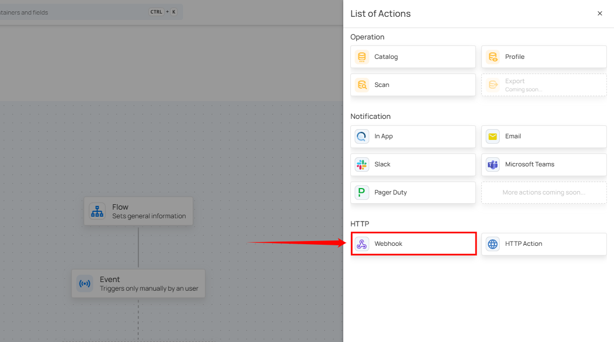

A **Webhook Settings** panel will appear on the right-hand side, enabling users to configure and send webhook notifications.

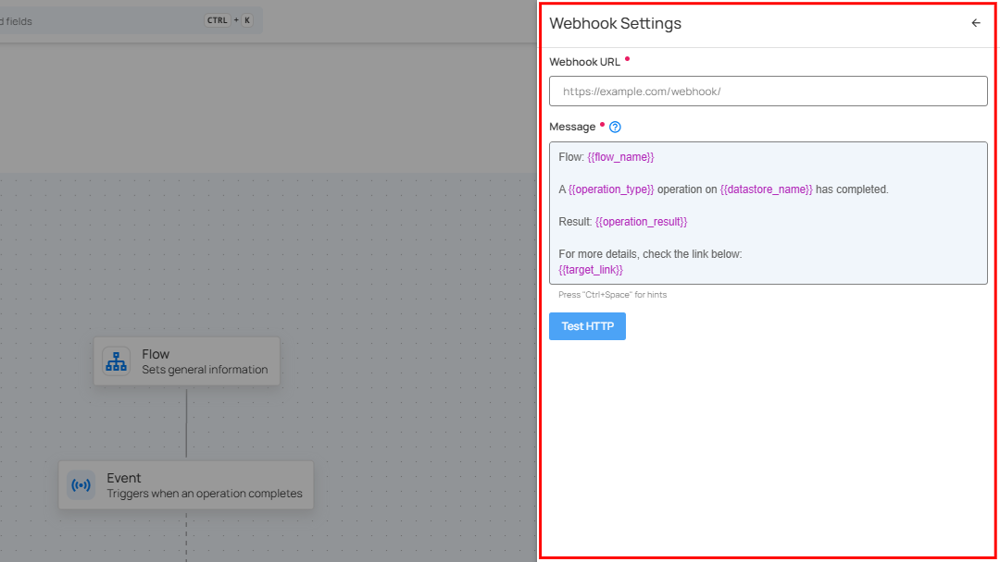

| No. |             Field |                            Description |
| :---- | :---- | :---- |
| 1. |  Webhook URL | Enter the desired **"Webhook URL"** of the target system where you want to receive notifications. |
| 2. | Message | Text area to customize the notification message content with dynamic placeholders like **`{{flow_name}}`**, **`{{operation_type}}`**, and **`{{operation_result}}`**. |

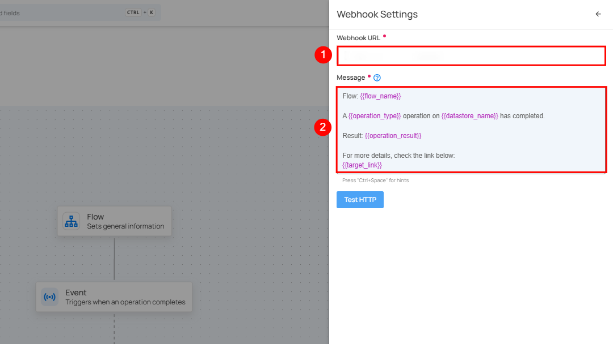

**Step 2**: Click on the **"Test HTTP"** button to send a test notification to the webhook URL you provided. If the webhook URL is correct, you will receive a confirmation message saying **"Notification successfully sent."** This indicates that the webhook is functioning correctly.

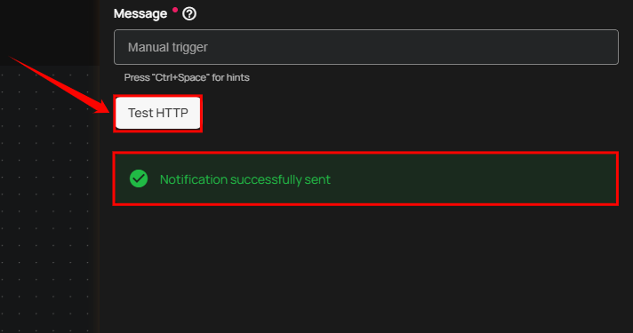

**Step 3:** Once you have entered all the values, then click on the **Save** button.

**HTTP Action**

Integrating HTTP Action notifications allows users to receive timely updates or alerts directly to a specified server endpoint. By setting up HTTP Action notifications with specific trigger conditions, you can ensure that you are instantly informed about critical events, such as operation completions or anomalies detected. This approach enables you to take immediate action when necessary, helping to address issues quickly and maintain the smooth and efficient operation of your processes.

**Step 1:** Click on **HTTP Action.**

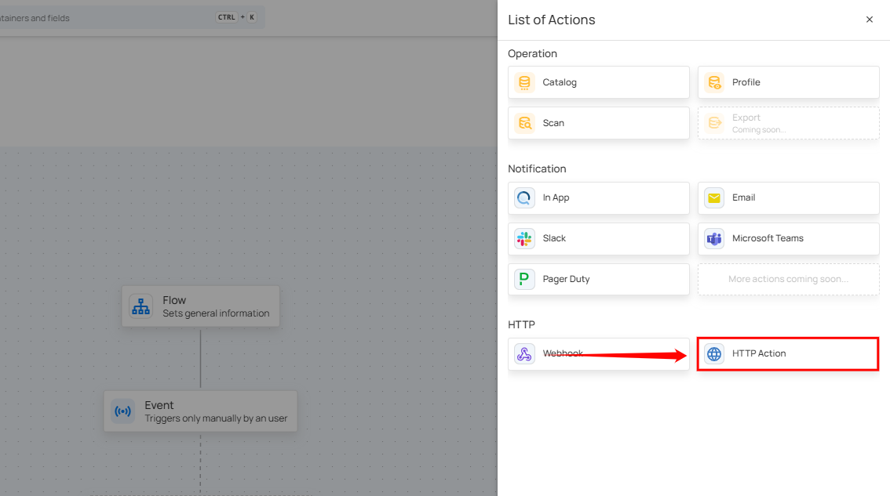

An **HTTP Action Settings** panel will appear on the right-hand side, enabling users to configure and send HTTP Action notifications.

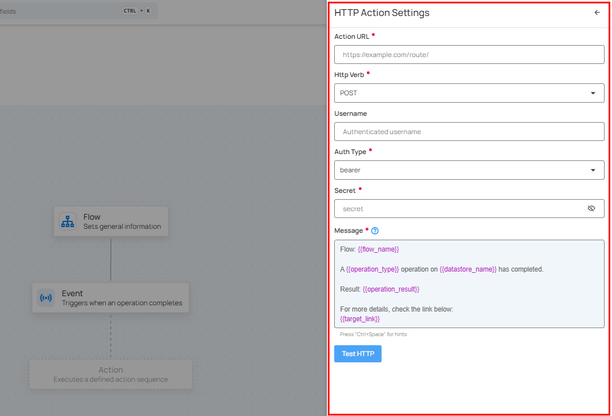

**Step 2:** Enter the following detail where you want the notification to be sent.

**1. Action URL:** Enter the **“Action URL”** in this field. It specifies the server endpoint for the HTTP request and defines where data will be sent or retrieved. It must be correctly formatted and accessible, including the protocol (http or https), domain, and path.

**2. HTTP Verbs:** HTTP verbs specify the actions performed on server resources. Common verbs include:

* **POST:** Use POST to send data to the server to create something new. For example, it's used for submitting forms or uploading files. The server processes this data and creates a new resource.  
* **PUT:** Updates or creates a resource, replacing it entirely if it already exists. For example, updating a user’s profile information or creating a new record with specific details.  
* **GET:** Retrieves data from the server without making any modifications. For example, requesting a webpage or fetching user details from a database.

**3. Username:** Enter the username needed for authentication.

**4. Auth Type:** This field specifies how to authenticate requests. Choose the method that fits your needs:

* **Basic:** Uses a username and password sent with each request. Example: **“Authorization: Basic ”.**  
* **Bearer:** Uses a token included in the request header to access resources. Example: **“Authorization: Bearer < token >”.**  
* **Digest:** Provides a more secure authentication method by using a hashed combination of the username, password, and request details. Example: **Authorization: Digest username=" ", realm=" ", nonce=" ", uri=" ", response=" ".**

**5. Secret:** Enter the password or token used for authentication. This is paired with the **Username** and **Auth Type** to securely access the server. Keep the secret confidential to ensure security.

**6. Message:** Enter your custom message using variables in the Message field, where you can specify the content of the notification that will be sent out.

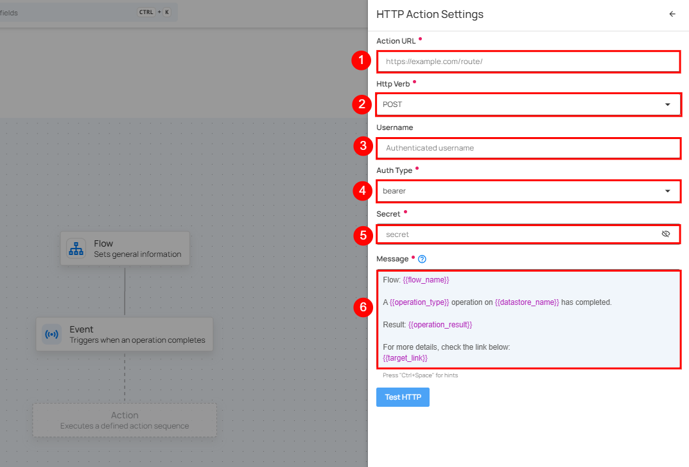

!!! tip
    You can write your custom notification message by utilizing the autocomplete feature. This feature allows you to easily insert internal variables such as `{{ flow_name }}`, `{{ operation_type }}`, and `{{ datastore_name }}`. As you start typing, the autocomplete will suggest and recommend relevant variables in the dropdown.

**Step 3:** Click the **"Test HTTP"** button to verify the correctness of the Action URL. If the URL is correct, a confirmation message saying **"Notification successfully sent"** will appear, confirming that the HTTP action is set up and functioning properly.

**Step 4:** Once you have entered all the values, then click on the **Save** button.

**Step 3:** After completing all the required details in the **"Add Flow"** section, click on the **Publish** button to finalize the process.

After clicking the **Publish** button, a success notification appears confirming that the flow has been successfully added.

## View Created Flows

Once a flow is added, it will be visible in the **Definitions** tab, where you can view all the created flows.

## Clone a Flow

Users can duplicate existing flows to simplify the reuse and modification of flow configurations for similar scenarios.

**Step 1**: Click on the existing flow you want to clone.

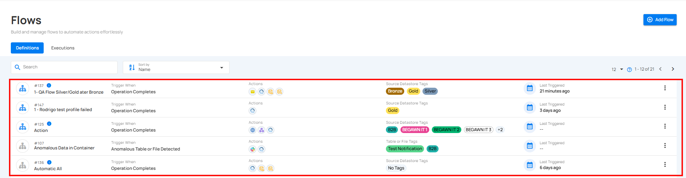

**Step 2**: A new window will open displaying the flow's detailed configuration. Click the settings icon and select **Clone**.

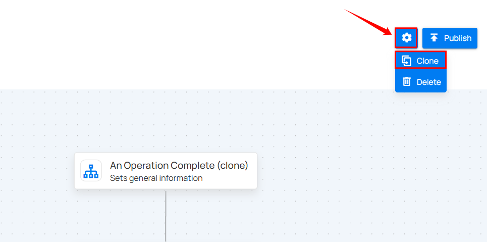

**Step 3:** After selecting the clone button, click the **Publish** button to publish it.

After clicking the **Publish** button, a success notification appears confirming that the flow has been successfully added.

## Sort Flows

Qualytics allows you to sort your flows by **Created Date** and **Name** to easily organize and prioritize them according to your needs.  

Whatever sorting option is selected, you can arrange the data either in ascending or descending order by clicking the caret button next to the selected sorting criteria.  

## Execute Manual Flows

Users can start a manual flow from the vertical ellipsis menu for greater flexibility in executing flows.

**Step 1:** Locate the manual flow in your list of flows.

**Step 2:** Click the **vertical ellipsis (⋮)** next to the manual flow you wish to execute, then select **"Execute"** from the dropdown menu to trigger the flow.

After clicking the **Execute** button, a success notification appears confirming that the flow has been successfully executed.

## Manage Flows

**Manage Flow**  allows users to edit, delete, deactivate or activate flows. Users can update configurations, remove outdated flows, or pause triggers to maintain an organized and efficient workflow system.

### Edit Flow

**Edit Flow** feature lets users update existing flows by modifying configurations or adding actions.

**Step 1:** Click the flow you want to edit.

**Step 2:** After clicking the flow, a new window will open displaying the flow's detailed configuration. Click on the boxes you want to edit.

For demonstration purposes we have selected the Flow node.

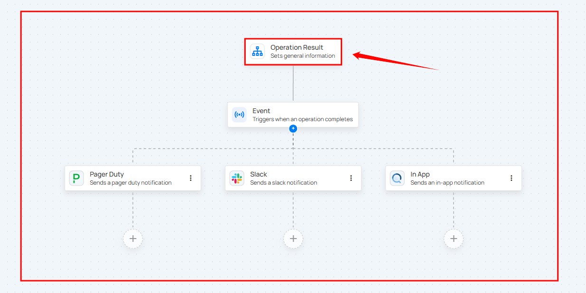

**Step 3:** Click the **`Save`** button to apply the updates.

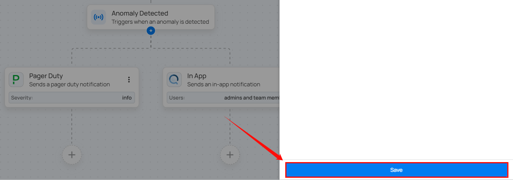

**Step 4:** After clicking the **`Save`** button, click the **`Publish`** button located in the top right corner to finalize and publish the changes.

### Delete Flow

**Delete Flow** feature allows you to permanently remove unwanted or outdated flows from the system. This helps in maintaining a clean and organized list of active flows.

**Step 1**: Click the **vertical ellipsis (⋮)** next to the flow that you want to delete, then click on **Delete** from the dropdown menu.

After clicking the delete button, a confirmation modal window **Delete Flow** will appear.

**Step 2**: Click on the **Delete** button to delete the flow.

After clicking the **Delete** button, a success notification appears confirming the deletion.

### Deactivate Flow

Users can deactivate a flow to pause its triggers by disabling it. This prevents the flow from being executed until it is reactivated.

**Step 1**: Click the **vertical ellipsis (⋮)** next to the flow that you want to deactivate, then click on **Deactivate** from the dropdown menu.

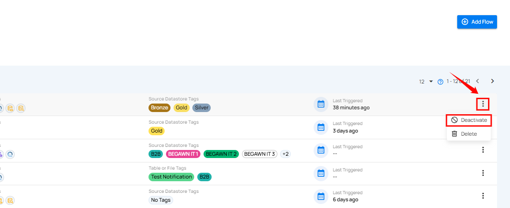

After clicking the **Deactivate** button, a success notification appears confirming the deactivation.

### Activate Flow

Users can reactivate a flow that was previously deactivated. Once reactivated, the flow’s triggers become active again, allowing it to run automatically based on the defined conditions.

**Step 1**: Click the **vertical ellipsis (⋮)** next to the flow that you want to activate, then click on **Activate** from the dropdown menu.

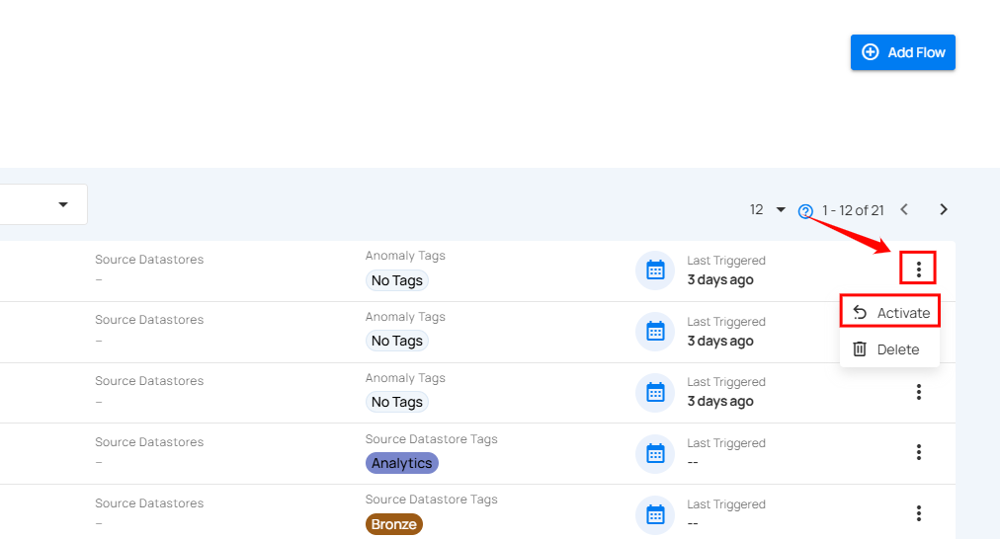

After clicking the **Activate** button, a success notification appears confirming the activation.

## Clone an Action

Users can duplicate an existing action in just a few clicks. Cloning an action allows you to quickly replicate its configuration without manually setting it up again.

**Step 1:** Click the vertical ellipsis (**⋮**) on the action you want to clone, then select the **Clone** option from the menu.

**Step 2:** After clicking the Clone option, a cloned action will be created.

## Flows Execution

Execution tab allows users to view the execution history and current status of a flow. It provides detailed timestamps, status updates, and a comprehensive record of flow executions for efficient tracking and analysis.

Click on the **Execution** tab.

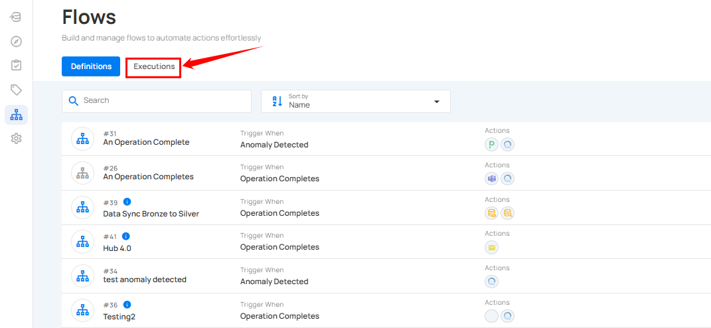

You will be navigated to the **Execution** tab, where you can view the complete execution history of all created flows.

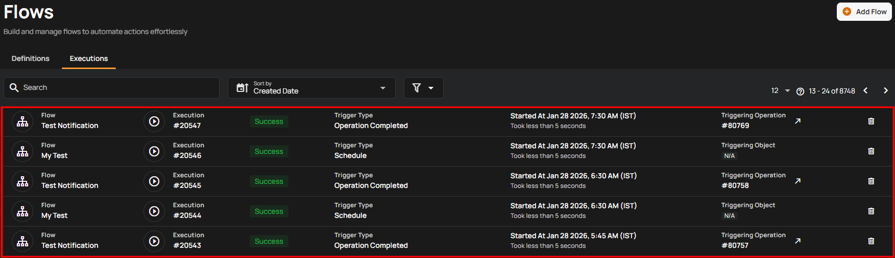

### See a Flow Execution

Users can view flow execution in real-time by clicking on the desired flow operation. The page shows detailed operations but does not allow editing.

**Step 1:** Click on the flow operation you want to view.  

 After clicking, the user will navigate to the selected flow operation details. The page displays all operational details in real-time. Note that this page is for viewing only, and no edits can be made here.  

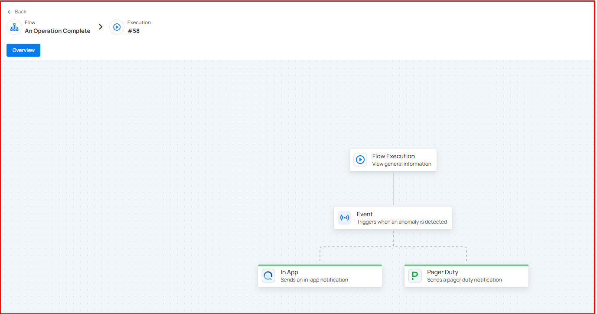

### Understanding Flow States

On the bottom-right corner, there is a **Legend** indicating the possible states of an action, such as:

* **Success** (Green)

* **Failure** (Red)

* **Aborted** (Orange)

* **Skipped** (Yellow)

* **Running** (Blue with dotted lines animation)

* **Pending** (Gray)

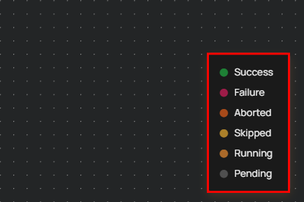

If a step is running, you will see a **dot-line animation**, signaling that the step is in progress.  
Once completed, the Action box will change its color to reflect the final state.  

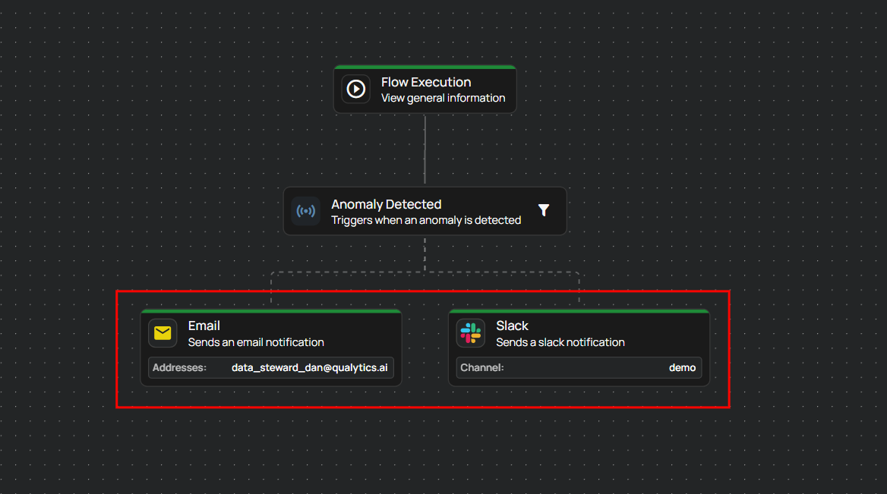

### Accessing Operation Results

To view detailed results of specific operations:

**Step 1:** Click the **Top Right Arrow** button within the action operation box.  

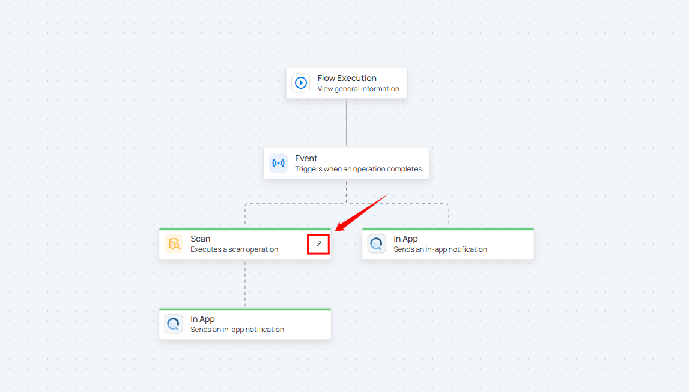

**Step 2:** You will navigate to the Activity page, where a Result Modal will open, displaying in-depth details of the operation.

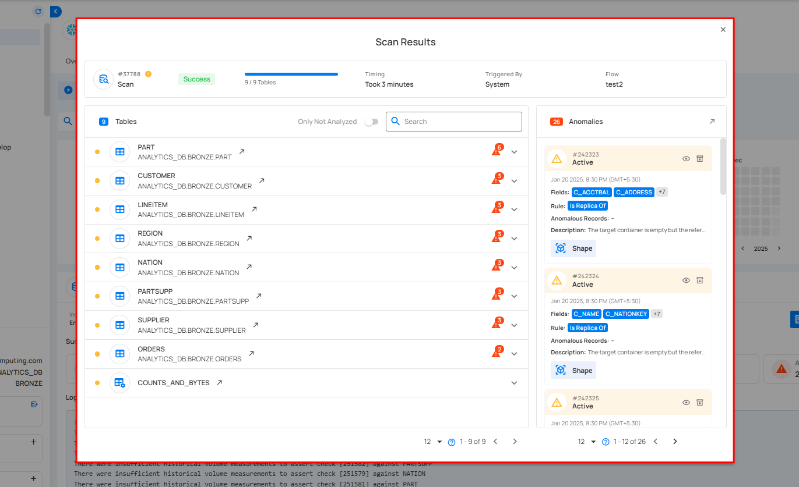

### Delete Flow Execution

**Step 1:** Click the Delete icon next to the flow execution you want to remove.

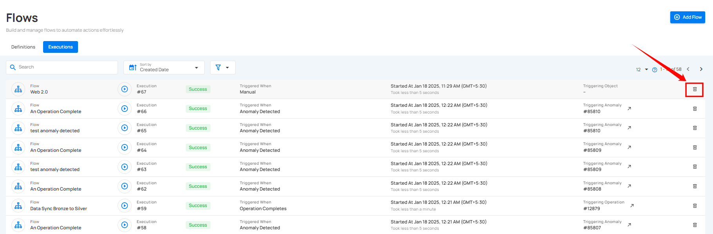

A confirmation modal window **Delete Flow Execution** will appear.

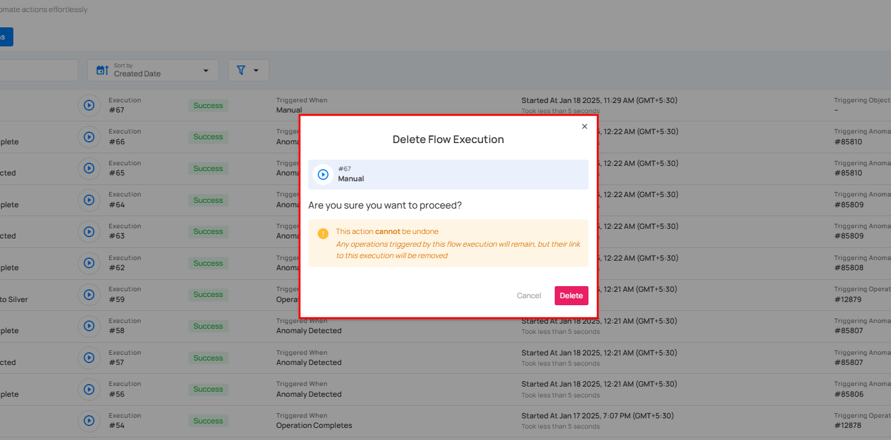

**Step 2:** Click on the **Delete** button to delete the flow execution.

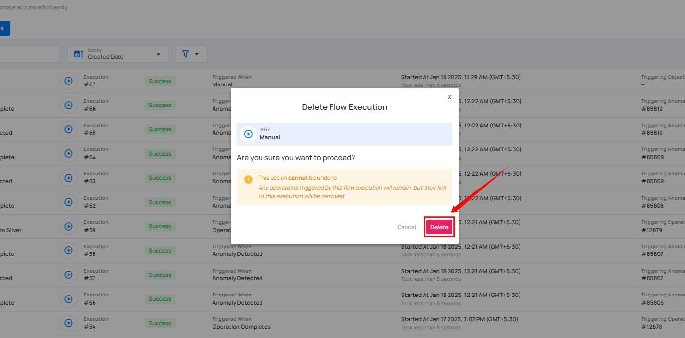

After clicking the **Delete** button, a success notification appears confirming the deletion.

## Filter and Sort

**Filter and Sort**  in the **`Executions`** tab help organize flow execution data. Users can sort by creation date or duration and filter by flow name, status, or trigger type for quick access to specific details.

### Sort

**Sort By** feature allows users to organize executions by **Created Date** or **Duration**, simplifying the process of reviewing flow executions based on their creation or runtime.

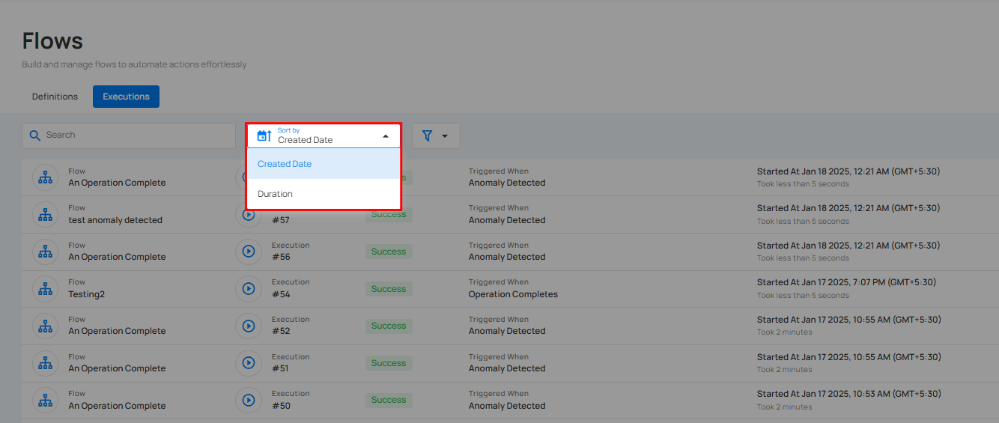

### Filter

**Filter** feature allows users to refine flow execution results based on specific criteria. By clicking the filter icon, users can choose from the following options:

| No. |                   Filter |                                  Description |
| :---- | :---- | :---- |
| 1. | Flows | Select a specific flow to view its executions. |
| 2. | Status | Filter executions by their completion status (e.g., success, failure and running). |
| 3. | Trigger When | Filter executions based on their trigger condition. |

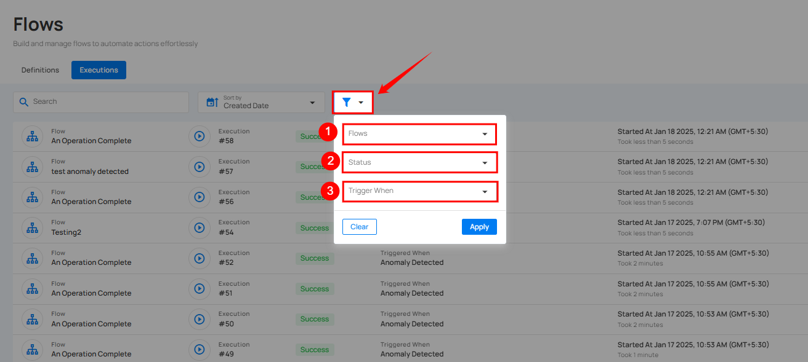

## Operations

In the Activity tab, users can easily identify flow executions. The **`Flow`** column shows the flow name and includes a button to redirect users to the flow's operation. This feature is available in **Explore Activities, Datastore Activity,** and **Container Activity**.

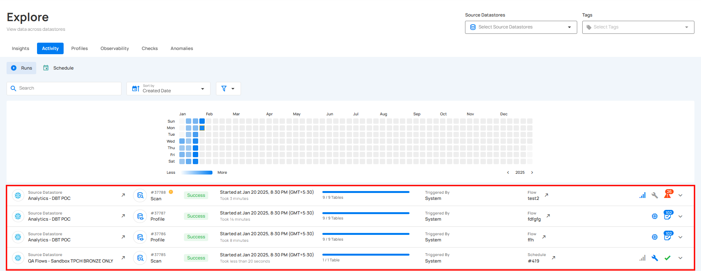