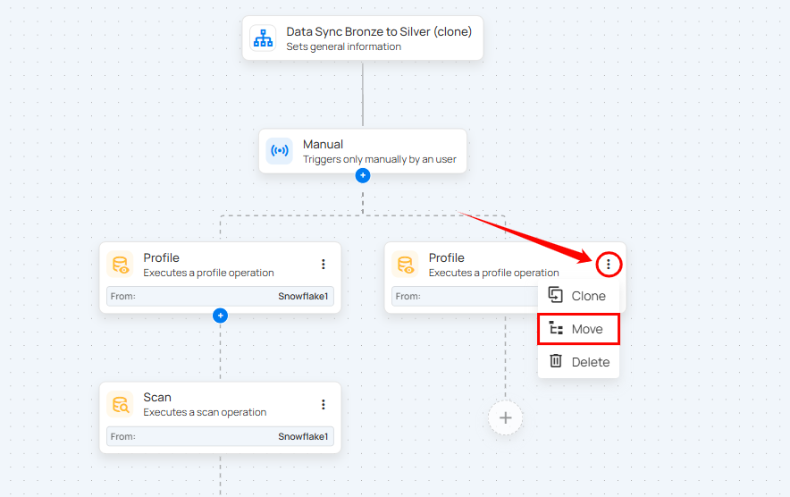
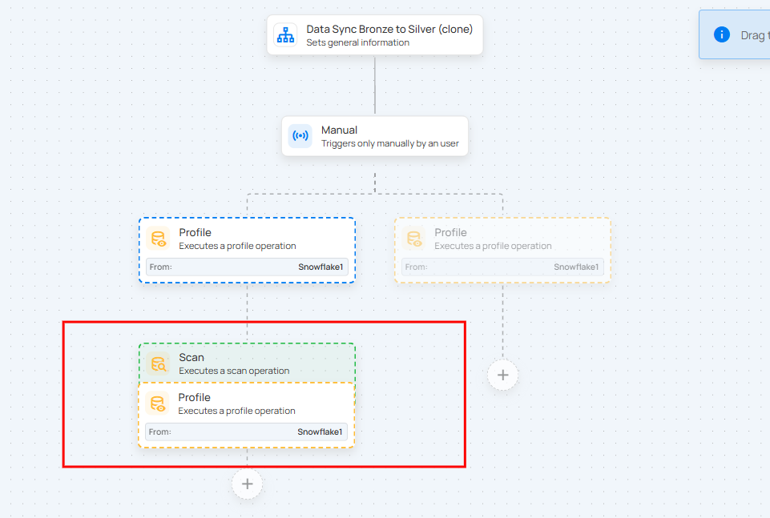

# Move an Action Node

Users can move an existing action node within a flow to change its position and execution order. The action node moves along with its downstream actions, helping reorganize the flow without recreating actions or breaking the flow logic.

**Step 1:** Click the vertical ellipsis (**⋮**) on the action you want to move, then select the **Move** from the menu.

**Step 2:** Drag the action to the desired location in the flow and drop it to confirm. The action and all of its downstream actions move together. Visual indicators show valid and invalid drop locations.

!!! info
    Moving an action preserves the flow hierarchy and does not affect the existing configuration.

