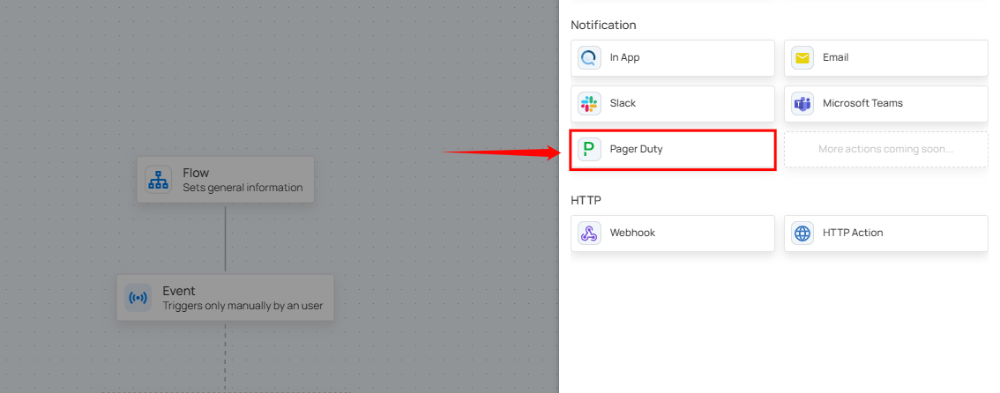

# Notification

Users can configure the application to send notifications through various channels. The available notification options include:

* In App.

* Email.

* Slack.

* Microsoft Teams.

* PagerDuty.

## In App

This will send an app notification to all users that use Qualytics. Users can set a custom message using variables and modify the standard text.

**Step 1:** Click on **In App.**

A panel **In App Settings** will appear on the right-hand side, allowing you to configure the notification message.

**Message:** Enter your custom message using variables in the Message field, where you can specify the content of the notification that will be sent out.

!!! tip
    You can write your custom notification message by utilizing the autocomplete feature. This feature allows you to easily insert internal variables such as `{{ flow_name }}`, `{{ container_name }}`, and `{{ datastore_name }}`. As you start typing, the autocomplete will suggest and recommend relevant variables in the dropdown.

**Step 2:** After configuring the message, click **Save** to finalize the settings.

## Email

Adding email notifications allows users to receive timely updates or alerts directly in their inbox. By setting up notifications with specific triggers and channels, you can ensure that you are promptly informed about critical events, such as operation completions or detected anomalies. This proactive approach allows you to take immediate action when necessary, helping to address issues quickly and maintain the smooth and efficient operation of your processes.

**Step 1:** Click on **Email.**

A panel **Email Settings** will appear on the right-hand side, allowing you to add email addresses, specify an email subject, and configure the notification message.

| No. |                  Field  |                         Description |
| :---- | :---- | :---- |
| 1. | Email Address | Enter the email address where the notification should be sent.  |
| 2. | Email Subject | Enter the subject line of the notification email to help recipients identify its purpose.  |
| 3. | Message | Text area to customize the notification message content with dynamic placeholders like **`{{flow_name}}`**, **`{{operation_type}}`**, and **`{{operation_result}}`**. |

**Step 2:** Click the Test Notification button to send a test email to the provided address. If the email is successfully sent, you will receive a confirmation message indicating **Notification successfully sent.**

**Step 3:** Once all fields are configured, click the **Save** button to finalize the email notification setup.

## Slack

Qualytics integrates with Slack to deliver real-time notifications on scan completions, anomalies, and operational statuses, ensuring teams stay informed and can act quickly. With this integration, users receive instant alerts for system events, monitor scan results, and manage data anomalies directly within Slack. They can view notifications, acknowledge issues, and take necessary actions without switching platforms.

**Step 1**: Click on **Slack.**

A **Slack Settings** panel appears on the right side of the screen.

| No. |       Field | Description |
| :---- | :---- | :---- |
| **1.** |    Channel | Choose the channel where notifications should be sent using the **Channel** dropdown. For demonstration purposes, the channel **#demo** is selected. |
| **2.** |    Preview | Shows a preview of the Slack notification that will be sent when the flow runs. |

**Step 2:** Click the **Test Notification** button to send a sample notification to the selected Slack channel.

A prompt appears stating **Notification successfully sent** once the notification is successfully delivered.

**Step 3:** Once the notification is successfully sent, check your connected Slack workspace to ensure it is linked to Qualytics. You will see the test notification in the selected Slack channel.

!!! note
    Each trigger generates a different type of Slack notification message. The content and format of the message vary based on the specific trigger event.

**Step 4:** After confirming that the notification was received successfully, return and click the Save button.

## Examples of Trigger Messages

Trigger messages in Slack provide real-time notifications for various system events, ensuring timely awareness and action. Each trigger message follows a unique format and conveys different types of information based on the operation performed. Below are examples highlighting distinct scenarios:

**Scenario 1: Scan Completion Notification**

When a data cataloging or scan operation completes successfully, a notification is sent to Slack. The message includes details such as the dataset name, operation type (e.g., Catalog Operation), and the result of the operation. 

**Scenario 2: Anomalous Table or File Detected**

When a scan detects a critical data anomaly, Slack sends a detailed notification highlighting the issue. The notification includes the dataset name, flow (such as Quality Monitor), and source datastore. It also provides a summary of the anomaly, specifying the number of records that differ between datasets and the container where the discrepancy was found. Additionally, the message offers an option to view detailed results.

**Scenario 3: Anomaly Detected**

When a scan detects record anomalies, Slack sends a notification highlighting the affected container, flow, and source datastore. It specifies the number of records that differ between datasets and provides options to view or acknowledge the anomaly.

## Managing Qualytics Alerts in Slack

Qualytics Slack integration enables real-time monitoring and quick action on data quality issues directly from Slack. This guide outlines the different types of alerts and the actions you can take without leaving Slack.

**When an Operation Success or failure** 

**Step 1:** A Slack notification confirms the scan completion with a **Success/failure** status.

For demonstration purposes we are using Success operation.

**Step 2:** Click **View Operation** to be redirected automatically to the result section in Qualytics.

**When an Anomalous File or Table is Detected** 

**Step 1:** A Slack alert notifies about anomalies in a dataset.

**Step 2:** Click **View Results** to examine the identified discrepancies directly in Qualytics.

**When a Record Anomaly is Detected**

If a **shape or record anomaly** is found, you'll receive a Slack notification. You can take the following actions:

* **View Anomaly** –  Click on view anomaly to open the details in Qualytics to investigate further.  

* **Acknowledge** – Click on Acknowledge to mark it as reviewed to avoid duplicate alerts.  

  

* **Horizontal ellipsis(⋯)**  – Click on horizontal ellipsis.

  A dropdown will open with option **comment** and **archive** :  

| No. |                Action |              Description |
| :---- | :---- | :---- |
| **1.** |        Comment | Add Comment to collaborate with your team. |
| **2.** |       Archive | Archive if no further action is needed. |

## Microsoft Teams

**Step 1:** Click on **Microsoft Teams.**

A panel **Microsoft Teams Settings** will appear on the right-hand side, allowing you to add a webhook url and configure the notification message.

| No. |                  Field  |                         Description |
| :---- | :---- | :---- |
| 1. | Teams Webhook URL | Enter the Teams webhook URL where the notification should be sent.  |
| 2. | Message | Text area to customize the notification message content with dynamic placeholders like **`{{flow_name}}`**, **`{{operation_type}}`**, and **`{{operation_result}}`**. |

**Step 2:** Click the **"Test Notification"** button to send a test message to the provided **“Webhook URL”.** If the message is successfully sent, you will receive a confirmation notification indicating **"Notification successfully sent".**

**Step 3:** Once all fields are configured, click the **Save** button to finalize the Microsoft Teams notification setup.

## PagerDuty

Integrating PagerDuty with Qualytics ensures that your team gets instant alerts for critical data events and system issues. With this connection, you can automatically receive real-time notifications about anomalies, operation completions and other important events directly in your PagerDuty account. By categorizing alerts based on severity, it ensures the right people are notified at the right time, speeding up decision-making and resolving incidents efficiently. This helps your team respond quickly to issues, reducing downtime and keeping data operations on track.

**Step 1:** Click on **PagerDuty.**

A **PagerDuty Settings** panel will appear on the right-hand side, enabling users to configure and send PagerDuty notifications.

**Integration Key:** Enter the **Integration Key** where you want the notification to be sent.

**Severity:** Select the appropriate PagerDuty severity level to categorize incidents based on their urgency and impact. The available severity levels are:

* **Info:** For informational messages that don't require immediate action but provide helpful context.

* **Warning:** For potential issues that may need attention but aren't immediately critical.

* **Error:** For significant problems that require prompt resolution to prevent disruption.

* **Critical:** For urgent issues that demand immediate attention due to their severe impact on system operations.

**Message:** Enter your custom message using variables in the Message field, where you can specify the content of the notification that will be sent out.

!!! tip 
    You can write your custom notification message by utilizing the autocomplete feature. This feature allows you to easily insert internal variables such as `{{ flow_name }}`, `{{ operation_type }}`, and `{{ datastore_name }}`. As you start typing, the autocomplete will suggest and recommend relevant variables in the dropdown.

**Step 2:** Click on the **Test notification** button to check if the integration key is functioning correctly. Once the test notification is sent, you will see a success message, **"Notification successfully sent."**

**Step 3:** Once you have entered all the values, then click on the **Save** button.

## FAQ

**1>.** Can I test notifications before publishing?

Yes. Each notification channel—Email, Slack, Teams, PagerDuty, and HTTP—includes a Test Notification button that allows you to send a sample message before publishing the flow.