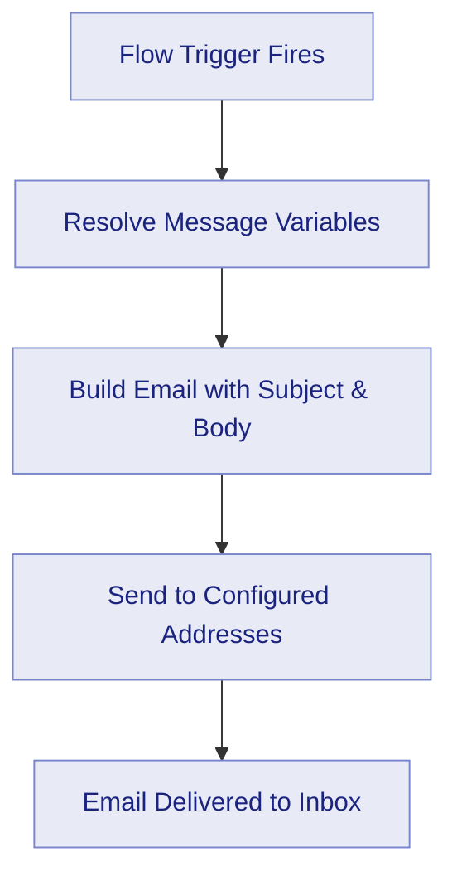
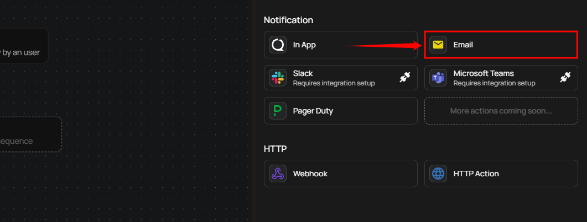
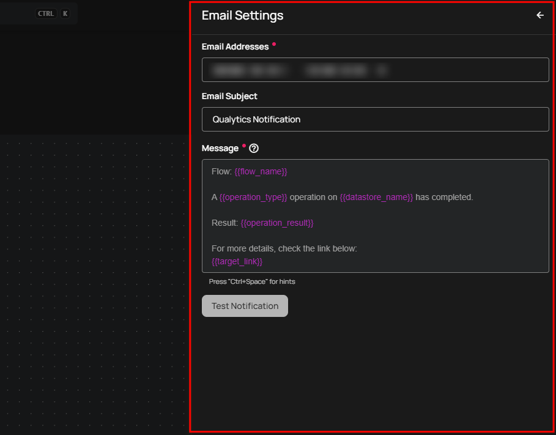
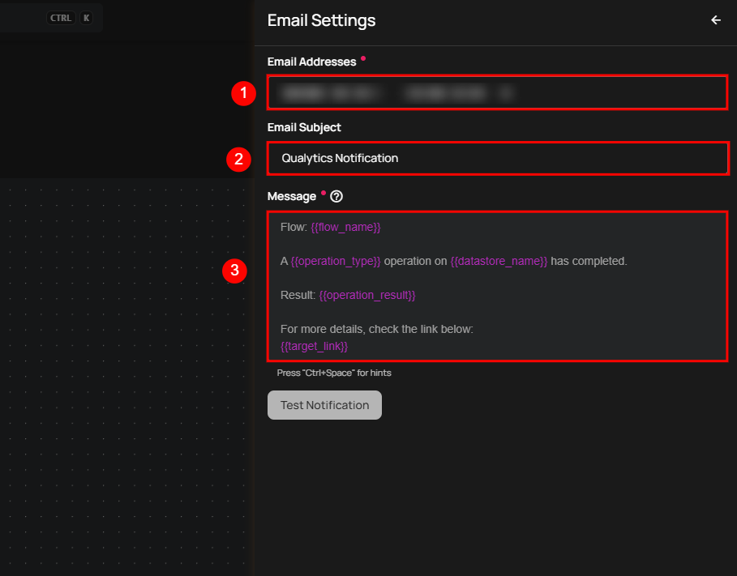

# Email Notification

Email notifications deliver data quality alerts directly to one or more email inboxes. When a Flow trigger fires, Qualytics resolves any message variables, builds an email with the configured subject and body, and sends it to every address in the recipient list. Each address is processed independently — if one address is invalid, the remaining recipients still receive the notification.

Email is well suited for stakeholders who need a persistent, searchable record of data quality events outside of the Qualytics platform, such as compliance officers, external partners, or team members who do not regularly log in.

## Lifecycle

## Configuration

**Step 1:** Click on **Email.**

A panel **Email Settings** will appear on the right-hand side, allowing you to add email addresses, specify an email subject, and configure the notification message.

| No. | Field | Description |
| :---- | :---- | :---- |
| 1. | Email Address | Enter one or more email addresses separated by `;` or `,`. Each address receives the notification independently — invalid addresses are silently skipped without affecting the others. The notification fails only if **all** provided addresses are invalid. |
| 2. | Email Subject | Enter the subject line for the notification email. This helps recipients quickly identify the purpose and priority of the message in their inbox. |
| 3. | Message | Text area to customize the notification message content with dynamic variables like `{{ flow_name }}`, `{{ operation_type }}`, and `{{ operation_result }}`. |

!!! tip
    Use the autocomplete feature (triggered by `Ctrl+Space`) to insert variables such as `{{ flow_name }}`, `{{ container_name }}`, and `{{ datastore_name }}`. The autocomplete only suggests variables that are valid for the selected Flow trigger type.

**Step 2:** Click the **Test Notification** button to send a test email to the provided address. If the email is successfully sent, you will receive a confirmation message indicating **"Notification successfully sent."**

**Step 3:** Once all fields are configured, click the **Save** button to finalize the email notification setup.

## Message Variables

Email notifications support the same dynamic tokens as all other notification channels. The available tokens depend on the Flow trigger type:

| Token | Description |
| :--- | :--- |
| `{{ flow_name }}` | Name of the Flow |
| `{{ datastore_name }}` | Datastore involved in the event |
| `{{ datastore_link }}` | Link to the datastore |
| `{{ container_name }}` | Container (table or file) involved |
| `{{ container_link }}` | Link to the container |
| `{{ operation_type }}` | Type of operation (Catalog, Profile, Scan) |
| `{{ operation_result }}` | Result of the operation (Success, Failure) |
| `{{ anomaly_message }}` | Description of the detected anomaly |
| `{{ anomaly_type }}` | Type of anomaly detected |
| `{{ target_link }}` | Direct link to view the event details |

!!! warning
    **Manual** and **Scheduled** Flow trigger types do not support message variables. Notification messages for these triggers must use static text only.

For the complete list of tokens organized by trigger type, see the [Message Variables](../message-variables.md) documentation.

## Permission

| Operation | Minimum Permission |
| :--- | :--- |
| View notification specifications and tokens | Member |
| Configure and save notification | Manager |
| Test notification | Manager |

For the complete list of roles and permissions, see the [Security](../../../settings/security/overview.md) documentation.

## Troubleshooting

| Symptom | Possible Cause | Resolution |
| :--- | :--- | :--- |
| Test notification fails | Invalid email address | Verify the email address format. Ensure there are no extra spaces or typos. Multiple addresses must be separated by `;` or `,`. |
| Email not received | Email went to spam/junk folder | Check the recipient's spam or junk folder. Add the sender address to the allowlist. |
| Message variables showing as raw text | Unsupported token for the trigger type | Ensure the tokens used are valid for the selected Flow trigger type. Use the autocomplete feature (`Ctrl+Space`) to see available tokens. |
| Multiple recipients but only some received | One or more invalid addresses | Invalid addresses are silently skipped. Verify each address individually using the **Test Notification** feature. |
| Notification sent but content is empty | Message field left blank | Enter a message in the configuration. Email notifications require both a subject and a message body. |
