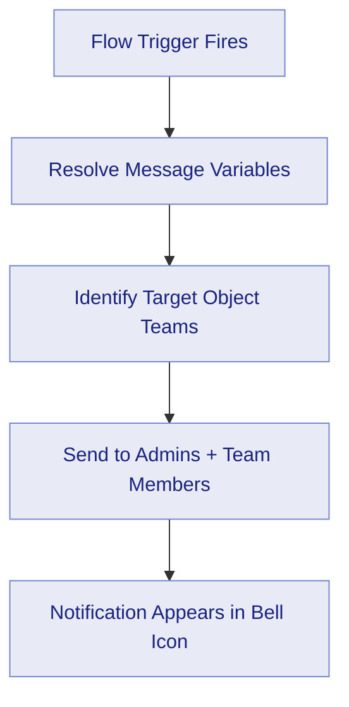
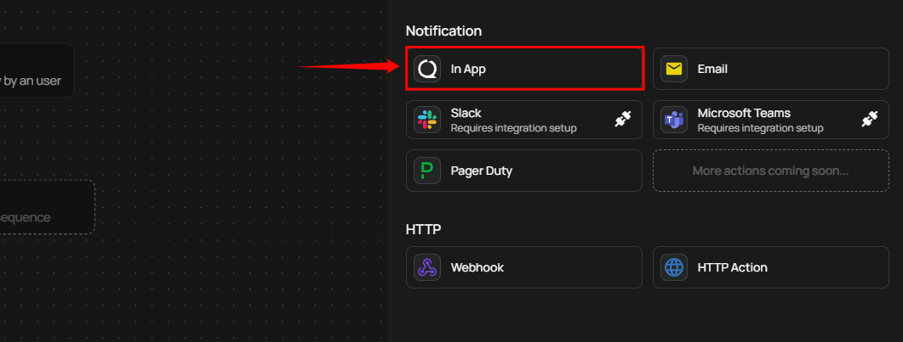
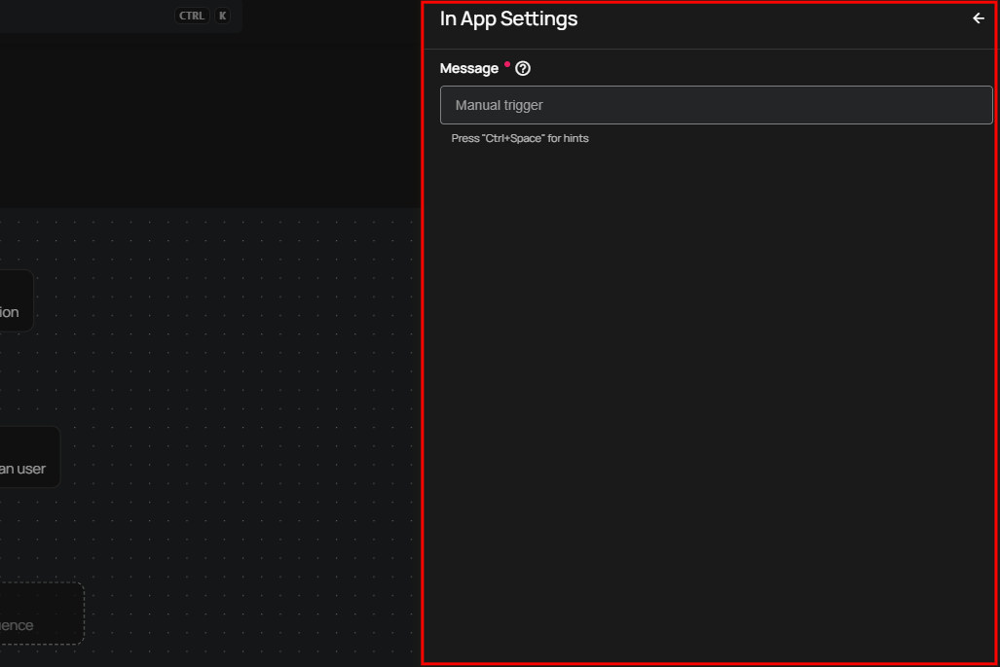
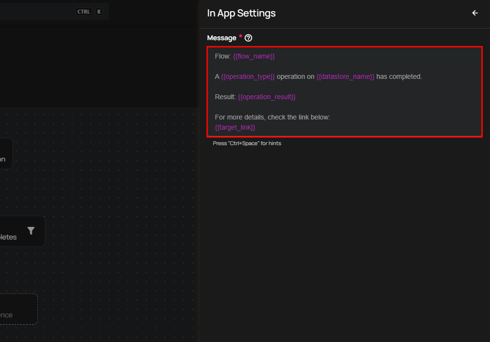

# In App Notification

In App notifications deliver alerts directly within the Qualytics platform. When a Flow trigger fires, Qualytics creates a notification for each eligible user — all **Admin** users and all users belonging to **teams associated with the target object** (e.g., the datastore or container involved in the event). If the target object has no assigned teams, all users in the platform receive the notification.

Notifications appear in the **bell icon** in the navigation bar, where users can view and manage them.

## Lifecycle

## Configuration

**Step 1:** Click on **In App.**

A panel **In App Settings** will appear on the right-hand side, allowing you to configure the notification message.

**Message:** Enter your custom message in the Message field. You can use dynamic variables that will be replaced with real values when the notification is sent. The available variables depend on the Flow trigger type (e.g., Anomaly, Operation, Partition Scan).

!!! tip
    Use the autocomplete feature (triggered by `Ctrl+Space`) to insert variables such as `{{ flow_name }}`, `{{ container_name }}`, and `{{ datastore_name }}`. The autocomplete only suggests variables that are valid for the selected Flow trigger type.

**Step 2:** After configuring the message, click **Save** to finalize the settings.

## Message Variables

In App notifications support dynamic tokens that depend on the Flow trigger type. Common tokens include:

| Token | Description |
| :--- | :--- |
| `{{ flow_name }}` | Name of the Flow |
| `{{ datastore_name }}` | Datastore involved in the event |
| `{{ container_name }}` | Container (table or file) involved |
| `{{ operation_type }}` | Type of operation (Catalog, Profile, Scan) |
| `{{ operation_result }}` | Result of the operation (Success, Failure) |
| `{{ anomaly_message }}` | Description of the detected anomaly |
| `{{ anomaly_type }}` | Type of anomaly detected |

!!! warning
    **Manual** and **Scheduled** Flow trigger types do not support message variables. Notification messages for these triggers must use static text only.

For the complete list of tokens organized by trigger type, see the [Message Variables](../message-variables.md) documentation.

## Permission

| Operation | Minimum Permission |
| :--- | :--- |
| View notification specifications and tokens | Member |
| Configure and save notification | Manager |
| Test notification | Manager |

For the complete list of roles and permissions, see the [Security](../../../settings/security/overview.md) documentation.

## Troubleshooting

| Symptom | Possible Cause | Resolution |
| :--- | :--- | :--- |
| Notification not appearing in bell icon | Flow trigger did not fire | Verify that the Flow is active and the trigger conditions are met. Check the Flow execution history for errors. |
| Notification not received by a specific user | User is not an Admin and not in a team assigned to the target datastore | Verify the user's team assignments include the relevant datastore. Admin users always receive In App notifications. |
| Message variables showing as raw text | Unsupported token for the trigger type | Ensure the tokens used are valid for the selected Flow trigger type. Use the autocomplete feature (`Ctrl+Space`) to see available tokens. |
| Notification sent but content is empty | Message field left blank | Enter a message in the configuration. In App notifications require a custom message to be set. |
