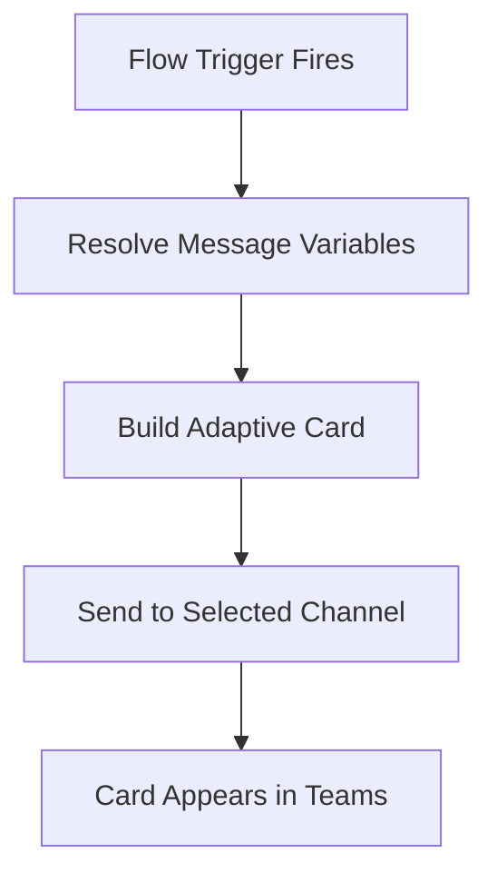
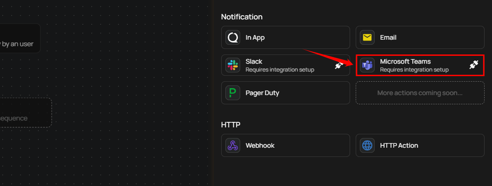
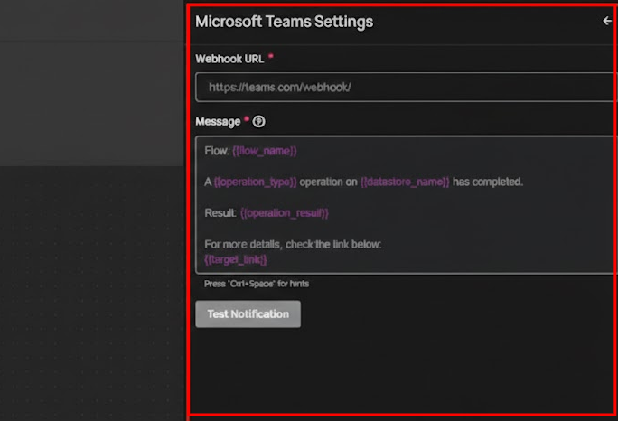
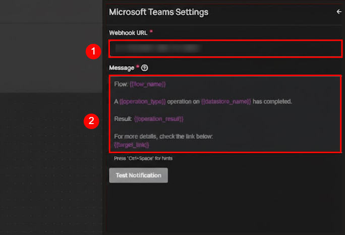

# Microsoft Teams Notification

!!! warning
    Before using Microsoft Teams notifications in Flows, you need to connect the Microsoft Teams integration in **Settings > Integrations**. See the [Microsoft Teams Integration setup guide](../../../settings/integrations/alerting/msft_teams.md) for instructions.

Microsoft Teams notifications deliver data quality alerts directly into your Teams channels as rich Adaptive Cards. When a Flow trigger fires, Qualytics resolves message variables, builds an Adaptive Card with the configured content, and posts it to the selected channel. Adaptive Cards provide a structured, visually formatted layout that makes it easy for team members to quickly understand the event context — including color-coded operation results — without leaving the Teams interface.

## Lifecycle

## Configuration

**Step 1:** Click on **Microsoft Teams.**

A panel **Microsoft Teams Settings** will appear on the right-hand side, allowing you to select a channel and configure the notification message.

| No. | Field | Description |
| :---- | :---- | :---- |
| 1. | Channel | Select the Teams channel where the notification should be sent. |
| 2. | Message | Text area to customize the notification message content with dynamic placeholders like `{{ flow_name }}`, `{{ operation_type }}`, and `{{ operation_result }}`. |

!!! tip
    Use the autocomplete feature (triggered by `Ctrl+Space`) to insert variables such as `{{ flow_name }}`, `{{ container_name }}`, and `{{ datastore_name }}`. The autocomplete only suggests variables that are valid for the selected Flow trigger type.

**Step 2:** Click the **"Test Notification"** button to send a test message to the selected channel. If the message is successfully sent, you will receive a confirmation notification indicating **"Notification successfully sent".**

**Step 3:** Once all fields are configured, click the **Save** button to finalize the Microsoft Teams notification setup.

## Message Variables

Microsoft Teams notifications support the same dynamic tokens as all other notification channels, plus a Teams-specific color token. The available tokens depend on the Flow trigger type:

| Token | Description |
| :--- | :--- |
| `{{ flow_name }}` | Name of the Flow |
| `{{ datastore_name }}` | Datastore involved in the event |
| `{{ datastore_link }}` | Link to the datastore |
| `{{ container_name }}` | Container (table or file) involved |
| `{{ container_link }}` | Link to the container |
| `{{ operation_type }}` | Type of operation (Catalog, Profile, Scan) |
| `{{ operation_result }}` | Result of the operation (Success, Failure) |
| `{{ operation_result_color__msft_teams }}` | Color code for the operation result (Teams-specific) |
| `{{ anomaly_message }}` | Description of the detected anomaly |
| `{{ anomaly_type }}` | Type of anomaly detected |
| `{{ target_link }}` | Direct link to view the event details |

!!! warning
    **Manual** and **Scheduled** Flow trigger types do not support message variables. Notification messages for these triggers must use static text only.

For the complete list of tokens organized by trigger type, see the [Message Variables](../message-variables.md) documentation.

## Permission

| Operation | Minimum Permission |
| :--- | :--- |
| View notification specifications and tokens | Member |
| Configure and save notification | Manager |
| Test notification | Manager |

For the complete list of roles and permissions, see the [Security](../../../settings/security/overview.md) documentation.

## Troubleshooting

| Symptom | Possible Cause | Resolution |
| :--- | :--- | :--- |
| No channels available in dropdown | Teams integration not connected | Connect the Microsoft Teams integration in **Settings > Integrations > Microsoft Teams** before configuring notifications. |
| Test notification fails | Webhook or connector issue | Verify the Teams integration is active and the connector has not been removed from the Teams channel. |
| Notification sent but not visible in Teams | Message posted to a different channel | Verify the selected channel in the notification configuration matches the intended destination. |
| Adaptive Card not rendering properly | Teams client version outdated | Ensure the Teams client is up to date. Adaptive Cards require a minimum Teams client version to render correctly. |
| Message variables showing as raw text | Unsupported token for the trigger type | Ensure the tokens used are valid for the selected Flow trigger type. Use the autocomplete feature (`Ctrl+Space`) to see available tokens. |
