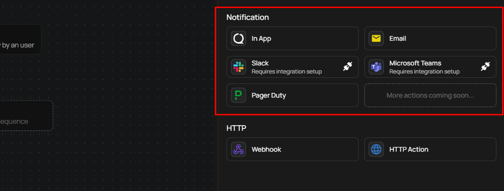
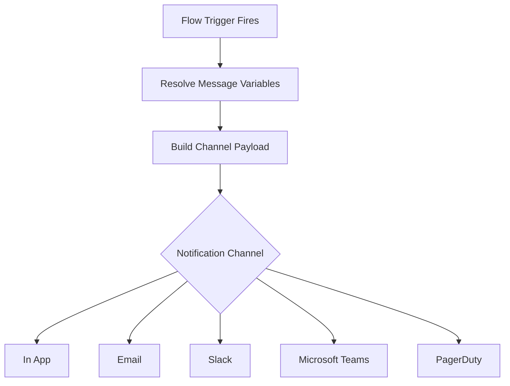

# Notifications - Overview

Notifications are Flow actions that deliver real-time alerts through external channels when data quality events occur. Every time a Flow trigger fires — whether from an anomaly detection, an operation completion, a partition scan, or a scheduled event — Qualytics resolves the configured message variables, builds a channel-appropriate payload, and dispatches it to the target destination.

## Why Notifications Matter

Data quality issues lose impact when they sit unnoticed in a dashboard. Notifications close the gap between detection and action by pushing alerts to where your team already works — inboxes, chat channels, and incident management platforms. With notifications you can:

- **React faster**: Get alerts the moment a scan detects anomalies, an operation fails, or a data quality check triggers — no need to manually check the platform.
- **Reach the right people**: Route critical anomalies to PagerDuty on-call teams, send operational summaries to Slack channels, and deliver compliance records to email recipients — all from a single Flow.
- **Add context automatically**: Use message variables to include datastore names, container links, anomaly descriptions, and operation results so responders understand the issue without navigating to Qualytics first.
- **Scale without manual effort**: Once configured, notifications run autonomously on every trigger event. Combine multiple channels in the same Flow to ensure redundancy across communication tools.

## How Notifications Work

When a Flow trigger fires, Qualytics processes each notification action in order:

1. **Trigger event occurs** — An anomaly is detected, an operation completes, a partition scan finishes, or a scheduled/manual trigger fires.
2. **Variables are resolved** — Dynamic tokens like `{{ datastore_name }}` and `{{ anomaly_message }}` are replaced with real values from the event context. The available tokens depend on the trigger type (see [Message Variables](message-variables.md)).
3. **Payload is built** — Qualytics constructs the appropriate payload for each channel: plain text for Email and PagerDuty, Block Kit for Slack, Adaptive Cards for Microsoft Teams, or platform notifications for In App.
4. **Notification is dispatched** — The message is sent to the configured destination. Each channel is processed independently — if one fails, the others still deliver.
5. **Execution is recorded** — Every notification creates an audit record linked to the trigger event, so you can trace what was sent, when, and to whom.

!!! tip
    You can add multiple notification actions to a single Flow. For example, send an In App alert to the team, a Slack message to a monitoring channel, and a PagerDuty incident for critical anomalies — all triggered by the same event.

## Channels

| Channel | Description |
| :--- | :--- |
| [In App](in-app/overview.md) | Send notifications directly within the Qualytics platform to admins and team members assigned to the datastore. |
| [Email](email/overview.md) | Deliver notifications to one or more email addresses with a customizable subject and message body. |
| [Slack](slack/overview.md) | Send rich Block Kit messages to Slack channels with actionable buttons for viewing, acknowledging, commenting, and archiving anomalies. |
| [Microsoft Teams](microsoft-teams/overview.md) | Post Adaptive Card notifications to Microsoft Teams channels with color-coded operation results. |
| [PagerDuty](pagerduty/overview.md) | Trigger PagerDuty incidents with configurable severity, custom event details, and per-action routing key overrides. |

Each channel page includes configuration steps, message variable reference, permissions, and troubleshooting. For API endpoints and FAQ, see the dedicated pages within each channel section.

## Supported Triggers

Notifications can be attached to any Flow trigger type. The trigger type determines which message variables are available:

| Trigger Type | Description | Message Variables |
| :--- | :--- | :--- |
| **Anomaly** | Fires when a scan detects a data quality anomaly. | Datastore, container, anomaly type, anomaly message, check description, target link |
| **Operation** | Fires when an operation (Catalog, Profile, or Scan) completes. | Datastore, operation type, operation result, target link |
| **Partition Scan** | Fires when a partition-level scan completes. | Datastore, container, scan target, anomaly count, target link |
| **Anomaly Status Change** | Fires when an anomaly's status changes (e.g., acknowledged, archived). | Datastore, container, anomaly type, old status, new status |
| **Schedule** | Fires on a cron schedule. | Static text only — no message variables. |
| **Manual** | Fires when manually triggered by a user. | Static text only — no message variables. |

## Testing Notifications

Every notification channel includes a **Test Notification** button that sends a sample message before you publish the Flow. This allows you to verify the integration connection, message formatting, and channel targeting without waiting for a real trigger event.

!!! warning
    Test behavior varies by channel. For most channels (In App, Email, Slack, Microsoft Teams), a test sends a sample message. For PagerDuty, a test notification **creates an actual incident** in your PagerDuty service.

## Reference

| Topic | Description |
| :--- | :--- |
| [Message Variables](message-variables.md) | Complete reference of dynamic tokens available per trigger type, organized by Flow trigger. |
| [Notifications FAQ](faq.md) | Answers to common questions about notification behavior, triggers, testing, and permissions. |
