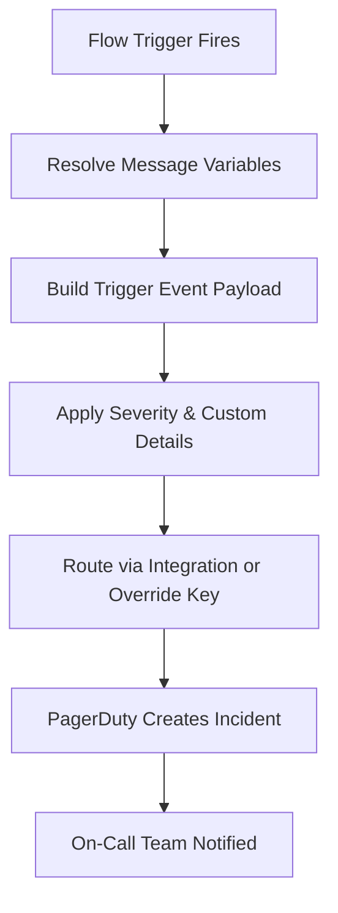
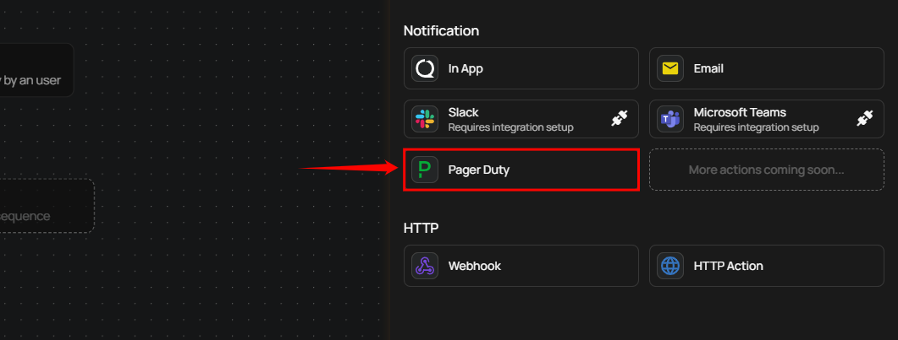
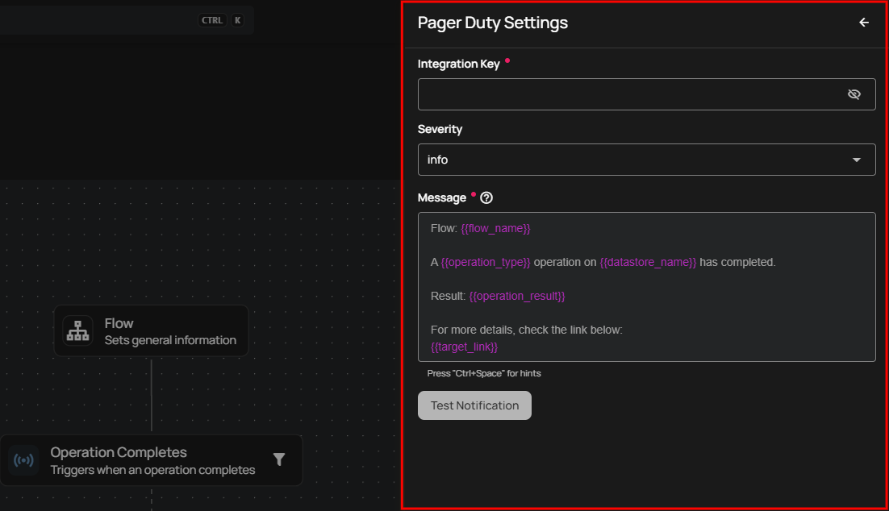
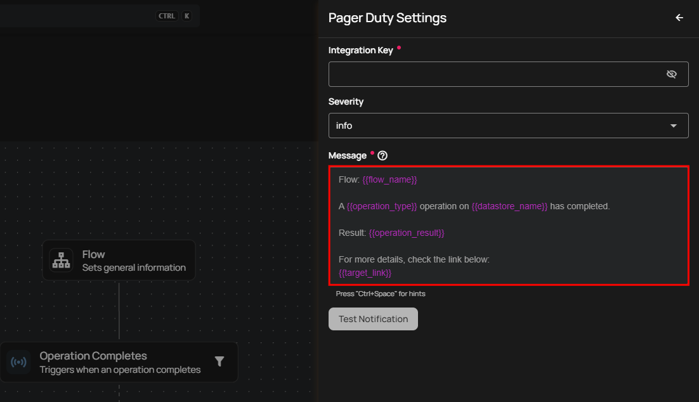
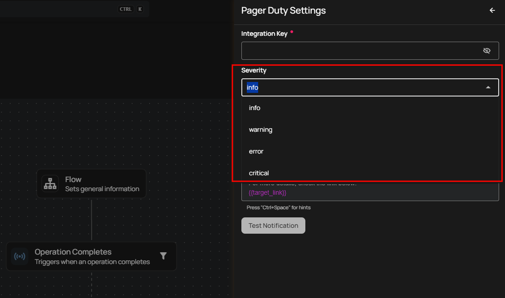
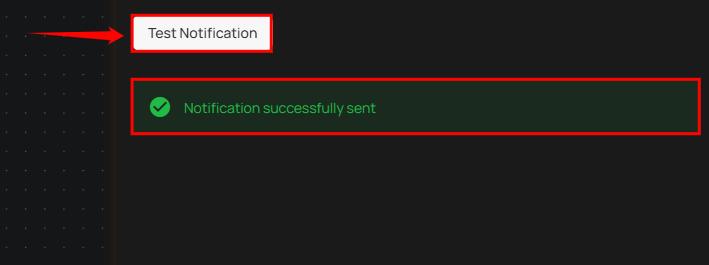

# PagerDuty Notification

!!! warning
    Before using PagerDuty in Flows, you need to connect the PagerDuty integration in **Settings > Integrations**. See the [PagerDuty Integration setup guide](../../../settings/integrations/alerting/pagerduty/managing-pagerduty/add-integration.md) for instructions.

Integrating PagerDuty with Qualytics ensures that your team gets instant alerts for critical data events and system issues. With this connection, you can automatically receive real-time notifications about anomalies, operation completions and other important events directly in your PagerDuty account. By categorizing alerts based on severity, it ensures the right people are notified at the right time, speeding up decision-making and resolving incidents efficiently.

## Lifecycle

## Configuration

**Step 1:** Click on **PagerDuty.**

A **PagerDuty Settings** panel will appear on the right-hand side, enabling users to configure and send PagerDuty notifications.

### Message

Enter your custom message using variables in the **Message** field. This becomes the incident summary in PagerDuty — the first thing responders see when an incident is triggered.

!!! tip
    You can write your custom notification message by utilizing the autocomplete feature. This feature allows you to easily insert internal variables such as `{{ flow_name }}`, `{{ operation_type }}`, and `{{ datastore_name }}`. As you start typing, the autocomplete will suggest and recommend relevant variables in the dropdown.

!!! note
    PagerDuty summaries are **plain text** (unlike Slack Block Kit or Microsoft Teams Adaptive Cards). The message is rendered as a single-line summary that appears as the incident title in PagerDuty.

### Severity

Select the appropriate PagerDuty severity level to categorize incidents based on their urgency and impact. The severity controls how PagerDuty handles the incident based on your service's urgency settings and notification rules.

| Severity | Description | Recommended Use |
| :--- | :--- | :--- |
| **Info** | Low urgency — may not page on-call depending on service configuration | Informational events, routine completions, status updates |
| **Warning** | Moderate urgency — follows service notification rules | Potential issues that need attention but aren't immediately critical |
| **Error** | High urgency — triggers notifications based on escalation policy | Significant problems that require prompt resolution to prevent disruption |
| **Critical** | Highest urgency — immediate notification via all configured channels | Urgent issues that demand immediate attention due to severe impact |

!!! tip
    PagerDuty's behavior for each severity level depends on your service's **urgency settings** and **notification rules**. Configure your PagerDuty service to match the alerting behavior you expect from each severity level.

### Additional Details

Optional key-value pairs that provide extra context to PagerDuty incidents. These appear in the incident's **Custom Details** section and help responders understand the issue quickly.

Qualytics automatically populates some details based on the event type (datastore name, container name, check type, etc.). Any additional details you configure here are merged with the auto-populated ones.

### Routing Key Override

By default, PagerDuty events are routed using the Routing Key configured in the [PagerDuty integration settings](../../../settings/integrations/alerting/pagerduty/overview.md). However, you can override this per action to route specific events to a **different PagerDuty service**.

This is useful when you want different types of events to go to different teams. For example:

- Critical anomaly alerts → **Production Incidents** service
- Operational status updates → **Data Platform Notifications** service

To override, enter the Routing Key of the target PagerDuty service in the **Routing Key Override** field. If left empty, the default integration key is used.

### Test and Save

**Step 2:** Click on the **Test notification** button to check if the configuration is working correctly. Once the test notification is sent, you will see a success message, **"Notification successfully sent."**

!!! warning
    Unlike connection validation (which uses Change Events), test notifications **will create an incident** in your PagerDuty service.

**Step 3:** Once you have entered all the values, then click on the **Save** button.

## Message Variables

PagerDuty notifications support the same dynamic tokens as all other notification channels. The available tokens depend on the Flow trigger type:

| Token | Description |
| :--- | :--- |
| `{{ flow_name }}` | Name of the Flow |
| `{{ datastore_name }}` | Datastore involved in the event |
| `{{ datastore_link }}` | Link to the datastore |
| `{{ container_name }}` | Container (table or file) involved |
| `{{ container_link }}` | Link to the container |
| `{{ operation_type }}` | Type of operation (Catalog, Profile, Scan) |
| `{{ operation_result }}` | Result of the operation (Success, Failure) |
| `{{ anomaly_message }}` | Description of the detected anomaly |
| `{{ anomaly_type }}` | Type of anomaly detected |
| `{{ target_link }}` | Direct link to view the event details |

!!! warning
    **Manual** and **Scheduled** Flow trigger types do not support message variables. Notification messages for these triggers must use static text only.

For the complete list of tokens organized by trigger type, see the [Message Variables](../message-variables.md) documentation.

## Permission

| Operation | Minimum Permission |
| :--- | :--- |
| View notification specifications and tokens | Member |
| Configure and save notification | Manager |
| Test notification | Manager |

For the complete list of roles and permissions, see the [Security](../../../settings/security/overview.md) documentation.

## Troubleshooting

| Symptom | Possible Cause | Resolution |
| :--- | :--- | :--- |
| Test notification fails | Invalid or expired Routing Key | Verify the Routing Key in the [PagerDuty integration settings](../../../settings/integrations/alerting/pagerduty/overview.md). Ensure the key matches an active Events API v2 integration in PagerDuty. |
| Incident not created in PagerDuty | PagerDuty service disabled or event rules suppressing | Check that the PagerDuty service is enabled and that event rules are not suppressing the event. |
| Severity not matching expected behavior | PagerDuty service urgency settings | PagerDuty's handling of severity depends on the service's urgency configuration. Review the service's notification rules in PagerDuty. |
| Routing Key Override not working | Override key is invalid | Verify the override Routing Key belongs to an active PagerDuty service with Events API v2 enabled. |
| Message variables showing as raw text | Unsupported token for the trigger type | Ensure the tokens used are valid for the selected Flow trigger type. Use the autocomplete feature to see available tokens. |
| Notification sent but no one was paged | Severity set to Info | Some PagerDuty services treat **Info** events as low urgency and may not page on-call. Increase the severity level or adjust the service's urgency settings. |
