# Slack Notification

!!! warning
    Before using Slack notifications in Flows, you need to connect the Slack integration in **Settings > Integrations**. See the [Slack Integration setup guide](../../../settings/integrations/alerting/slack.md) for instructions.

Qualytics integrates with Slack to deliver real-time, interactive notifications about data quality events directly into your team's channels. When a Flow trigger fires, Qualytics builds a rich Slack Block Kit message — complete with contextual details, color-coded results, and action buttons — and posts it to the configured channel. Unlike simple webhook messages, Slack notifications support interactive actions: responders can **view details in Qualytics**, **acknowledge anomalies**, **add comments**, or **archive** records without leaving Slack.

## Lifecycle

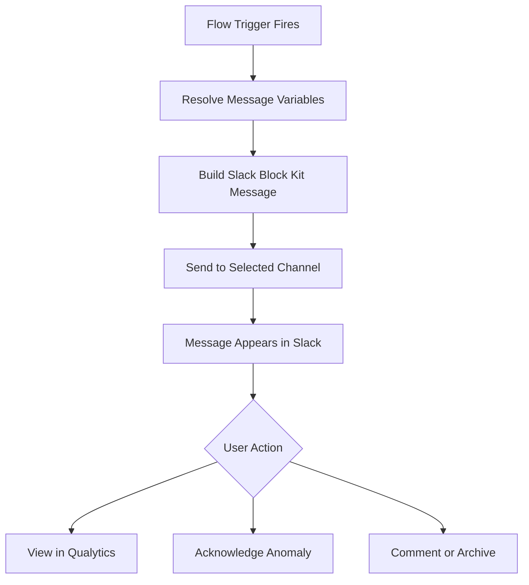

## Configuration

**Step 1**: Click on **Slack.**

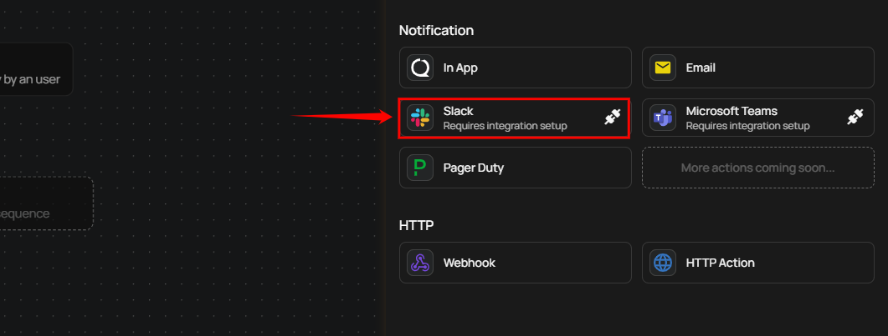

A **Slack Settings** panel appears on the right side of the screen.

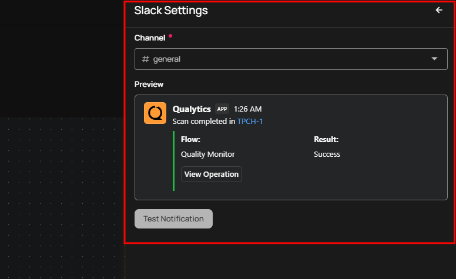

| No. | Field | Description |
| :---- | :---- | :---- |
| **1.** | Channel | Choose the channel where notifications should be sent using the **Channel** dropdown. For demonstration purposes, the channel **#demo** is selected. |
| **2.** | Preview | Shows a preview of the Slack notification that will be sent when the flow runs. |

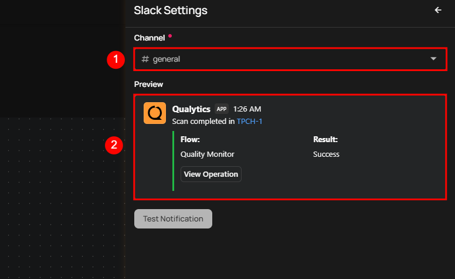

**Step 2:** Click the **Test Notification** button to send a sample notification to the selected Slack channel.

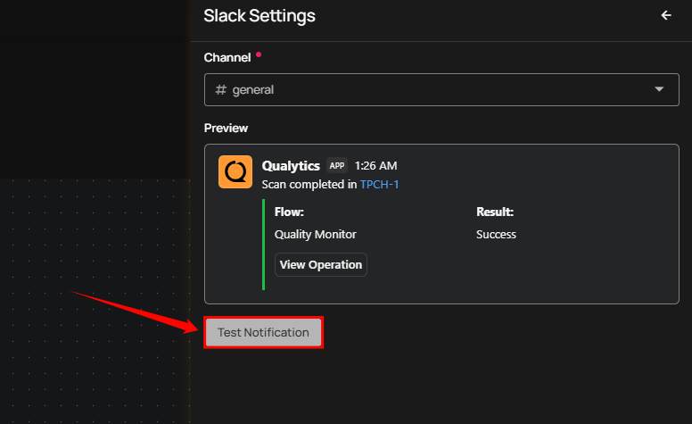

A prompt appears stating **Notification successfully sent** once the notification is successfully delivered.

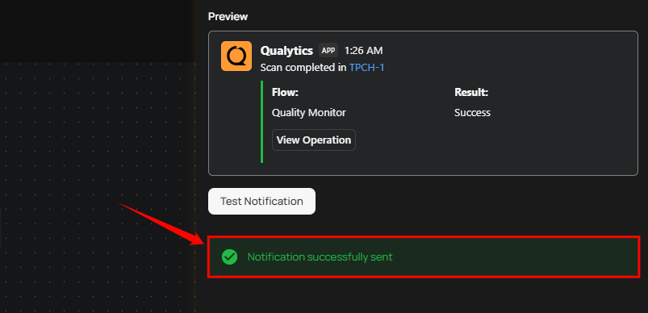

**Step 3:** Once the notification is successfully sent, check your connected Slack workspace to ensure it is linked to Qualytics. You will see the test notification in the selected Slack channel.

!!! note
    Each trigger generates a different type of Slack notification message. The content and format of the message vary based on the specific trigger event.

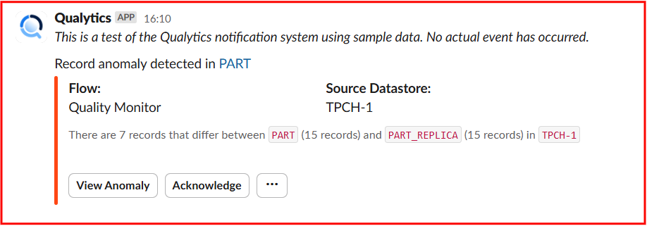

**Step 4:** After confirming that the notification was received successfully, return and click the Save button.

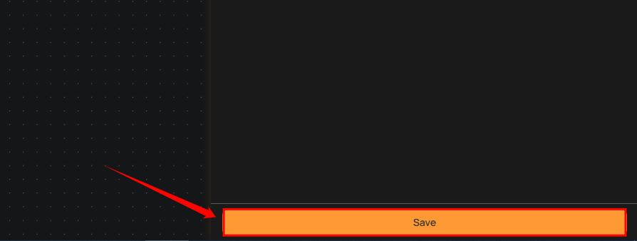

## Examples of Trigger Messages

Trigger messages in Slack provide real-time notifications for various system events, ensuring timely awareness and action. Each trigger message follows a unique format and conveys different types of information based on the operation performed. Below are examples highlighting distinct scenarios:

**Scenario 1: Scan Completion Notification**

When a data cataloging or scan operation completes successfully, a notification is sent to Slack. The message includes details such as the dataset name, operation type (e.g., Catalog Operation), and the result of the operation.

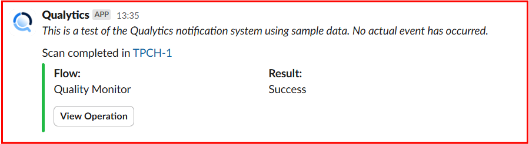

**Scenario 2: Anomalous Table or File Detected**

When a scan detects a critical data anomaly, Slack sends a detailed notification highlighting the issue. The notification includes the dataset name, flow (such as Quality Monitor), and source datastore. It also provides a summary of the anomaly, specifying the number of records that differ between datasets and the container where the discrepancy was found. Additionally, the message offers an option to view detailed results.

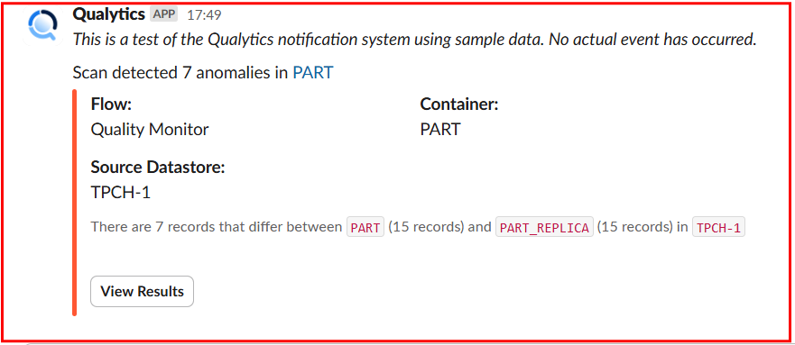

**Scenario 3: Anomaly Detected**

When a scan detects record anomalies, Slack sends a notification highlighting the affected container, flow, and source datastore. It specifies the number of records that differ between datasets and provides options to view or acknowledge the anomaly.

## Managing Qualytics Alerts in Slack

Qualytics Slack integration enables real-time monitoring and quick action on data quality issues directly from Slack. This guide outlines the different types of alerts and the actions you can take without leaving Slack.

**When an Operation Success or failure**

**Step 1:** A Slack notification confirms the scan completion with a **Success/failure** status.

For demonstration purposes we are using Success operation.

**Step 2:** Click **View Operation** to be redirected automatically to the result section in Qualytics.

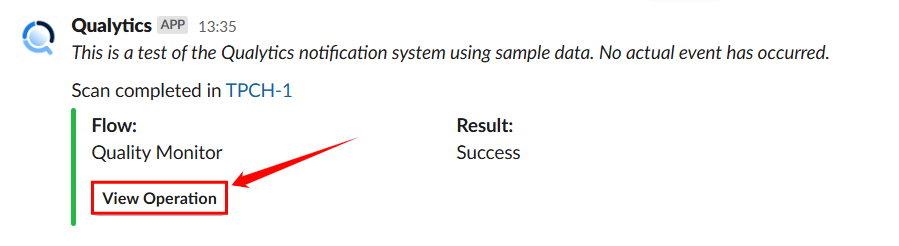

**When an Anomalous File or Table is Detected**

**Step 1:** A Slack alert notifies about anomalies in a dataset.

**Step 2:** Click **View Results** to examine the identified discrepancies directly in Qualytics.

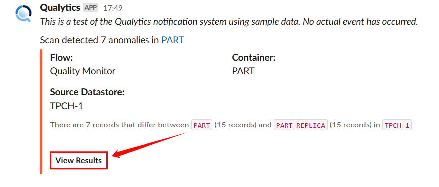

**When a Record Anomaly is Detected**

If a **shape or record anomaly** is found, you'll receive a Slack notification. You can take the following actions:

* **View Anomaly** – Click on view anomaly to open the details in Qualytics to investigate further.

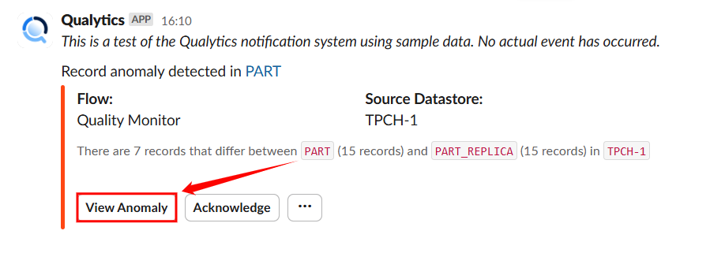

* **Acknowledge** – Click on Acknowledge to mark it as reviewed to avoid duplicate alerts.

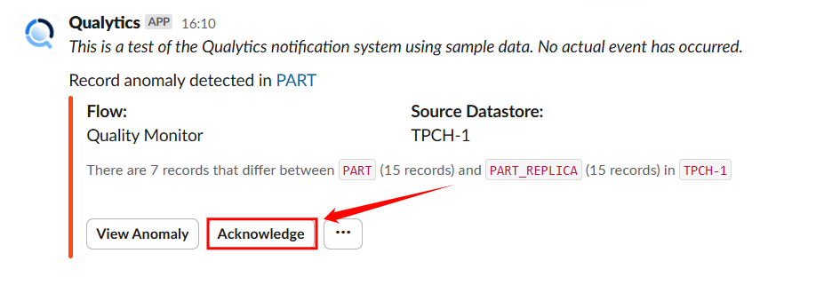

* **Horizontal ellipsis(⋯)** – Click on horizontal ellipsis.

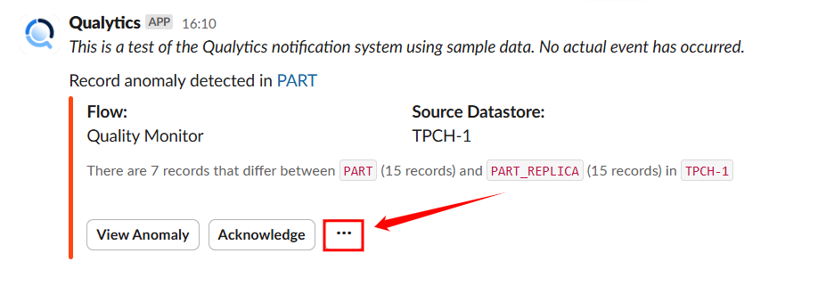

  A dropdown will open with option **comment** and **archive** :

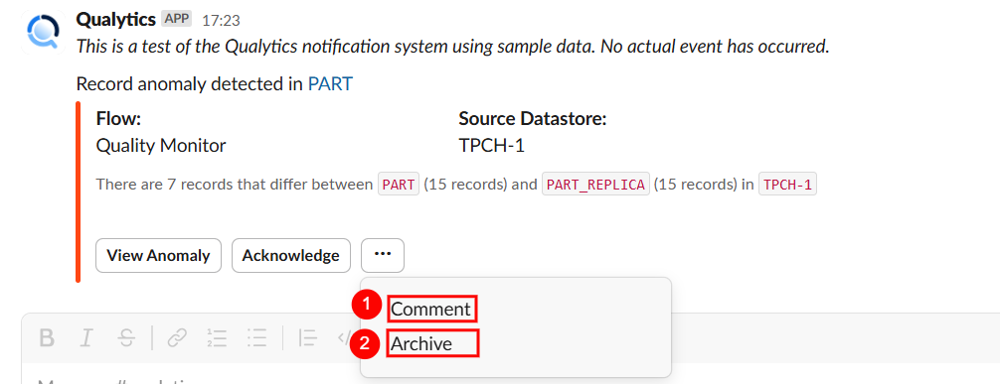

| No. | Action | Description |
| :---- | :---- | :---- |
| **1.** | Comment | Add Comment to collaborate with your team. |
| **2.** | Archive | Archive if no further action is needed. |

## Message Variables

Slack notifications support the same dynamic tokens as all other notification channels, plus a Slack-specific color token. The available tokens depend on the Flow trigger type:

| Token | Description |
| :--- | :--- |
| `{{ flow_name }}` | Name of the Flow |
| `{{ datastore_name }}` | Datastore involved in the event |
| `{{ datastore_link }}` | Link to the datastore |
| `{{ container_name }}` | Container (table or file) involved |
| `{{ container_link }}` | Link to the container |
| `{{ operation_type }}` | Type of operation (Catalog, Profile, Scan) |
| `{{ operation_result }}` | Result of the operation (Success, Failure) |
| `{{ operation_result_color }}` | Color code for the operation result (Slack-specific) |
| `{{ anomaly_message }}` | Description of the detected anomaly |
| `{{ anomaly_type }}` | Type of anomaly detected |
| `{{ target_link }}` | Direct link to view the event details |

!!! warning
    **Manual** and **Scheduled** Flow trigger types do not support message variables. Notification messages for these triggers must use static text only.

For the complete list of tokens organized by trigger type, see the [Message Variables](../message-variables.md) documentation.

## Permission

| Operation | Minimum Permission |
| :--- | :--- |
| View notification specifications and tokens | Member |
| Configure and save notification | Manager |
| Test notification | Manager |

For the complete list of roles and permissions, see the [Security](../../../settings/security/overview.md) documentation.

## Troubleshooting

| Symptom | Possible Cause | Resolution |
| :--- | :--- | :--- |
| No channels available in dropdown | Slack integration not connected | Connect the Slack integration in **Settings > Integrations > Slack** before configuring Slack notifications. |
| Test notification fails | Bot not added to the channel | Ensure the Qualytics Slack bot has been invited to the target channel. |
| Notification sent but not visible in Slack | Message posted to a different channel | Verify the selected channel in the notification configuration matches the intended destination. |
| Interactive buttons not working | Qualytics instance unreachable from Slack | Ensure your Qualytics instance URL is accessible from the internet so Slack can send action callbacks. |
| Message variables showing as raw text | Unsupported token for the trigger type | Ensure the tokens used are valid for the selected Flow trigger type. Use the autocomplete feature (`Ctrl+Space`) to see available tokens. |
