# Operation

Users can execute specific operations when the trigger activates. They can choose from the following options:

* Catalog.

* Profile.

* Scan.

* Export.

* Materialize.

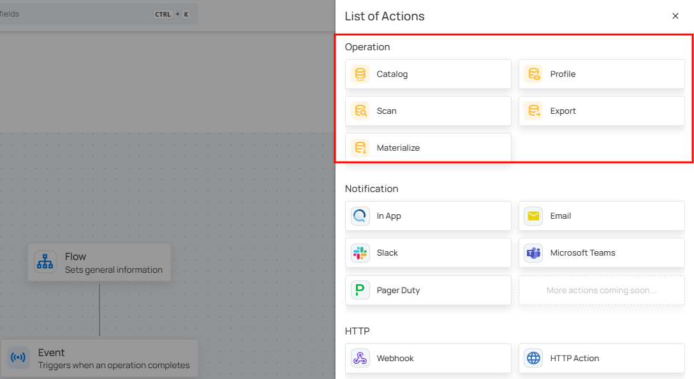

!!! Warning
    Only initialized datastores appear in the **Source Datastore** dropdown across all operation types. A datastore becomes initialized after it has successfully completed **Catalog**, **Profile**, and **Scan** runs at least once within the **Action Node Operation** section while setting up your flow.

## Catalog

**Step 1:** Click on **Catalog.**  

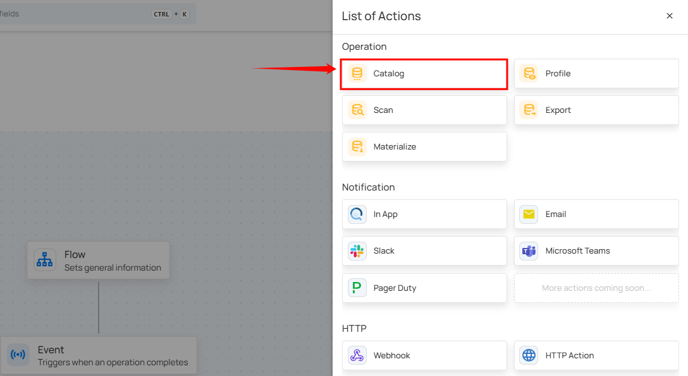

A panel **Catalog Settings** will appear on the right-hand side. This window allows you to configure the catalog operation.

| No. |                 Field |                 Description |
| :---- | :---- | :---- |
| 1. | Source Datastore | Select the source datastore to catalog. |
| 2. | Prune | Checkbox to enable or disable the removal of named collections (tables, views, files, etc.) that no longer exist in the datastore. |
| 3. | Recreate | Checkbox to enable or disable the recreation of previously deleted named collections in Qualytics for the catalog. |
| 4. | Include | Checkboxes to select Tables, Views, or both, specifying the resources to include in the catalog. |

**Step 2:** After configuring the settings, click Save to apply and proceed with the catalog operation.

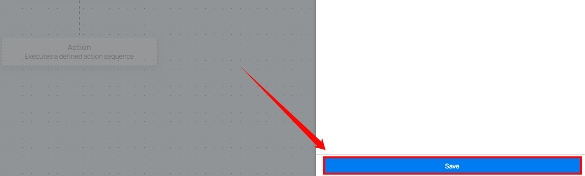

## Profile

**Step 1:** Click on **Profile.**  

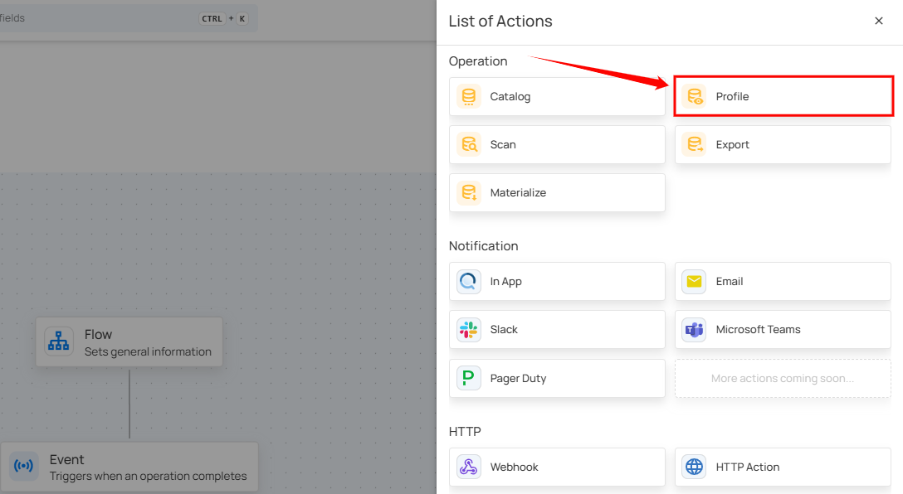

A panel **Profile Settings** will appear on the right-hand side. This window allows you to configure the Profile operation.

| No. |                    Field |    Description |
| :---- | :---- | :---- |
| 1. | Source Datastore | Select the source datastore to profile. |
| 2. | Select Tables | Allows users to select all tables, specific tables, or tables associated with selected tags to profile. |
| 3. | Read Settings | Configure the starting point for profiling and set a maximum record limit per table for profiling. |
| 4. | Inference Settings | Set the level of automated checks and decide whether inferred checks should be saved in draft mode. |

**Step 2:** Click Save to finalize the profile configuration.

## Scan

**Step 1:** Click on **Scan.**

A panel **Scan Settings** will appear on the right-hand side. This window allows you to configure the Scan operation.  

**Source Datastore:** Select the datastore to be scanned.

**Select Tables:** Choose all tables, specific tables, or tables associated with selected tags to include in the scan.

**Select Check Categories:** Select categories of checks to include, such as table properties (Metadata) or value checks (Data Integrity).

**Read Settings:** Define the scan strategy: incremental scans updated records; full scans process all records.

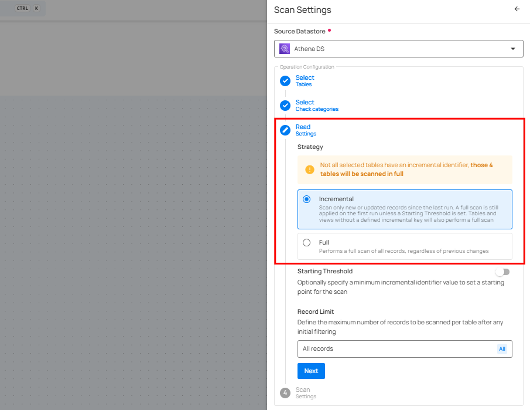

**Starting Threshold:** Set a starting point for scanning based on an incremental identifier.

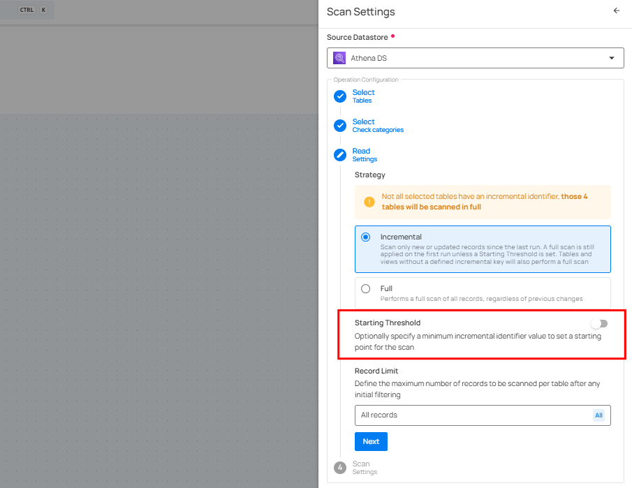

**Record Limit:** Specify the maximum number of records to scan per table.

**Scan Settings:** Choose how to manage duplicate or recurring anomalies by archiving overlaps or reactivating previously archived anomalies with fingerprint tracking.

**Anomaly Rollup Threshold:** Set the Rollup Threshold to limit how many anomalies are created per check. When the limit is reached, anomalies will be merged into one for easier management.

**Enrichment Source Record Limit:** Define the number of source records to include in the enrichment operation.

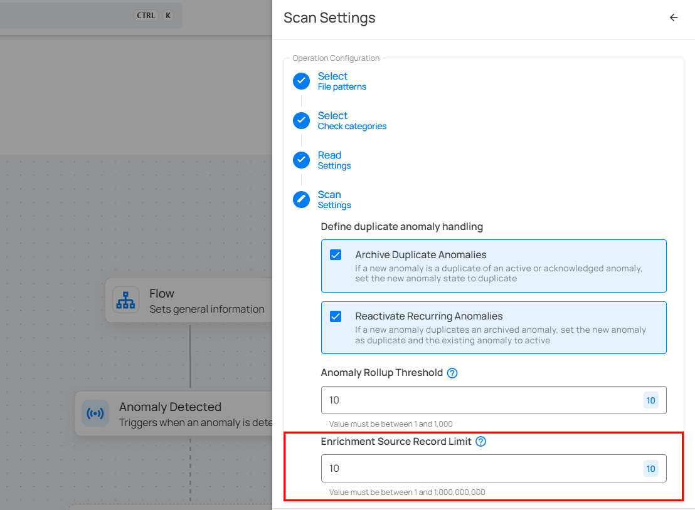

**Step 2:** Click Save to finalize the scan configuration.

## Export

**Step 1:** Click on **Export.**

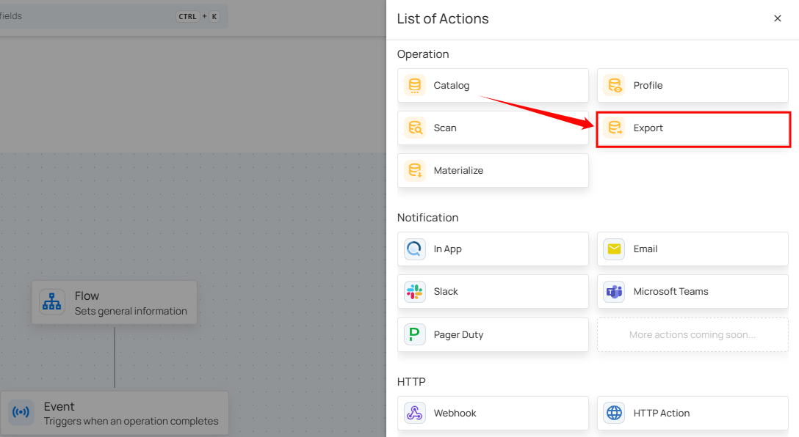

A panel **Export Settings** will appear on the right-hand side. This window allows you to configure the Export settings.

**Source Datastore:** Select the datastore to export data from.

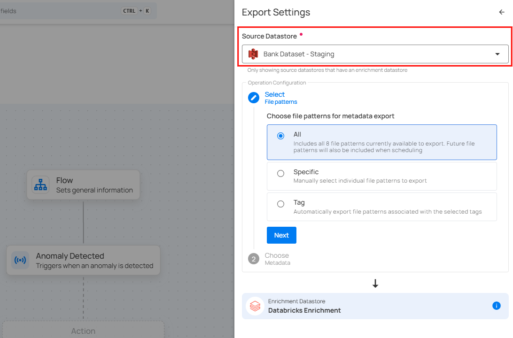

**Select file patterns to export:** **All** (all file patterns, including future ones), **Specific** (manually chosen file patterns), or **Tag** (file patterns based on selected tags).

**Select Metadata:** Choose metadata to export **anomalies**, **quality checks**, or **field profiles**. Anomalies detect data issues, quality checks validate data, and field profiles store field metadata.

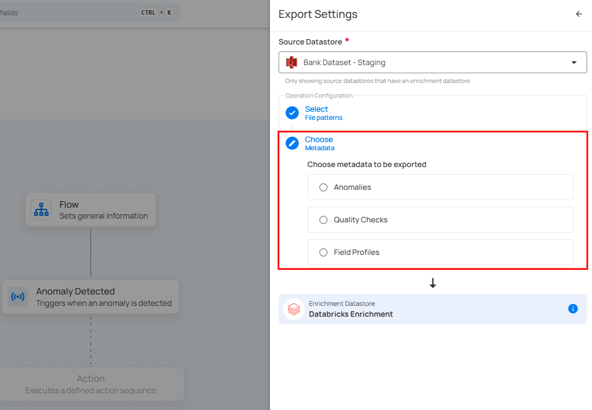

**Step 2:** Click Save to finalize the export configuration.

Export nodes display the asset type in their titles (e.g., “Export Anomalies”) to help you identify the exported content easily.

## Materialize

**Step 1:** Click on **Materialize.**

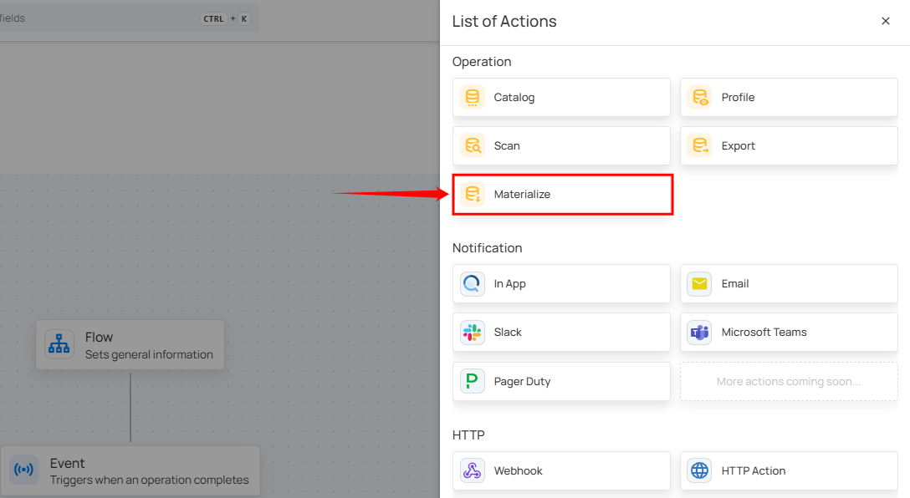

A panel **Materialize Settings** will appear on the right-hand side. This window allows you to configure the Materialize settings.

**Source Datastore:** Select the datastore to materialize data from.

**Select Tables:** Choose which tables (all, specific, or tagged) to extract from your source datastore and export to the enrichment datastore.

**Read Settings:** Select the record limit to control how much data is materialized per table.

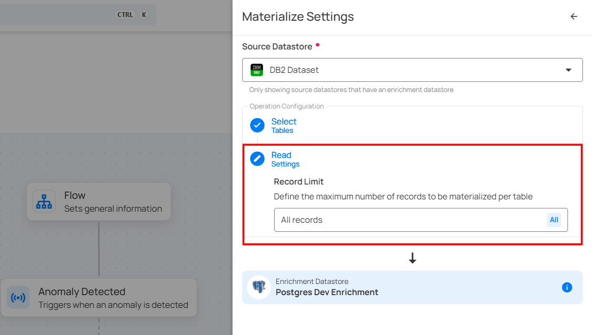

**Step 2:** Click Save to finalize the materialize configuration.

