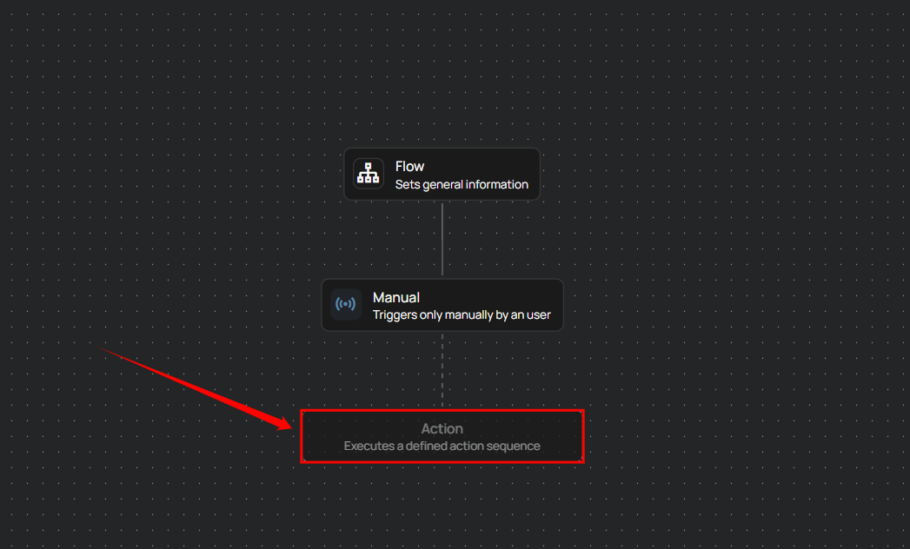
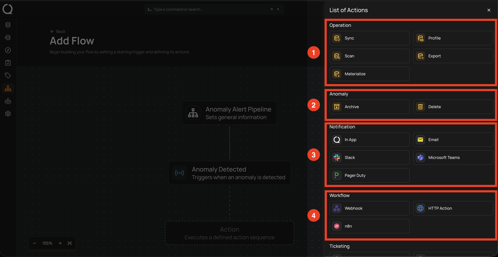
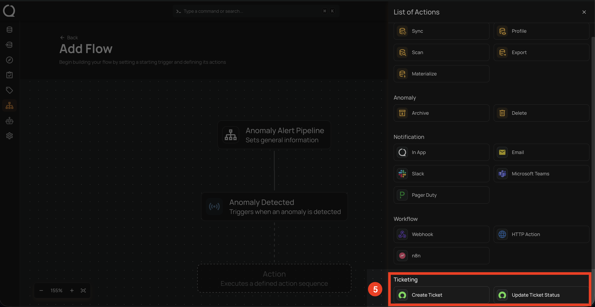

# Action Node

Actions define the specific steps the system will execute after a flow is triggered. They allow users to automate tasks, send notifications, or interact with external systems.

**Step 1:** After completing the **"Trigger"** node setup, users can click on the **"Actions"** node.  

A panel will appear on the right-hand side displaying the list of available actions. These actions define what the system will execute after the flow is triggered. The actions are categorized into five groups:

| REF. | CATEGORY | AVAILABLE ACTIONS |
|:----:|----------|-------------------|
| 1 | Operation | Sync, Profile, Scan, Export, Materialize |
| 2 | Anomaly | Archive, Delete |
| 3 | Notification | In App, Email, Slack, Microsoft Teams, Pager Duty |
| 4 | Workflow | Webhook, HTTP Action, n8n |
| 5 | Ticketing | Create Ticket, Update Ticket Status |

!!! info
    Inline summaries are shown within action nodes, displaying key details based on the action type—for example, datastore names for operations, Slack or Teams channels for notifications, and webhook URLs for HTTP actions. This enhancement provides quick clarity during flow configuration.

## Operations

!!! note
    For more detailed information, review the [operations documentation](../flows/operations.md){target="_blank"}.

## Anomaly

!!! note
    For more detailed information, review the [anomaly documentation](../flows/anomaly.md){target="_blank"}.

## Notifications

!!! note
    For more detailed information, review the [notifications documentation](../flows/notification.md){target="_blank"}.

## Notification Message Variables

!!! note
    For more detailed information, review the [notification tokens documentation](../flows/notification-tokens.md){target="_blank"}.

## Workflow

!!! note
    For more detailed information, review the [workflow documentation](../flows/workflow.md){target="_blank"}.

## Ticketing

!!! note
    For more detailed information, review the [ticketing documentation](../flows/ticketing.md){target="_blank"}.

## FAQ

**1.** Can I have multiple actions under a single flow?

Yes. You can chain multiple actions—such as **notifications, operations,** or **HTTP steps**—under a single flow to perform sequential or parallel tasks.
