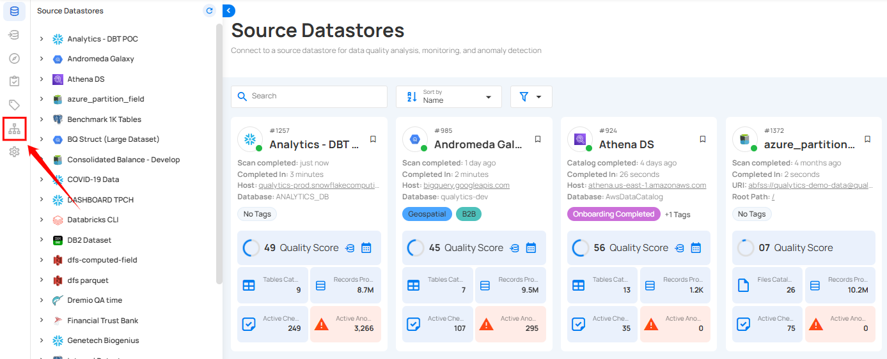
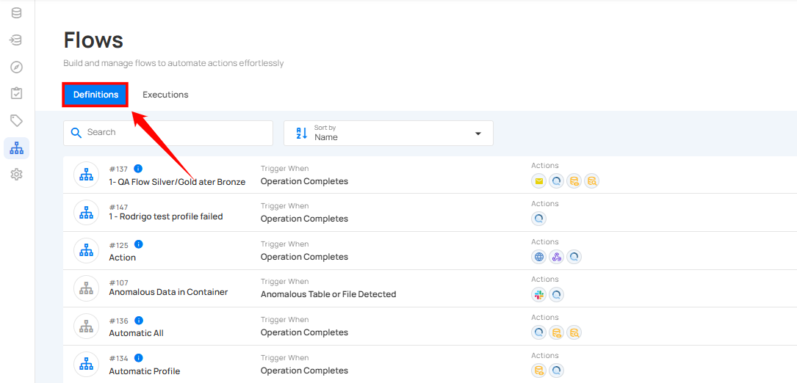
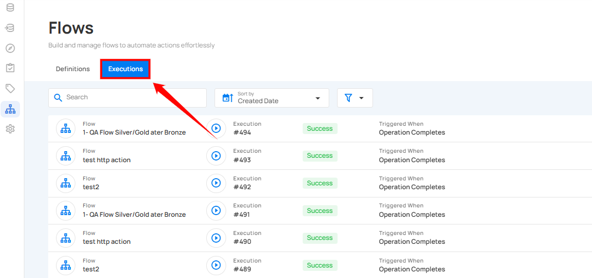

# Flows

Flows enable users to create pipelines by chaining actions and configuring how they are triggered. Triggers can be set based on predefined events and filters, offering a flexible and efficient way to automate processes. These actions can be notifications or operations, allowing users to inform various notification channels or execute tasks based on specific operations.

## Navigation to Flows

**Step 1**: Log in to your Qualytics account and click on **Flows** on the left side panel of the interface.  

You will navigate to the Flows interface, where you can add and manage flows. At the top, you will see two tabs:

* **Definitions:** Displays a list of all flows along with details like triggers, actions, tags, and the last triggered time.

* **Executions:** Provides the execution history of flows, including their status and timestamps.

## Add Flow

**Step 1**: Click on the **Add Flow** button from the top right corner.

For more information, please refer to the [add flow](../flows/add-flow.md) documentation.

## Flow Node

**Step 1:** Click on the **Flow** node.  

For more information, please refer to the [flow node](../flows/flow-node.md) documentation.

## Trigger Node

**Step 1:** After completing the **"Flow"** node setup, users can click on the **"Trigger"** node.

For more information, please refer to the [trigger node](../flows/trigger-node.md) documentation.

## Actions Node

Actions define the specific steps the system will execute after a flow is triggered. They allow users to automate tasks, send notifications, or interact with external systems.

For more information, please refer to the [action node](../flows/action-node.md) documentation.

## View Created Flow

Once a flow is added, it will be visible in the **Definitions** tab, where you can view all the created flows.

For more information, please refer to the [view created flow](../flows/view-created-flows.md) documentation.

## Execution Tab 

Execution tab allows users to view the execution history and current status of a flow. It provides detailed timestamps, status updates, and a comprehensive record of flow executions for efficient tracking and analysis.

For more information, please refer to the [execution tab](../flows/execution-tab.md) documentation.

