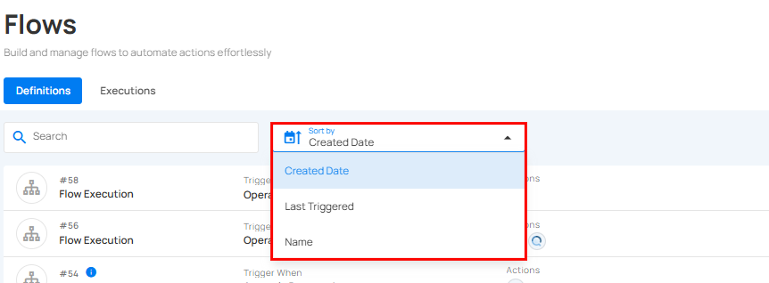
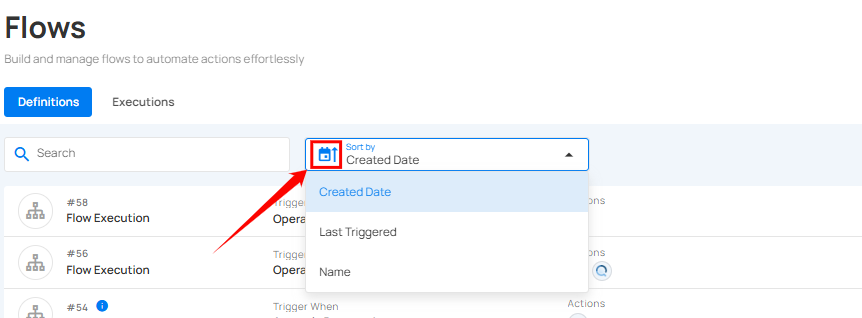

# Sort Flows

Qualytics allows you to sort your flows by **Created Date** and **Name** to easily organize and prioritize them according to your needs.  

Whatever sorting option is selected, you can arrange the data either in ascending or descending order by clicking the caret button next to the selected sorting criteria.  

