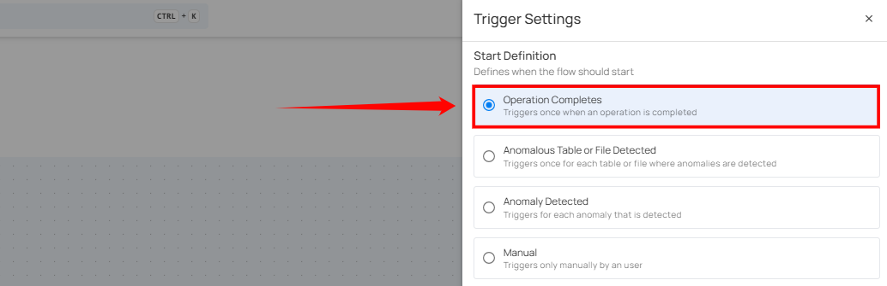
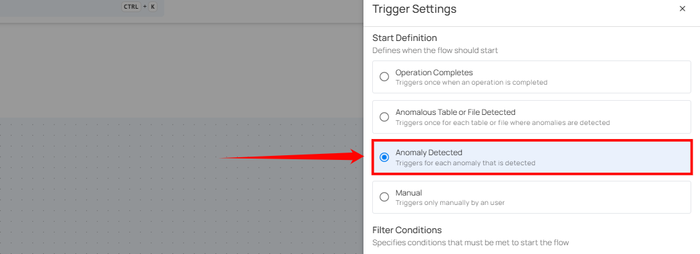
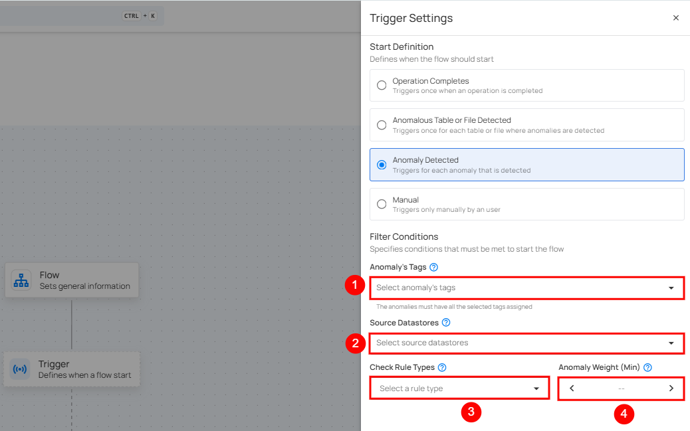

# Trigger

This is where you can configure how the Flow will be activated. It can be activated automatically by configuring the settings, or you can choose to activate it manually.

**Step 1:** After completing the **"Flow"** node setup, users can click on the **"Trigger"** node.

A panel will appear on the right-hand side, enabling users to define when the flow should start. The panel provides four options for initiating the flow. Users can choose one of the following options:

* Schedule

* Operation Completes.

* Anomalous Table and File Detection.

* Anomaly Detected.

* Manual

## Important Information About Triggers

!!! note
    Each Flow can have only **one trigger**. If you want to execute a different action or change the trigger, you’ll need to **clone** the Flow and configure the new trigger.

    [Click here to learn how to clone a Flow](../flows/clone-a-flow.md){target="_blank"}.

## Schedule

The Schedule trigger runs a flow automatically at a defined time interval. Use this trigger when you want the actions in a flow to execute on a recurring schedule—such as hourly, daily, weekly, or monthly—without manual intervention. Scheduled flows are useful for automating routine tasks, periodic scans, exports, or notifications, and they run based on the configured schedule time (UTC).

**Schedule Configuration**

**1. Hourly:** This option allows you to schedule the flow to run every hour at a specified minute. You can define the frequency in hours and the exact minute within the hour the flow should start. Example: If set to **Every 1 hour(s) on minute 0**, the flow will run every hour at the top of the hour (e.g., 1:00, 2:00, 3:00).

**2. Daily:** This option schedules the flow to run once every day at a specific time. You specify the number of days between runs and the exact time of day in UTC. Example: If set to **Every 1 day(s) at 00:00 UTC,** the flow will run every day at midnight UTC.

**3. Weekly:** This option schedules the flow to run on specific days of the week at a set time. You select the days of the week and the exact time of day in UTC. Example: If configured to run on "Sunday" and "Friday" at 00:00 UTC, the flow will execute at midnight UTC on those days.

**4. Monthly:** This option schedules the flow to run once a month on a specific day at a set time. You specify the day of the month and the time of day in UTC. If set to "On the 1st day of every 1 month(s), at 00:00 UTC," the flow will run on the first day of each month at midnight UTC.

**5. Advanced:** The Advanced option allows you to configure more complex and custom schedules using Cron expressions. This is useful when you need precise control over when a flow runs.

Cron expressions are a powerful and flexible way to schedule tasks. They use a syntax that specifies the exact timing of the task based on five fields:

-   Minute (0 - 59)
-   Hour (0 - 23)
-   Day of the month (1 - 31)
-   Month (1 - 12)  
-   Day of the week (0 - 6) (Sunday to Saturday)

Each field can be defined using specific values, ranges, or special characters to create the desired schedule.

**Example:** The Cron expression `0 0 * * *` schedules the flow to run at midnight (00:00) every day. Here’s a breakdown of this expression:

-   0 (Minute) - The task will run at the 0th minute.
-   0 (Hour) - The task will run at the 0th hour (midnight).
-   *(Day of the month) - The task will run every day of the month.
-   *(Month) - The task will run every month.
-   *(Day of the week) - The task will run every day of the week.

Users can define other specific schedules by adjusting the Cron expression. For example:

-   0 12 * * 1-5 - Runs at 12:00 PM from Monday to Friday.
-   30 14 1 * * - Runs at 2:30 PM on the first day of every month.
-   0 22 * * 6 - Runs at 10:00 PM every Saturday.

To define a custom schedule, enter the appropriate Cron expression in the "Custom Cron Schedule (UTC)" field before specifying the schedule name. This will allow for precise control over the timing of the operation, ensuring it runs exactly when needed according to your specific requirements.

## Operation Completes

This type of flow is triggered whenever an operation, such as a catalog, profile, or scan, is completed on a source datastore. Upon completion, teams are promptly notified through in-app messages and, if configured, via external notification channels such as email, Slack, Microsoft Teams, and others. For example, the team is notified whenever the catalog operation is completed, helping them proceed with the profile operation on the datastore.

**Filter Conditions**

Filters can be set to narrow down which operations should trigger the flow execution:

1. **Source Datastore Tags**: The flow is triggered only for source datastores that have all the selected tags assigned.

2. **Source Datastores**: The flow is triggered only for the selected source datastores.

3. **Operation Types**: The flow is triggered only for operations that match one or more of the selected types.

4. **Operation Status**: The flow is triggered for operations with a status of either Success or Failure.

Once the conditions are set, click the **Save** button to finalize the trigger configuration.

## Anomalous Table and File Detected

This flow is triggered when anomalies are detected within a specific table, file and check rule types. It includes information about the number of anomalies found and the specific scan target within the datastore. This is useful for assessing the overall health of a particular datastore.  

**Filter Conditions**

Users can optionally set filters to specify which tables or files should trigger the flow execution.

1. **Tables / Files Tags**: Only tables or files with all the selected tags assigned will trigger the flow.

2. **Source Datastores**: The flow is triggered only for the selected source datastores.

3. **Check Rule Types**: Only anomalies identified by one or more of the selected check rule types will initiate the flow.

After defining the conditions, users must click the **Save** button to finalize the trigger configuration.  

## Anomaly Detected

This type of flow is triggered when any single anomaly is identified in the data. The flow message typically includes the type of anomaly detected and the datastore where it was found. It provides specific information about the anomaly type, which helps quickly understand the issue's nature.

**Filter Condition**

Users can define specific conditions to determine when the flow should be initiated.

1. **Anomaly’s Tags**: Only anomalies with all selected tags assigned will trigger the flow.

2. **Source Datastores**: Only triggered when anomalies are detected in the selected datastores.

3. **Check Rule Types**: Only anomalies identified by one or more of the selected check rule types will initiate the flow.

4. **Anomaly Weight (Min)**: Only anomalies with a weight equal to or greater than the specified value will trigger the flow.

**Step 2:** Once the filter conditions are set, users must click the **Save** button to finalize the configuration.

## Manual

The flow starts only when the user manually triggers it. It doesn’t depend on any automatic conditions or detections, giving the user full control. 

!!! note
    Here you can manually activate a Flow. For a full walkthrough of manual execution, refer to
    [Execute Manual Flows](../flows/execute-manual-flows.md){target="_blank"} documentation.

Once selected, users must click the **Save** button to confirm the manual trigger configuration.

Hover over the **filter tooltip** in trigger nodes to view the applied conditions such as tags, datastores, and operation types. This provides quick visibility into how each trigger is configured.

## FAQ

**1>.** What’s the difference between a Flow and a Trigger?

A Flow is the overall automation pipeline, while a Trigger determines when the flow starts — such as after operation completion, anomaly detection, or manually.