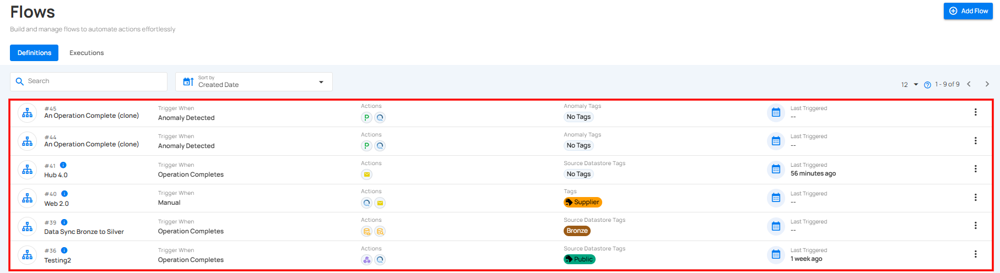
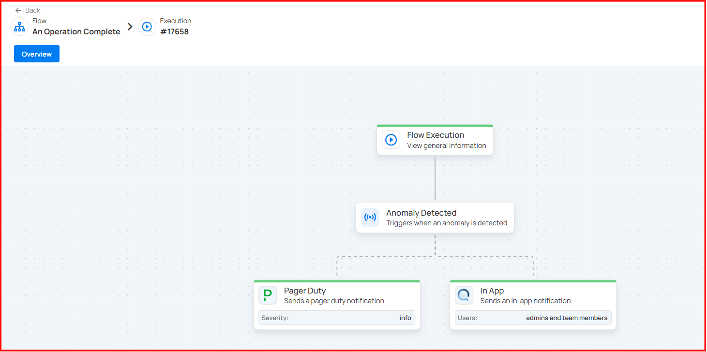
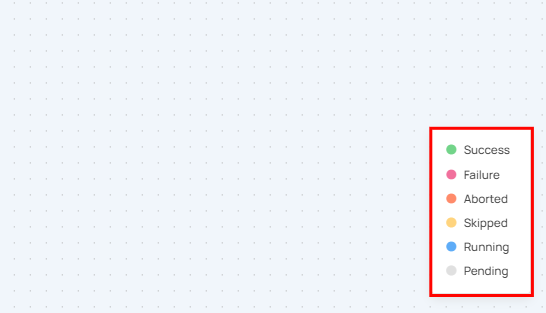
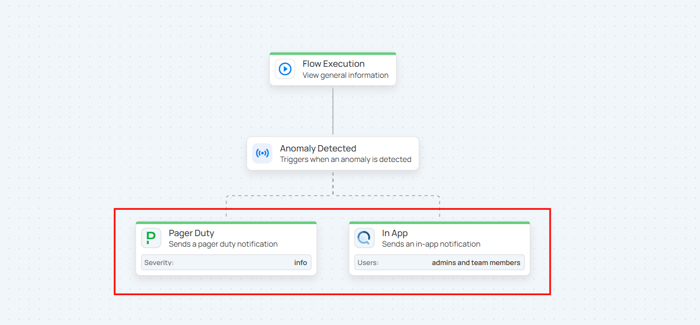
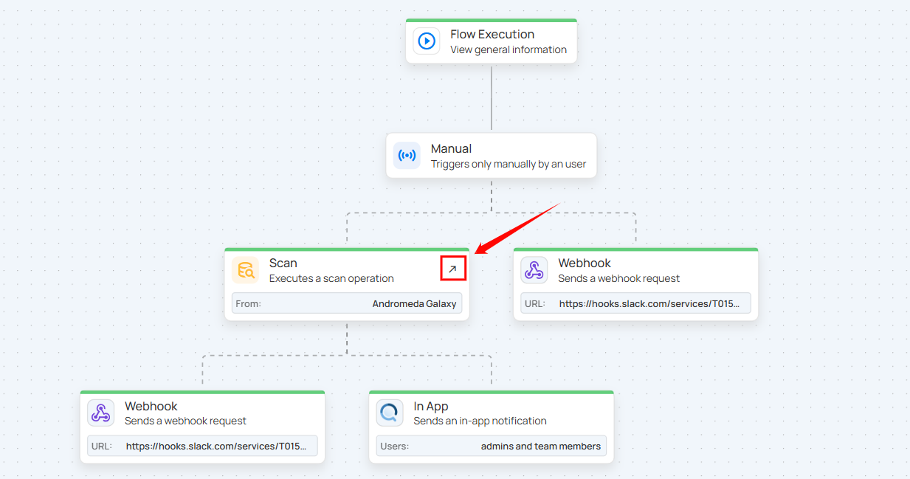
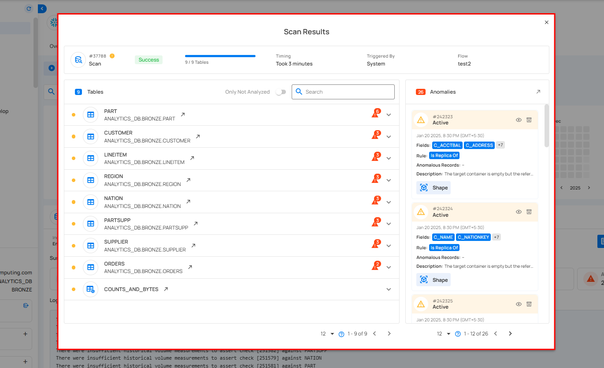

# View and Track Flow Executions

The **Execution** tab allows users to view the execution history and current status of a flow. It provides detailed timestamps, status updates, and a comprehensive record of flow executions for efficient tracking and analysis.

## Accessing the Execution Tab

**Step 1**: Click on the **Execution** tab.

Once clicked, you will be navigated to the **Execution** tab, where you can view the complete execution history of all created flows.

## See a Flow Execution

Users can view flow execution in real-time by clicking on the desired flow operation. The page will show detailed operations, but no edits can be made here.

**Step 1**: Click on the flow operation you want to view.

After clicking, you will navigate to the selected flow operation details page. The page displays all operational details in real-time. Please note, this page is **view-only**, and no edits can be made.

## Understanding Flow States

On the bottom-right corner, there is a **Legend** indicating the possible states of an action, such as:

- **Success** (Green)
- **Failure** (Red)
- **Aborted** (Orange)
- **Skipped** (Yellow)
- **Running** (Blue with dotted lines animation)
- **Pending** (Gray)

If a step is running, you will see a **dot-line animation**, signaling that the step is in progress. Once the action completes, the **Action** box will change its color to reflect the final state.

## Accessing Operation Results

To view detailed results of specific operations:

**Step 1**: Click the **Top Right Arrow** button within the action operation box.

**Step 2**: You will navigate to the **Activity page**, where a **Result Modal** will open, displaying in-depth details of the operation.

