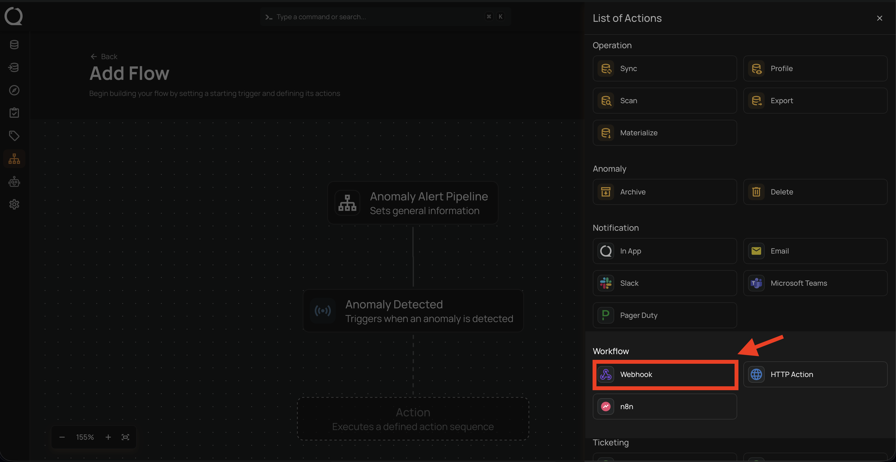
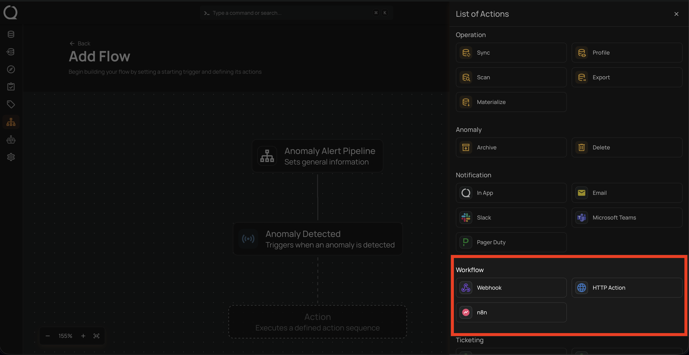
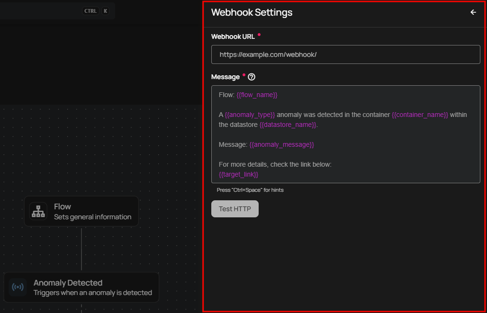
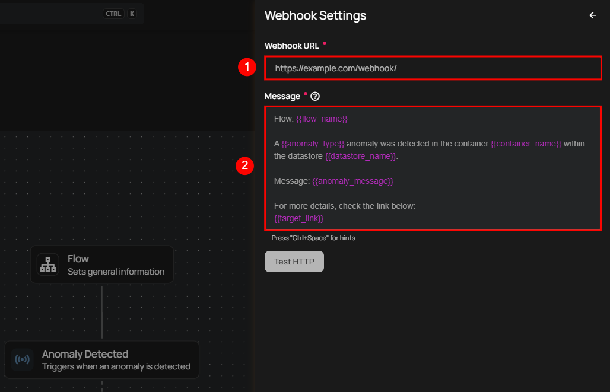
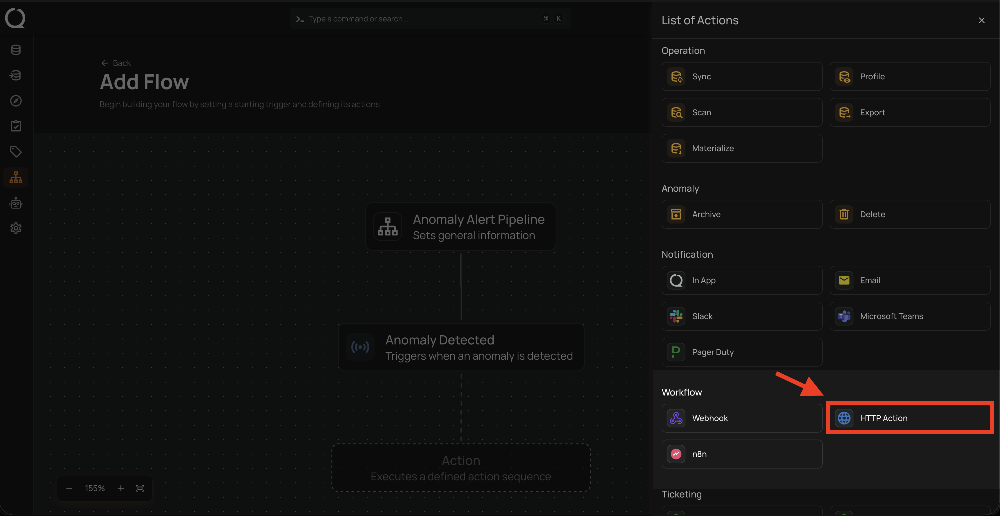
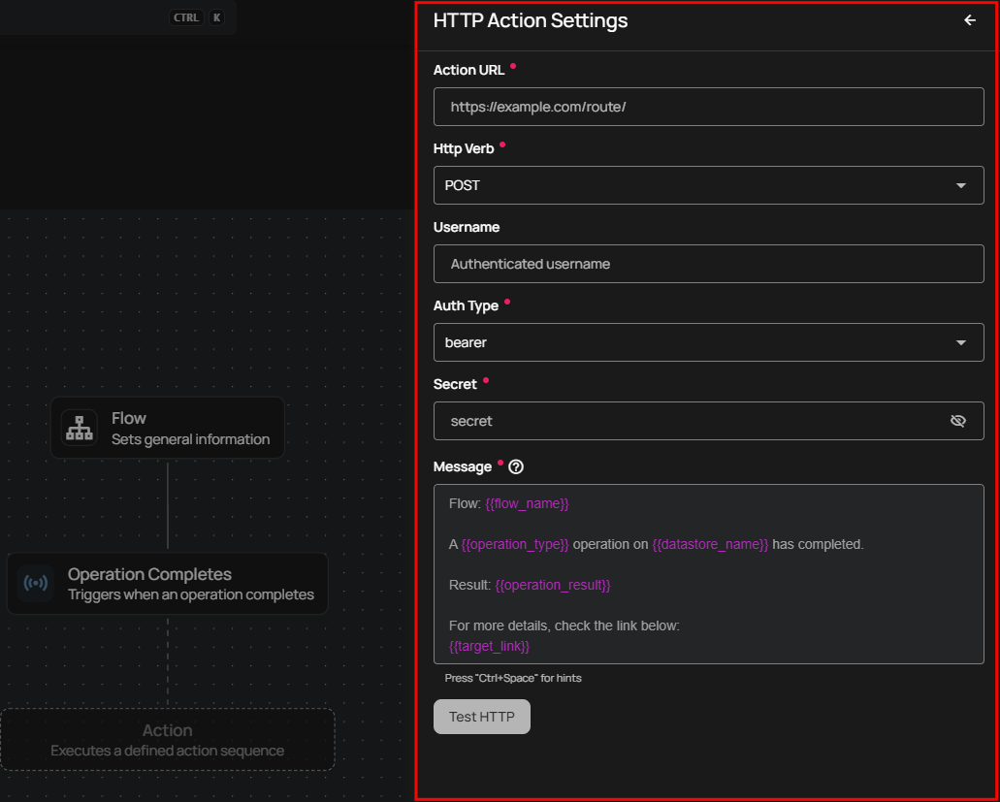
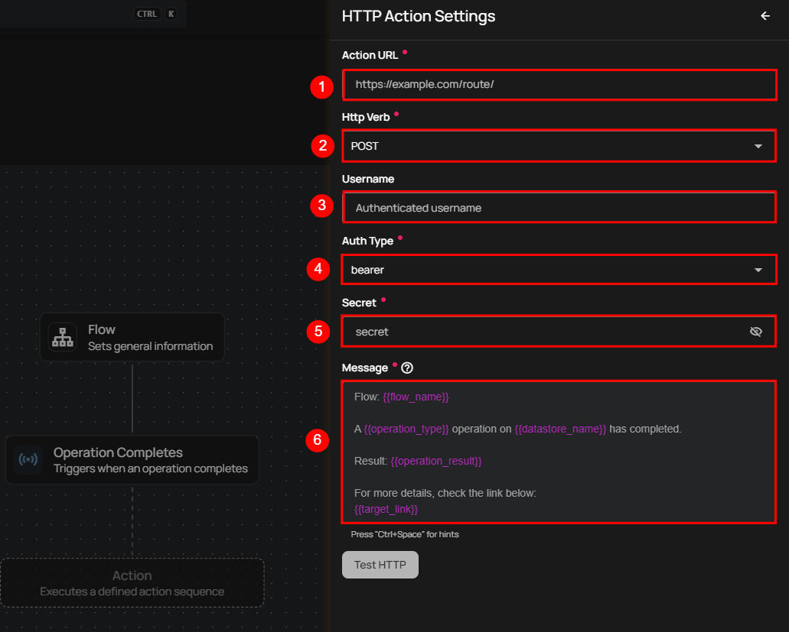
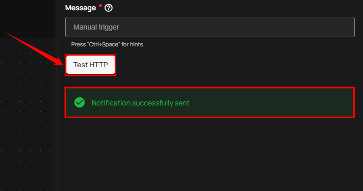
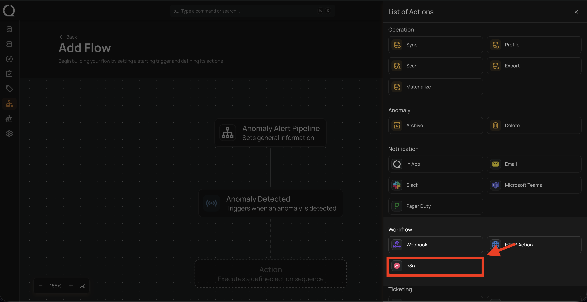

# Workflow

Users can connect to external apps for notifications using one of these services:

* Webhook.

* HTTP Action.

* n8n.



## Webhook

Qualytics allows you to connect external apps for notifications using webhooks, making it easy to stay updated in real time. When you set up a webhook, it sends an instant alert to the connected app whenever a specific event or condition occurs. This means you can quickly receive notifications about important events as they happen and respond right away. By using webhook notifications, you can keep your system running smoothly, keep everyone informed, and manage your operations more efficiently.

**Step 1:** Click on **Webhook.**



A **Webhook Settings** panel will appear on the right-hand side, enabling users to configure and send webhook notifications.



| No. |             Field |                            Description |
| :---- | :---- | :---- |
| 1. |  Webhook URL | Enter the desired **"Webhook URL"** of the target system where you want to receive notifications. |
| 2. | Message | Text area to customize the notification message content with dynamic placeholders like **`{{flow_name}}`**, **`{{operation_type}}`**, and **`{{operation_result}}`**. |



**Step 2**: Click on the **"Test HTTP"** button to send a test notification to the webhook URL you provided. If the webhook URL is correct, you will receive a confirmation message saying **"Notification successfully sent."** This indicates that the webhook is functioning correctly.


**Step 3:** Once you have entered all the values, then click on the **Save** button.


## HTTP Action

Integrating HTTP Action notifications allows users to receive timely updates or alerts directly to a specified server endpoint. By setting up HTTP Action notifications with specific trigger conditions, you can ensure that you are instantly informed about critical events, such as operation completions or anomalies detected. This approach enables you to take immediate action when necessary, helping to address issues quickly and maintain the smooth and efficient operation of your processes.

**Step 1:** Click on **HTTP Action.**



An **HTTP Action Settings** panel will appear on the right-hand side, enabling users to configure and send HTTP Action notifications.



**Step 2:** Enter the following detail where you want the notification to be sent.

**1. Action URL:** Enter the **"Action URL"** in this field. It specifies the server endpoint for the HTTP request and defines where data will be sent or retrieved. It must be correctly formatted and accessible, including the protocol (http or https), domain, and path.

**2. HTTP Verbs:** HTTP verbs specify the actions performed on server resources. Common verbs include:

* **POST:** Use POST to send data to the server to create something new. For example, it's used for submitting forms or uploading files. The server processes this data and creates a new resource.
* **PUT:** Updates or creates a resource, replacing it entirely if it already exists. For example, updating a user's profile information or creating a new record with specific details.
* **GET:** Retrieves data from the server without making any modifications. For example, requesting a webpage or fetching user details from a database.

**3. Username:** Enter the username needed for authentication.

**4. Auth Type:** This field specifies how to authenticate requests. Choose the method that fits your needs:

* **Basic:** Uses a username and password sent with each request. Example: **"Authorization: Basic ".**
* **Bearer:** Uses a token included in the request header to access resources. Example: **"Authorization: Bearer < token >".**
* **Digest:** Provides a more secure authentication method by using a hashed combination of the username, password, and request details. Example: **Authorization: Digest username=" ", realm=" ", nonce=" ", uri=" ", response=" ".**

**5. Secret:** Enter the password or token used for authentication. This is paired with the **Username** and **Auth Type** to securely access the server. Keep the secret confidential to ensure security.

**6. Message:** Enter your custom message using variables in the Message field, where you can specify the content of the notification that will be sent out.



!!! tip
    You can write your custom notification message by utilizing the autocomplete feature. This feature allows you to easily insert internal variables such as `{{ flow_name }}`, `{{ operation_type }}`, and `{{ datastore_name }}`. As you start typing, the autocomplete will suggest and recommend relevant variables in the dropdown.

**Step 3:** Click the **"Test HTTP"** button to verify the correctness of the Action URL. If the URL is correct, a confirmation message saying **"Notification successfully sent"** will appear, confirming that the HTTP action is set up and functioning properly.



**Step 4:** Once you have entered all the values, then click on the **Save** button.


**Step 5:** After completing all the required details in the **"Add Flow"** section, click on the **Publish** button to finalize the process.


After clicking the **Publish** button, a success notification appears confirming that the flow has been successfully added.

## n8n

n8n is a workflow automation platform. Qualytics integrates with it via a dedicated community node (`@qualytics/n8n-nodes-qualytics`), enabling you to trigger n8n workflows directly from Qualytics flow events.

!!! tip
    Before configuring this action, install the Qualytics community node in your n8n instance: `npm install @qualytics/n8n-nodes-qualytics`. You can also find the package on [npm](https://www.npmjs.com/package/@qualytics/n8n-nodes-qualytics){:target="_blank"}.

**Step 1:** Click on **n8n.**



An **n8n Settings** panel will appear on the right-hand side, enabling users to configure the n8n webhook connection.

**Step 2:** Enter the following details:

| Field | Required | Description |
| :---- | :---- | :---- |
| Webhook URL | Yes | The n8n webhook URL where Qualytics will send the payload (e.g., `https://your-n8n-instance.com/webhook/qualytics`). |
| Webhook Secret | No | An optional secret value sent as the `x-qualytics-secret` request header, used to authenticate and validate incoming requests in n8n. |

**Step 3:** Once you have entered all the values, click the **Save** button.

**Step 4:** After completing all the required details in the **"Add Flow"** section, click on the **Publish** button to finalize the process.

### Payload Structure

When a flow is triggered, Qualytics sends a structured JSON payload via POST to your n8n webhook URL. The payload includes the following fields:

```json
{
  "event": "qualytics.flow.triggered",
  "flow": {
    "id": 123,
    "name": "My Flow"
  },
  "trigger": {
    "type": "anomaly",
    "timestamp": "2026-03-19T12:00:00Z"
  },
  "datastore": {
    "id": 1,
    "name": "Production DB"
  },
  "context": {
    "anomalies": [
      {
        "id": 456,
        "type": "record",
        "description": "Value out of expected range",
        "container": "orders",
        "fields": ["total_amount"],
        "created_at": "2026-03-19T11:59:00Z"
      }
    ],
    "containers": [
      {
        "id": 10,
        "name": "orders"
      }
    ],
    "quality_checks": [
      {
        "id": 99,
        "name": "Total Amount Check",
        "status": "failed"
      }
    ]
  },
  "operation": {
    "id": 789,
    "type": "scan",
    "result": "warning"
  },
  "target_link": "https://your-qualytics-instance.com/datastores/1"
}
```

!!! note
    Not all fields are present in every payload. Fields like `datastore`, `operation`, `context.anomalies`, `context.containers`, `context.quality_checks`, and `target_link` are included only when relevant to the trigger type.
