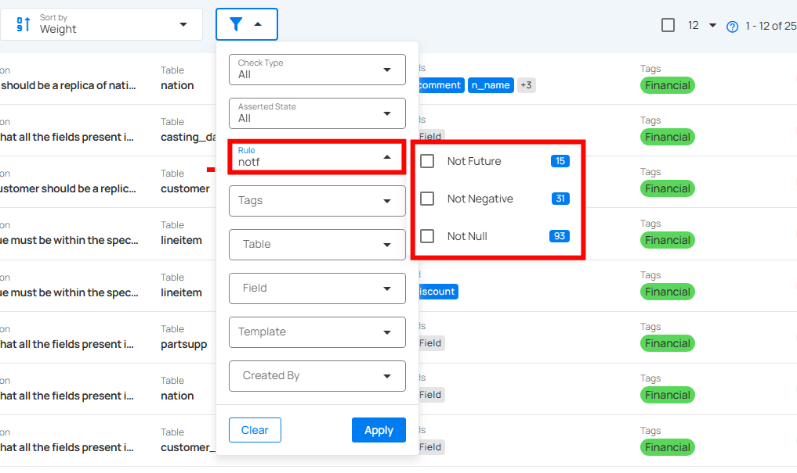
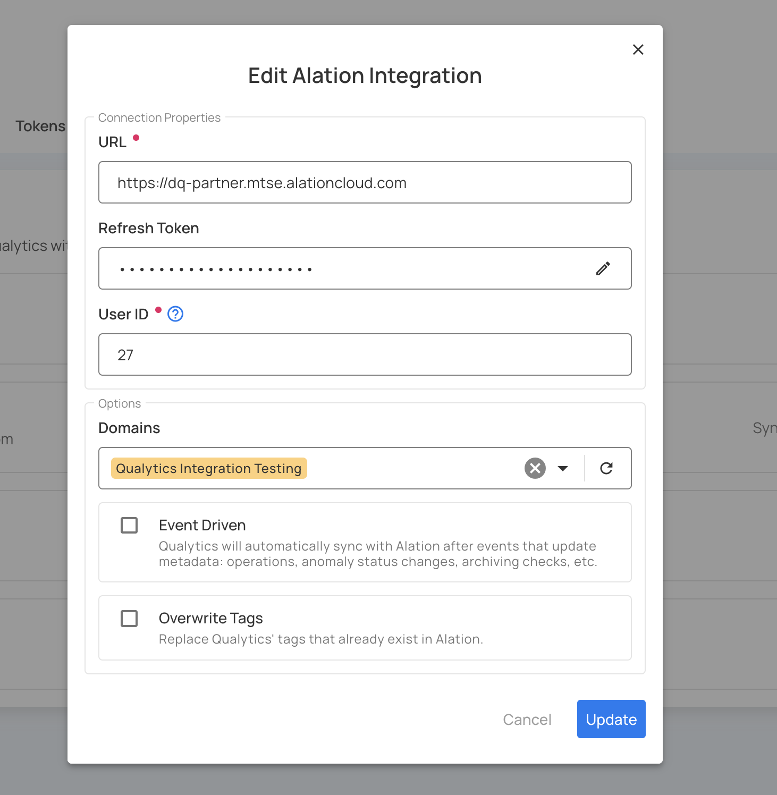
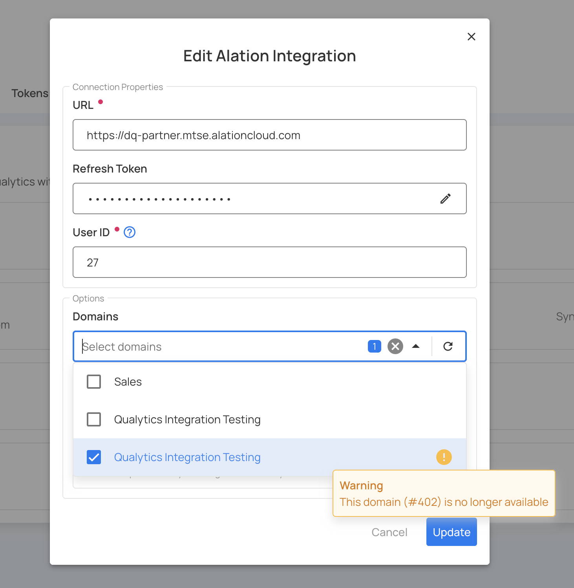

# **Fuzzy Search for Forms & Filters**

You can now search with **typos** and **partial matches** across form and filter inputs, making it easier to find what you need with a more natural and forgiving search experience.  
This behavior applies to all areas of the platform where search or filter inputs are available — such as **Checks**, **Profiles**, **Integrations**, and **Anomalies**.

Fuzzy Search enhances traditional filtering by allowing users to locate results **even when search terms are incomplete or slightly misspelled**.  
It helps speed up workflows when you can’t recall exact names, IDs, or field labels.

## 💡 How It Works

- Works across both **form fields** and **filter dropdowns**.  
- Matches **partial text**, **case variations**, and **near-miss spellings**.  
- Applies instantly when typing in a text-based field or filter.  
- Compatible with multi-field and nested filter components.  

**Example:**  
Typing `afterda` automatically matches filters or fields containing **After Date Time**.

## Where It Applies

- **Filter Panels** → Checks, Profiles, and Anomalies pages  
- **Searchable Dropdowns** → Domain selection and configuration forms in Integrations  
- **Form Inputs** → Fields that support text-based search from selectable lists  

!!! info
    This enhancement applies globally to all filter and form components that support search functionality.

## Notes

- Fuzzy search improves usability but does not override existing **validation** or **filter logic**.  
- Results are still scoped to the available data source — matches must exist in the system.  
- You can continue to use **exact terms** for more precise searches.  

!!! warning
    If a selected value becomes unavailable (for example, when a domain is deleted or disabled), you’ll see a **warning message** indicating the issue.  
    **Example:**  
    *“This domain (#402) is no longer available.”*  
    You can update or reselect a valid domain before saving your changes.
    
    

### Example Use Case

Suppose you’re filtering checks and can’t remember the full name of a rule.  
You type `afterda` in the **Rule** field, and the system instantly shows **After Date Time**, eliminating the need for exact matches.

!!! tip
    Use fuzzy search whenever you’re unsure of the exact keyword — it’s especially helpful for long rule names, computed table fields, or descriptive labels.