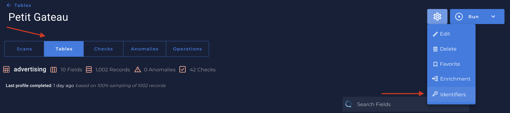
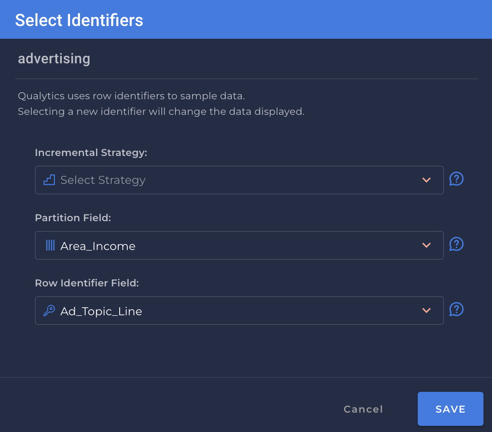

# What is an Identifier?

* `Identifier` is a Field that can be used to group records in a Table Container into distinct ordered partitions in support of incremental operations:
    1. `A whole number` - all records with the same partition_id value are considered part of the same partition.

    2. `A float or timestamp` - all records between two defined values are considered part of the same partition (the defining values will be set by incremental `Scan` / `Profile` business logic).

Since Partitions are required to support `Incremental` Operations, an Incremental Identifier is required for every Table Container. 

---

# Managing an Identifier

* You can manage an identifier in the Tables view of a selected datastore:
 
    

* In the pop-up modal, specific configuration is displayed and can be edited:
  
    {: style="height:450px"}

    1. `Strategy` - TODO add details
        * `None`
        * `Last modified`
        * `Batch value`
    2. `Partition Field`
        * A Field that can be used by Apache Spark to group the records in a Dataframe into smaller sets that fit within Spark worker’s memory. The ideal Partition Identifier is an Incremental Identifier of type `datetime`, however alternatives are identified and exposed to the user.

    !!! info
        If no partition identifier can be identified, then repeatable ordering candidates (order by fields) are used for less efficient processing of containers with a very large number of rows.

