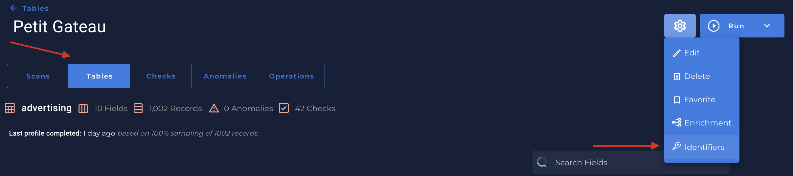
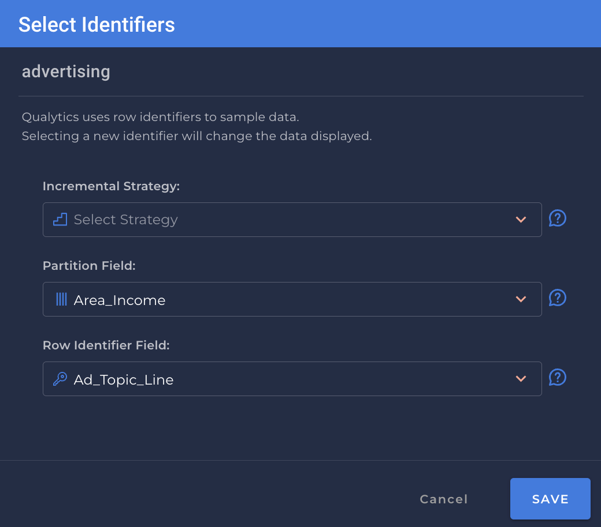

# What is an Identifier?

* `Identifier` a Field that can be used to group the records in the Table Container into distinct ordered Qualytics Partitions in support of incremental operations upon those partitions: 
    1. A whole number.
        1. Then all records with the same partition_id value are considered part of the same partition.

    2. A float or timestamp.
        1. Then all records between two defined values are considered part of the same partition (the defining values will be set by incremental scan/profile business logic).

Since Qualytics Partitions are required to support `Incremental` Operations, an Incremental Identifier is required for a Table Container to support incremental Operations. 

---

# Managing an Identifier

* You can manage an identifier in a specific table of a selected datastore:
    

* Once you clicked in `Identifiers` button, the `identifier` screen is shown:
    {: style="height:450px"}

    1. `Strategy`
        * `None`
        * `Last modified`
        * `Batch value`
    2. `Partition Field`
        * A Field that can be used by Spark to group the records in a Dataframe into smaller sets that fit within our Spark worker’s memory. The ideal Partition Identifier is an Incremental Identifier of type datetime since that can serve as both but we identify alternatives should that not be available.
    !!! info
        If no partition identifier can be identified then repeatable ordering candidates (order by fields) are used for less efficient processing of containers with a very large number of rows.

