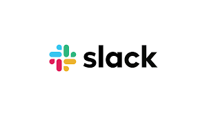
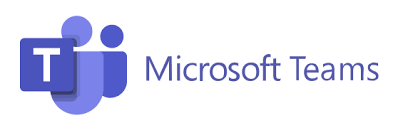

# Alerting Integrations

The Qualytics platform integrates with popular enterprise messaging platforms, such as [Slack](./alerting/slack.md) and [Microsoft Teams](./alerting/msft_teams.md) to enable real-time communication about data quality events. These integrations help ensure that your teams remain informed and can respond quickly when data issues occur.

-  Receive instant notifications when data quality issues are detected
-  Alert relevant team members about failed quality checks in real-time
-  Share operational status updates and system health notifications
-  Configure custom alerts based on data quality thresholds and conditions
-  Route notifications to specific channels or teams based on data context

These integrations ensure your teams stay informed about data quality events as they happen, enabling rapid response and maintaining continuous data quality awareness across your organization.

## Available Integration

Qualytics makes it easy to deliver alerts through the communication platforms your teams already rely on. Below are the currently supported integrations:

### Slack 

Integrate Qualytics with Slack to send real-time alerts directly to your Slack channels. This allows teams to stay on top of data quality events without switching tools.

For more detail you can refer to the [slack integration](./alerting/slack.md) documentation.

### Microsoft Teams

Connect Microsoft Teams to receive automated alerts about failed checks, system health updates, and threshold-based events right within your team chats.

For more detail you can refer to the [microsoft teams](./alerting/msft_teams.md) documentation.

