# Microsoft Teams

Microsoft Teams integration in Qualytics enables seamless communication by connecting your Microsoft Teams workspace with data quality updates and notifications. It involves configuring Azure resources, providing necessary credentials, and establishing a direct link to your Teams workspace for alerts and communication.

Let's get started 🚀

## Microsoft Teams Setup Guide

This section provides a comprehensive walkthrough to help you configure the necessary resources and retrieve the required credentials. By following this setup process, you'll have everything you need to complete the integration form.

!!! warning
    Some steps in this guide may require administrator privileges in your Microsoft Azure environment. If you don't have the necessary permissions, you might need to coordinate with your IT department or someone with administrative access to your Azure tenant.

### Creating a Microsoft Entra App Registration

The Microsoft Entra App Registration is used by Qualytics to provision Teams bot resources in your environment.

**Step 1:** Log in to to the <a href="https://portal.azure.com/#view/Microsoft_AAD_RegisteredApps/ApplicationsListBlade" target="_blank" rel="noopener">Microsoft Entra App Registrations</a>, and select New registration from the main menu to create a new application.

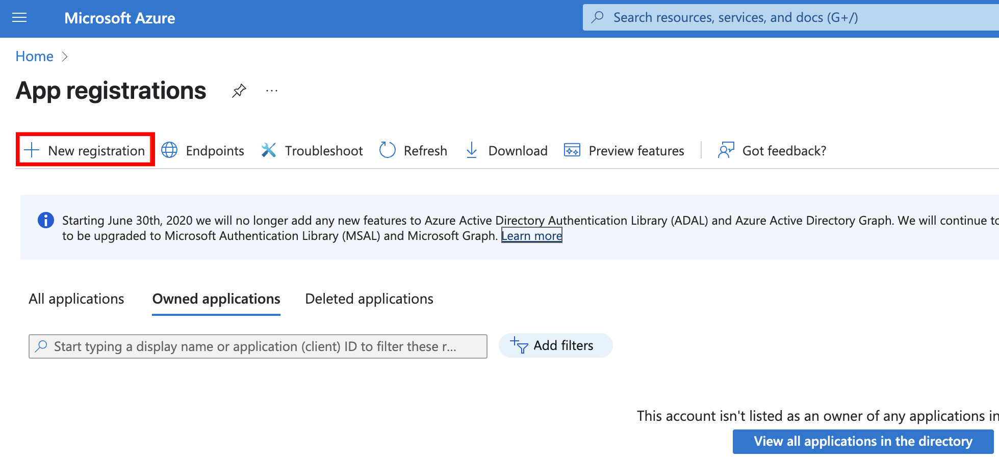

**Step 2:** You will be navigated to the **App registrations** dashboard. Fill in the required details for the app registration**:**

* **Name:** Enter a name for your app (e.g., *Qualytics Bot Manager*).

* **Supported account types:**Select Accounts in this organizational directory only (Single tenant).

* **Redirect URI:** Leave this field blank, as it is not required for this integration.

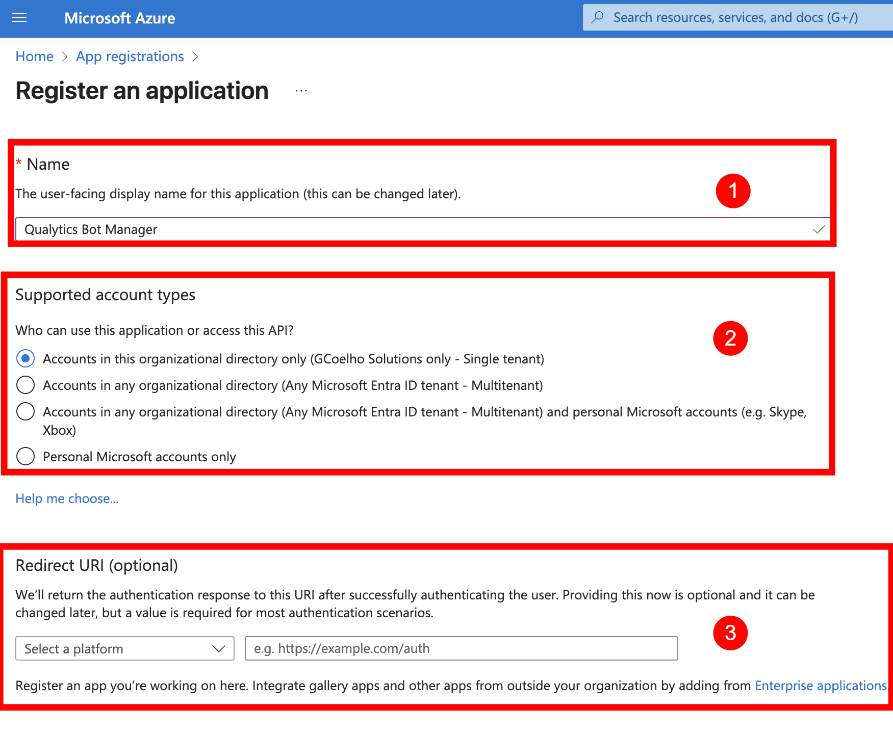

**Step 3:** Click **Register** button to complete the app registration.

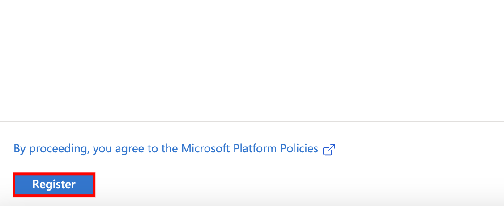

**Step 4:** After the app is registered, you’ll be redirected to the **Overview** page, where the **Application (client) ID** is displayed. Copy this ID it will be needed later for the Qualytics integration.

#### Adding API Permissions

The Microsoft Entra App needs the "Application.ReadWrite.All" permission to create and manage bot resources.

**Step 1:** Click on **Manage** from the side panel, then select **API permissions** from the dropdown.

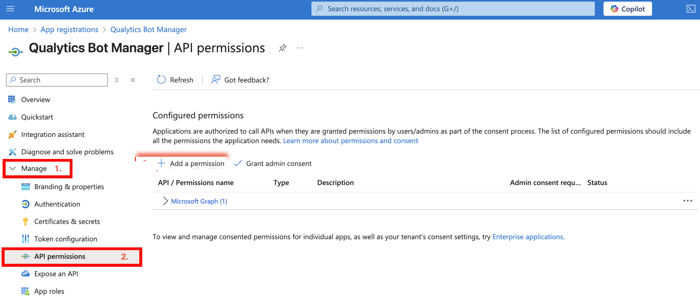

**Step 2:** Click on **Add permission** to begin configuring access permissions for the app.

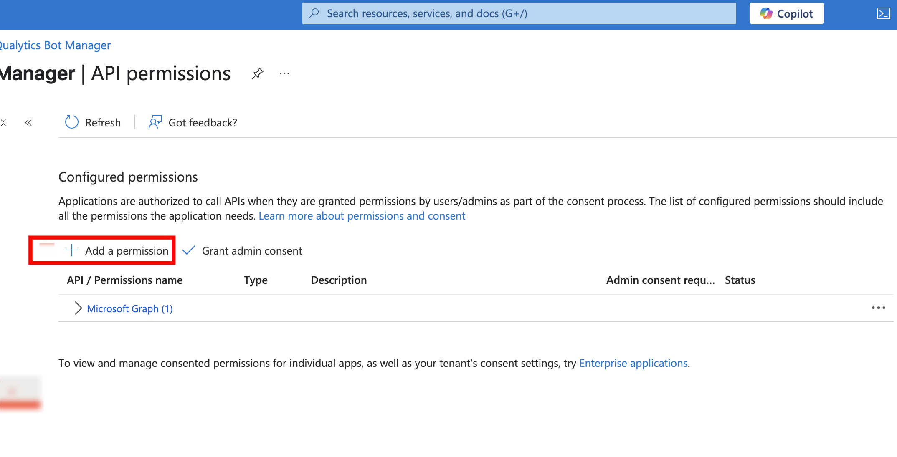

**Step 3:** A right side pannel titled **Request API permissions** will appear. Select **Microsoft Graph** from the list of options.

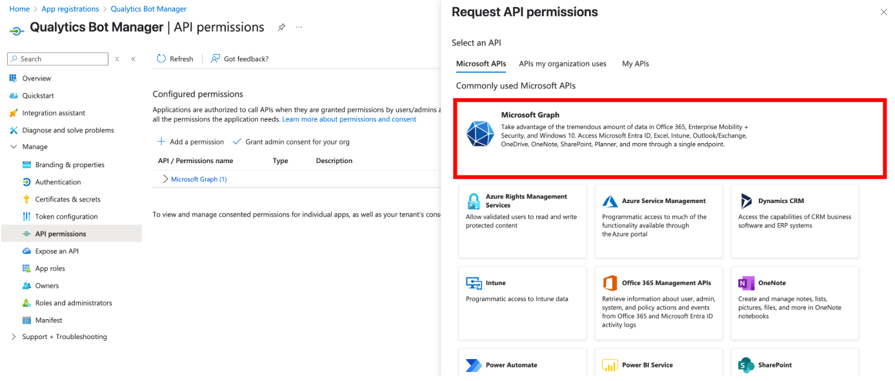

**Step 4:** After selecting **Microsoft Graph,** choose **Application permissions** to allow the app to run without a signed-in user.

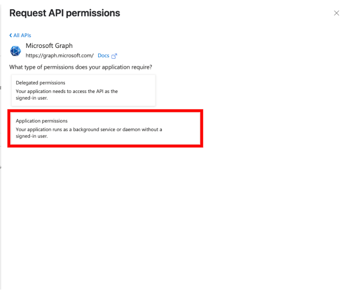

A dropdown appears search for **Application.ReadWrite.All**, check the box under **Application permissions**, and click **Add permissions**.

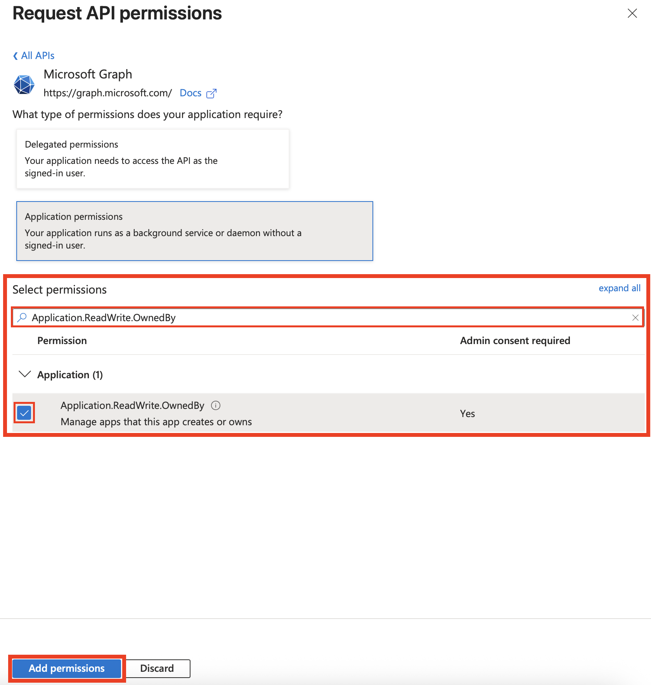

**Step 5:** Once the permission is added, you'll return to the API permissions page. Click **Grant admin consent for [Your Organization]** to approve the selected permissions and enable them for use across your organization.

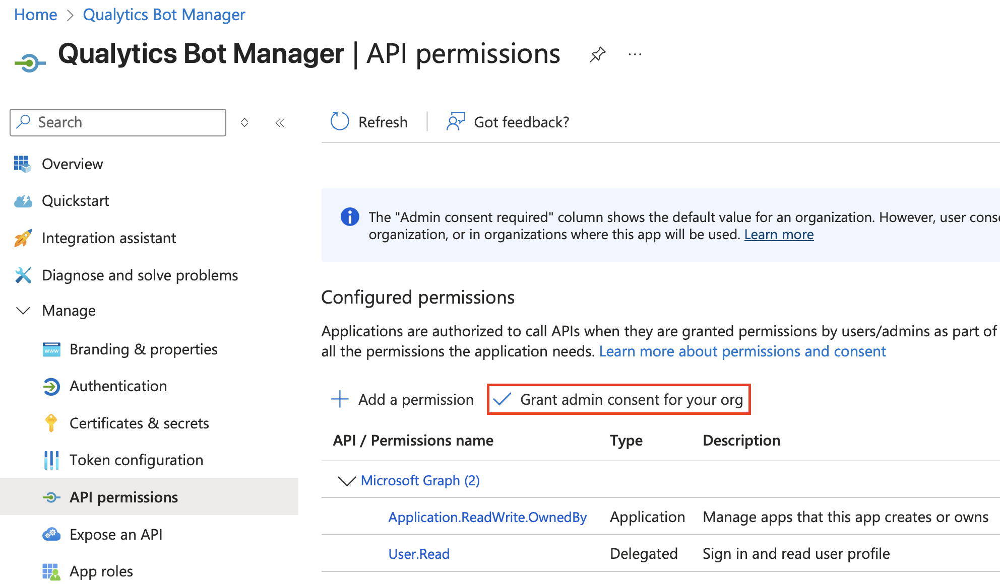

#### Creating a Client Secret

The Client Secret authorizes Qualytics to programmatically create bot resources.

**Step 1:**  Click on **Manage** from the side panel, then select **Certificates & secrets** from the dropdown.

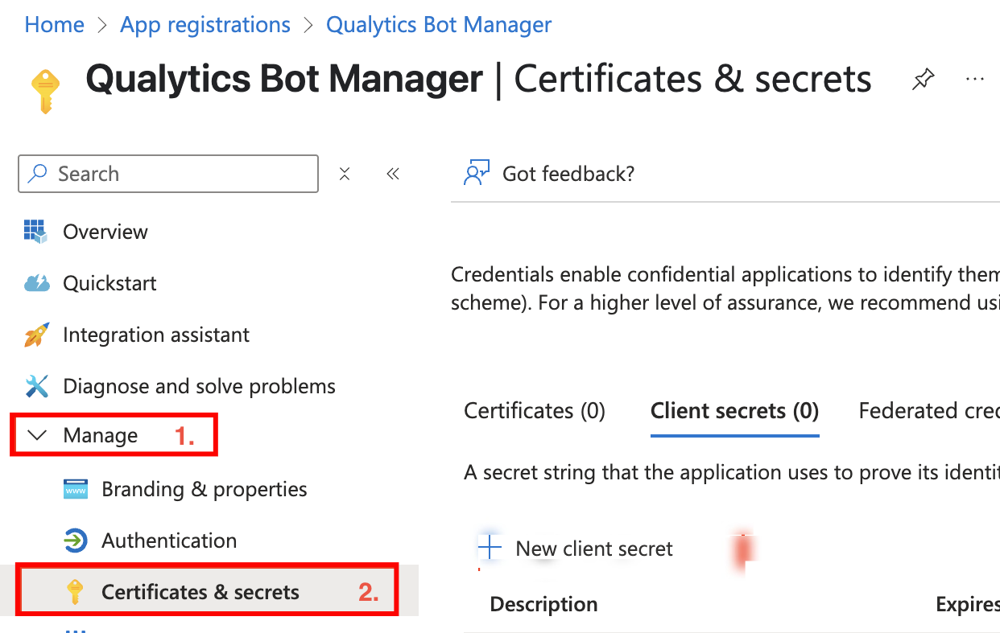

**Step 2:** Click on **+ New client secret** to generate a new secret key for the application.

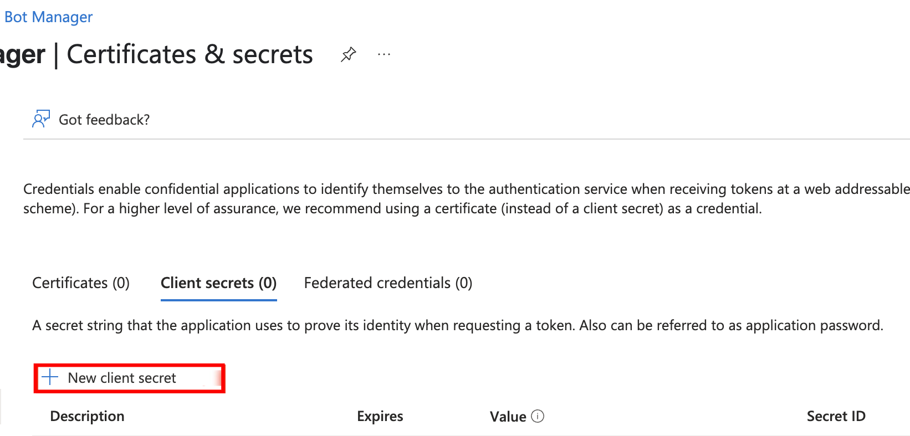

**Step 3:** After clicking **+ New client secret**, a panel will appear. Enter a description (e.g., *Qualytics Integration*) and choose an expiration period (up to 24 months). Then click **Add**.

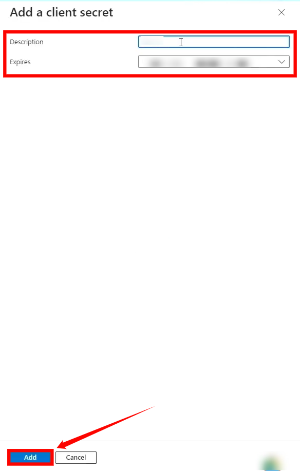

**Step 4:** Once the client secret is created, copy the **Value** immediately and save it securely. This will be used as the **App Client Secret** for the Qualytics integration.

!!! warning
    The client secret value is only displayed once immediately after creation. Make sure to copy and securely store it as you won't be able to retrieve it again.

### Retrieving the Azure Subscription ID

The Subscription ID is required to manage bot resources in your Azure environment.

**Step 1:**  Navigate to **<a href="https://portal.azure.com/#view/Microsoft_Azure_Billing/SubscriptionsBladeV2" target="_blank" rel="noopener">Subscriptions in the Azure Portal</a>** and select the subscription you want to use for the Teams integration.

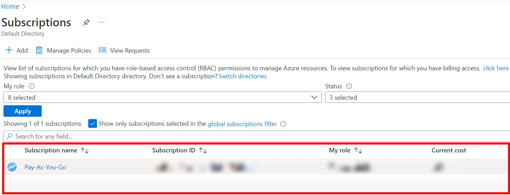

**Step 2:** Copy the **Subscription ID** from the Overview section of your selected subscription. This ID is required later to assign roles and permissions for the Microsoft Teams integration.

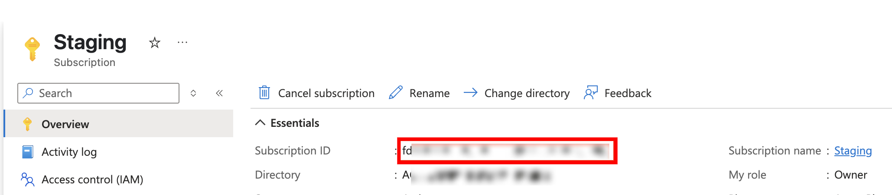

#### Verifying the Microsoft Bot Service

You need to verify if the Microsoft Bot Service resource provider is registered in your subscription.

**Step 1:** Click on **Settings** in the left-hand menu, then select **Resource providers** from the dropdown.

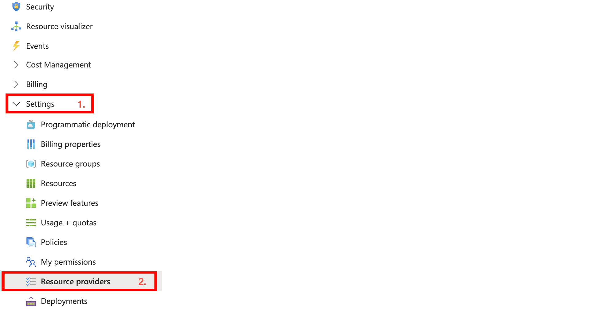

**Step 2:**Search for **Microsoft.BotService** in the provider list and check that the **Status** is **Registered.**

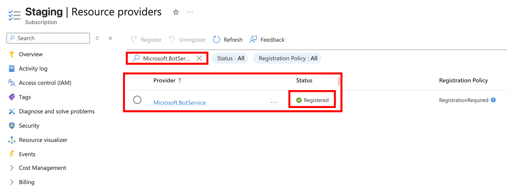

!!! note
    The step 3 is only required if the resource provider is not already registered. If the Microsoft.BotService provider is already marked as "Registered" in your subscription, you can skip this step.

**Step 3:** Click **Register** to enable the resource provider if it's not already registered.

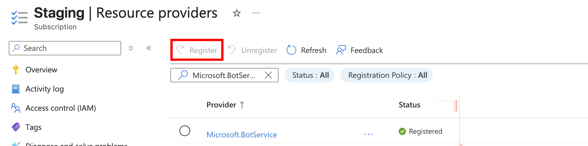

### Setting Up the Resource Group

The Resource Group will hold and manage the bot resources created by Qualytics.

**Step 1:** Navigate to <a href="https://portal.azure.com/#browse/resourcegroups" target="_blank" rel="noopener">Resource Groups in the Azure Portal</a> and click **Create a resource** to set up a new resource group if you don’t already have one.

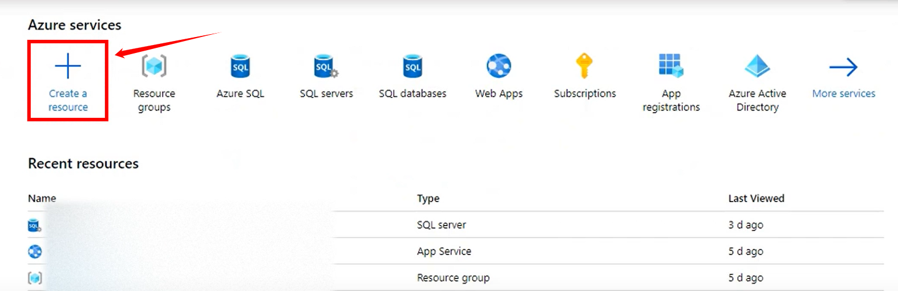

**Step 2:** Choose your **Subscription**, enter a Resource group name (e.g., **`qualytics-msft-teams-rg`**), select a **Region**, and then click **Review + create**.

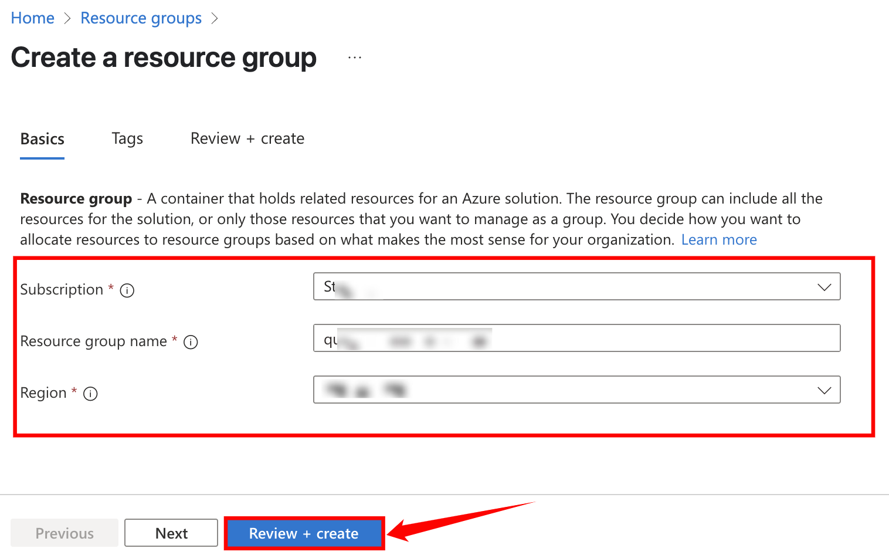

**Step 3:** After clicking **Review + create,** you'll see a summary of the details. Once validated, click **Create.**

!!! note
    Once created, note the **Resource Group name** for the Qualytics integration.

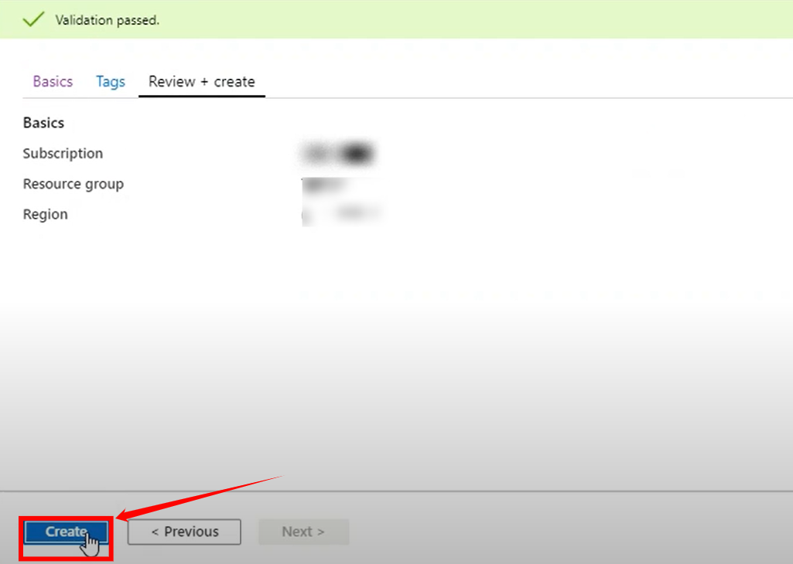

#### Assigning the Azure Bot Service Contributor Role

The Microsoft Entra App needs the "Azure Bot Service Contributor" role to manage bot resources.

**Step 1:** Navigate to your Resource Group and select **Access control (IAM)** from the left menu and click on  the **Add** and select **Add Role Assignment** from the dropdown.

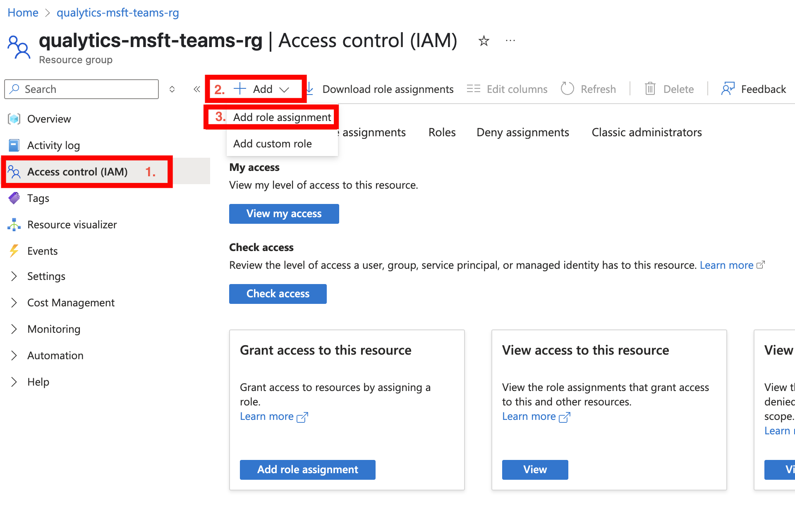

**Step 2:** You’ll be navigated to the **Add role assignment** tab. In the Role section, search and select **Azure Bot Service Contributor Role,** then click the **Next** button to continue.

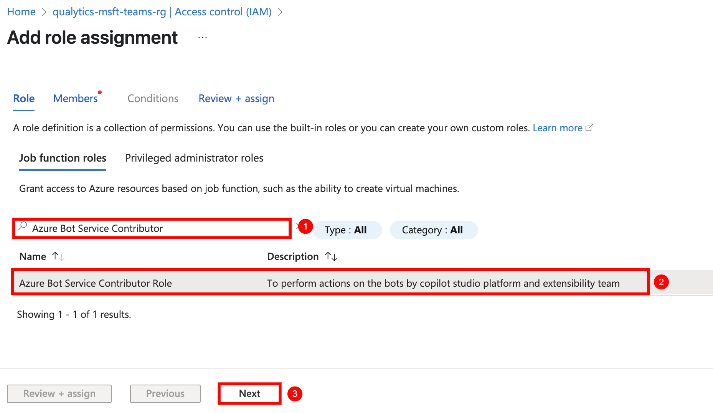

**Step 3:** You will be navigated to the **Members** tab. Under **Assign access to,** select **User, group, or service principal,** then click on **Select members.**

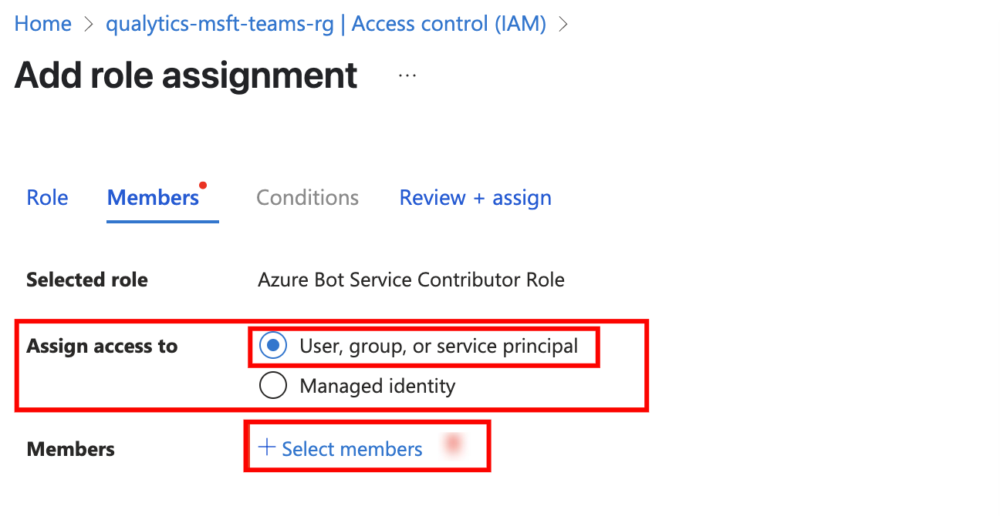

A **Select members** panel will appear. Search for the **Microsoft Entra app** you created earlier **(e.g., *Qualytics Bot Manager*),** select it from the list, and click on the **Select** button**.**

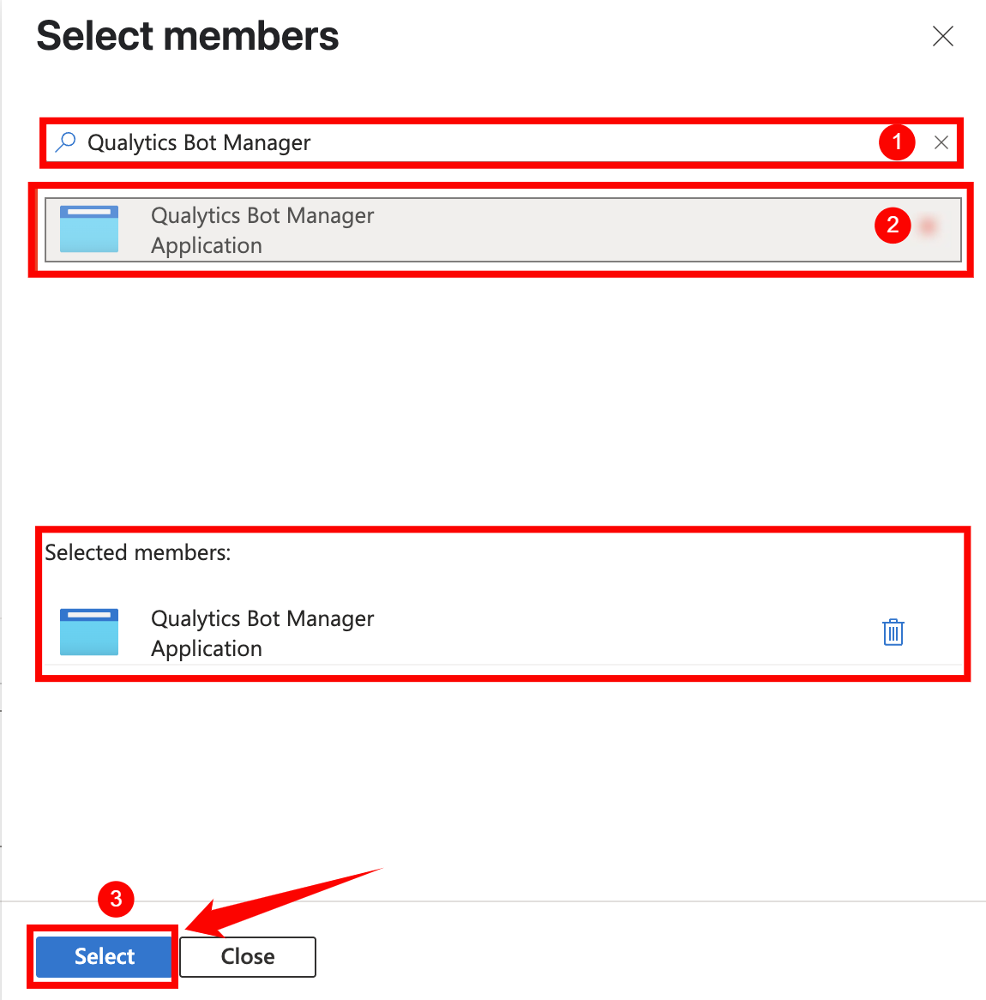

!!! tip
    Enterprise Applications will only appear in the search results when you start typing the exact name used in your Entra App registration. If you don't see your app immediately, try typing the full name as you entered it when creating the app.

**Step 4:** Click on **Review + assign** from the navigation bar and confirm the role assignment then click on **Review + assign** button.

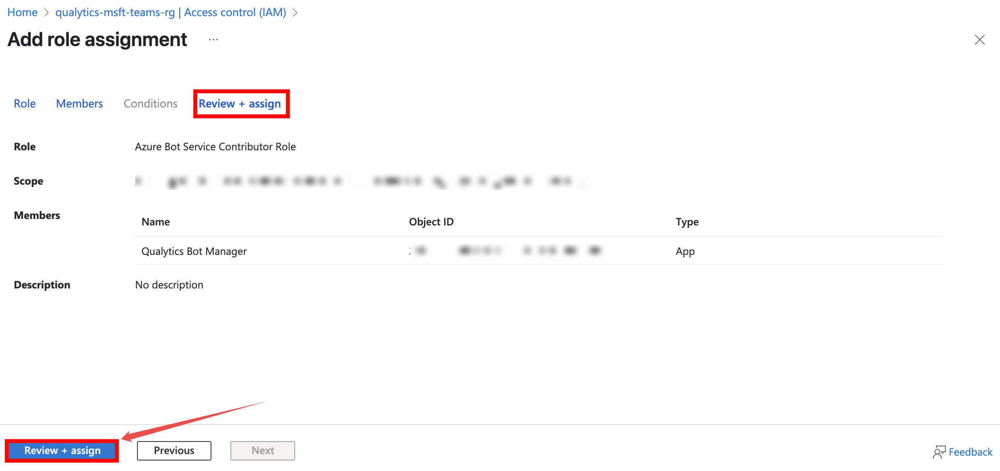

### Getting Your Microsoft Teams Link

You need to provide the link to your Microsoft Teams workspace.

**Step 1:** Log in to your Microsoft Teams desktop or web application. Navigate to the team where you want to receive Qualytics notifications, then right-click on the team name and select **Get link to team**.

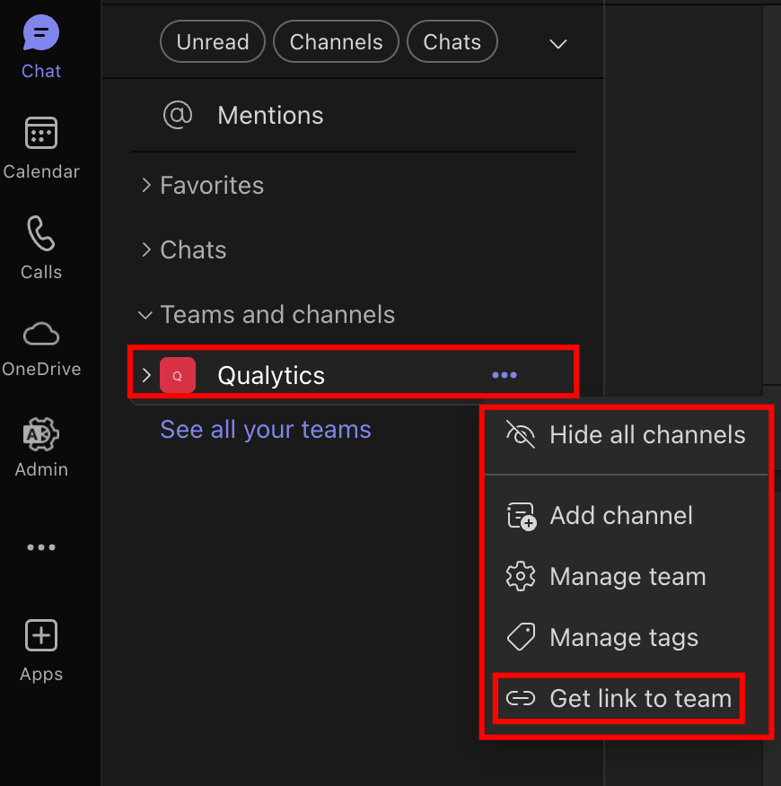

**Step 2:** A modal window titled **Get a link to the team** will appear. Click the **Copy** button to copy the team link.

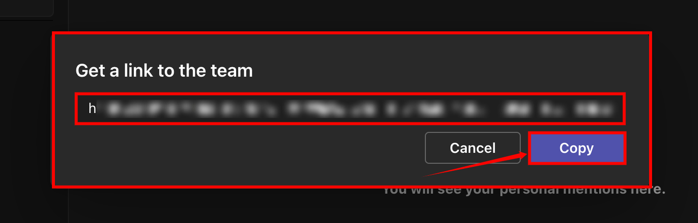

### Integration Summary

Now that you've gathered all the necessary information and configured the Azure resources, you're ready to integrate Microsoft Teams with Qualytics.

In the next section, we'll walk through the steps to access the Qualytics integration interface and enter these credentials to establish the connection between Qualytics and Microsoft Teams.

## Navigation to Integration

**Step 1:** Log in to your Qualytics account and click the **"Settings"** button on the left side panel of the interface.

**Step 2:** By default, Connections tab will open. Click on the **Integrations** tab.

## Connect Microsoft Teams Integration

Connect Microsoft Teams by providing necessary Azure credentials, configuring bot resources, and establishing a direct link to your Teams workspace for secure communication.

**Step 1:** Click on the **Connect** button next to Microsoft Teams to connect to the Teams Integration.

A modal window titled **"Add Microsoft Teams Integration"** appears. Fill in the connection properties to connect to Microsoft Teams.

**Step 2:** Fill out the required provisioning properties for the Microsoft Teams integration:

| No. | Field Name | Description |
| :---- | :---- | :---- |
| 1. | App Client ID | The Application (client) ID from the Overview page of your Entra App registration. |
| 2. | App Client Secret | The secret value you copied after creating a new client secret in your Entra App. |
| 3. | Azure Subscription ID | The Subscription ID you copied from the Azure Subscriptions page. |
| 4. | Azure Resource Group Name | The name of the Resource Group you created or selected for bot resources. |
| 5. | Microsoft Teams Link | The team link you copied from Microsoft Teams using the "Get link to team" option. |

**Step 3:** Click the **Provision and Next** button to provision the app resources and proceed with publishing the Qualytics app to the Microsoft Teams App Catalog.

!!! note
    Provisioning the app resources may take around 15 seconds to complete.

Once the app resources have been successfully provisioned, a confirmation message will appear stating, **"The Teams app resources have been successfully provisioned."**

**Step 4:** Click the **Publish** button to publish the Qualytics app to your organization's Microsoft Teams App Catalog.

!!! warning
    Microsoft may take up to 24 hours to make the app available in Teams after it's published.

## Completing the Teams Integration

After publishing the app to your organization's Teams App Catalog, the integration will show a **"Pending"** status in Qualytics until the app is installed in a Teams channel.

### Installing the App in Microsoft Teams

To complete the integration, you need to install the Qualytics app in Microsoft Teams:

**Step 1:** Log in to your Microsoft Teams desktop or web application and click on **Apps** in the left sidebar.

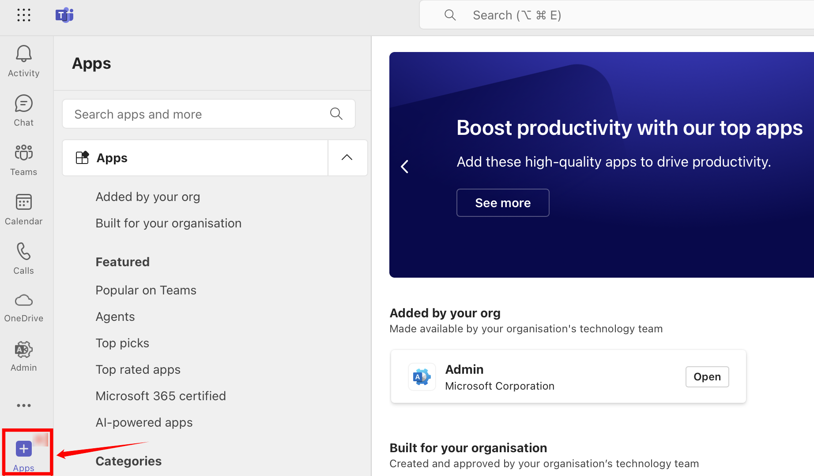

**Step 2:** After click on apps you will navigated to app dashboard. Select Built for your org to see custom apps for your organization and select the "Qualytics" app.

!!! note
    If you don't see the app immediately, it might still be propagating through Microsoft's systems. This can take up to 24 hours.

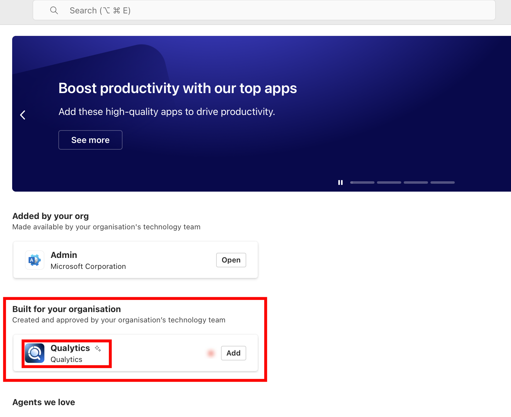

**Step 3:** Click **Add** to begin the installation process.

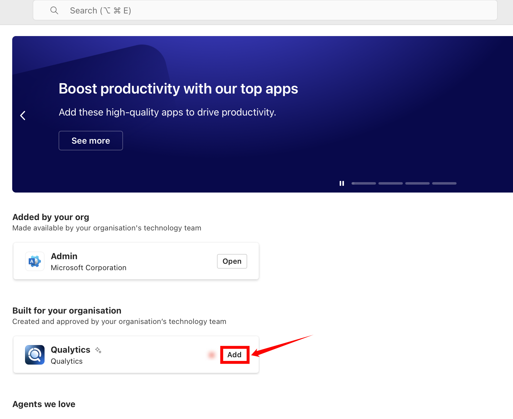

**Step 4:** After clicking the Add button, a window will appear prompting you to select a team and channel where you want to add the Qualytics app. Once selected, click Go to complete the installation.

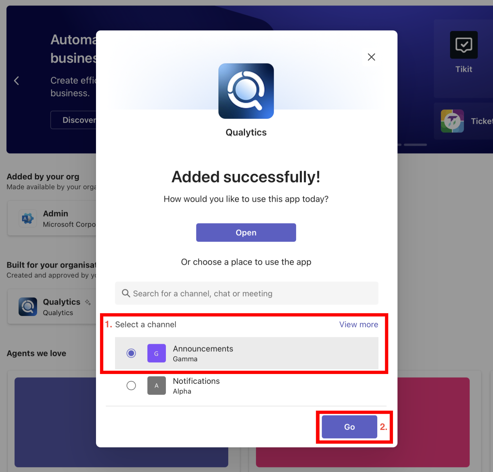

When you add the app to a team and channel, Qualytics will automatically detect the installation. You may need to refresh your browser to see the status update from **"Pending"** to **"Connected"** in the Qualytics Integrations page.

### Manual Verification (optional)

!!! important
    Manual verification serves as a fallback method if Qualytics doesn't automatically detect the app installation after adding it to a channel. If the status remains "Pending" after installing the app and refreshing the Qualytics page, use this manual verification process to complete the integration.

To manually verify the integration:

**Step 1:** Return to the Qualytics Integrations page and click on the **Verify app installation** button next to the Microsoft Teams integration.

When the verification is successful, the integration status will change to **"Connected"**, indicating that Qualytics can now send notifications to your Microsoft Teams workspace.

