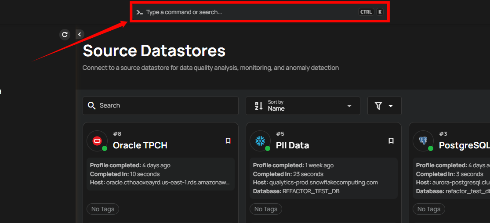
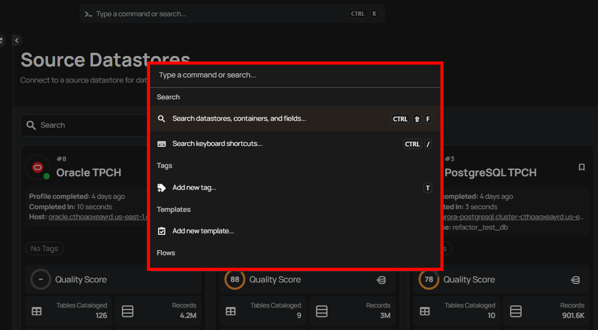
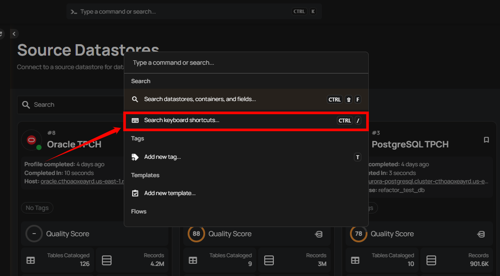
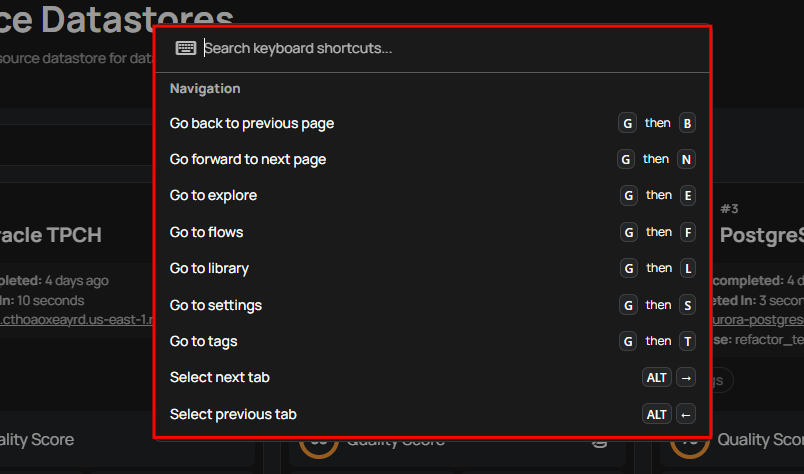
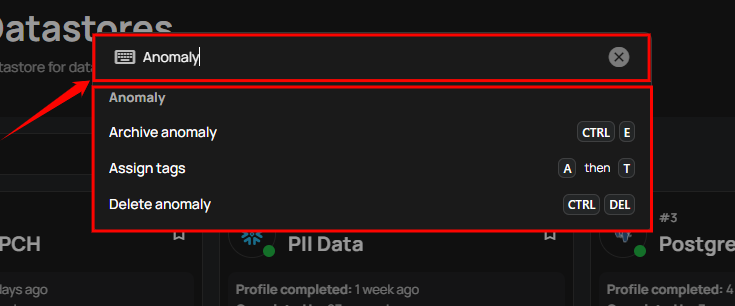

# Keyboard Shortcuts

Qualytics offers a comprehensive set of keyboard shortcuts to reduce mouse usage and accelerate everyday tasks. These shortcuts enable you to navigate the platform, run operations, manage checks, and update entities directly from the keyboard.

## 🔎 Understanding the Search Bar

The search bar at the top of the Qualytics dashboard functions as a **Command Bar**, not a direct asset search field.

The Command Bar is designed to:

- Navigate to product areas (Explore, Flows, Library, Settings, Tags)
- Run operations (sync, scan, export, profile, materialize)
- Create new entities (checks, templates, flows, tags)
- Open documentation (User Guide, API Docs)
- View keyboard shortcuts

Pressing **Enter** in this bar executes the currently highlighted command.

!!! important
    The top search bar does not always return datastore, container, or field results directly. To search for data assets (such as fields like `DOB`, `DOD`, containers, or datastores), use **Asset Search** (`Ctrl/⌘ + Shift + F`).

Let’s get started 🚀

**Step 1:** Log in to your Qualytics account and click on the **Search** bar at the top of the dashboard.

Alternatively, you can press **Ctrl + K** on Windows/Linux or **⌘ + K** on macOS to open the Search bar directly.

A popup window will appear, presenting various search options.

### ⚠️ How the Enter Key Works in the Command Bar

When you type in the top search bar and press **Enter**, the system executes the **currently highlighted command** in the dropdown list.

The Command Bar is designed to run commands — it does not automatically perform an asset search.

Depending on what is selected, pressing Enter may:

- Open a documentation page  
- Navigate to another section of the application  
- Run an operation  
- Open settings  
- Trigger another available command  

This is expected behavior.

#### 🔎 Example

- If you type **API** and the highlighted option is **Open API docs**, pressing **Enter** will open the API documentation page.

- If you type **Flows** and **Go to Flows** is highlighted, pressing **Enter** will navigate to the Flows page.

In both cases, the system is executing the selected command — not performing a data asset search.

### 🔎 If You Want to Search for Assets

To search for datastores, containers, or fields (for example, `DOB` or `DOD`), use one of the following methods:

#### Option 1: Keyboard Shortcut

- **Windows/Linux:** `Ctrl + Shift + F`
- **macOS:** `⌘ + Shift + F`

#### Option 2: From the Command Bar

1. Open the Command Bar:

- `Ctrl + K` (Windows/Linux) or `⌘ + K` (macOS)

2. Select **Search datastores, containers, and fields**

3. Enter your search term

This ensures you are using **Asset Search mode** instead of executing a command.

**Step 2:** Click on **Search Keyboard Shortcuts** to see all the shortcuts in one place.

A window will appear, displaying a comprehensive list of all shortcuts organized by category.

**Step 3:** You can now either search for a specific shortcut or scroll through the list to see all available options.

Qualytics supports a wide range of keyboard shortcut categories, including but not limited to:

| No. | Shortcut Category |
|-----|--------------------|
| 1.  | [Navigation](#navigation) |
| 2.  | [Anomaly](#anomaly) |
| 3.  | [Check](#check) |
| 4.  | [Checks](#checks) |
| 5.  | [Container](#container) |
| 6.  | [Datastore](#datastore) |
| 7.  | [Enrichment](#enrichment) |
| 8.  | [Field](#field) |
| 9.  | [Flow](#flow) |
| 10. | [Flow Execution](#flow-execution) |
| 11. | [Interface](#interface) |
| 12. | [Operations](#operations) |
| 13. | [Search](#search) |
| 14. | [Tags](#tags) |
| 15. | [Template](#template) |

### Search

> The Search shortcuts below are specifically for asset search and keyboard shortcut lookup. The top search bar (`Ctrl/⌘ + K`) is a Command Bar for navigation and actions.

The Search Shortcuts allow you to quickly find datastores, containers, fields, and view the complete list of shortcuts.

| Action | Windows/Linux | macOS |
|--------|--------------|--------|
| Search datastores, containers, and fields | Ctrl + Shift + F | ⌘ + Shift + F |
| Search keyboard shortcuts | Ctrl + / | ⌘ + / |

### Navigation

The Navigation Shortcuts make it easy to move between pages, switch tabs, and access core areas of the Qualytics platform efficiently.

| Action | Windows/Linux | macOS |
|--------|--------------|--------|
| Go back to previous page | G then B | G then B |
| Go forward to next page | G then N | G then N |
| Go to explore | G then E | G then E |
| Go to flows | G then F | G then F |
| Go to library | G then L | G then L |
| Go to settings | G then S | G then S |
| Go to tags | G then T | G then T |
| Select next tab | Alt + → | ⌥ + → |
| Select previous tab | Alt + ← | ⌥ + ← |

### Anomaly

The Anomaly Shortcuts provide quick actions for archiving, deleting, or tagging anomalies, helping you manage data issues faster.

| Action | Windows/Linux | macOS |
|--------|--------------|--------|
| Archive anomaly | Ctrl + E | ⌘ + E |
| Assign tags | A then T | A then T |
| Delete anomaly | Ctrl + Del | ⌘ + Del |

### Check

The Check Shortcuts give you instant access to actions like editing, archiving, tagging, or favoriting checks directly from the keyboard.

| Action | Windows/Linux | macOS |
|--------|--------------|--------|
| Archive check | Ctrl + E | ⌘ + E |
| Assign tags | A then T | A then T |
| Delete check | Ctrl + Del | ⌘ + Del |
| Edit check | E | E |
| Mark as favorite | Alt + F | ⌥ + F |

### Checks

The Checks Shortcuts are focused on creating new checks, whether from scratch or from templates, to speed up your validation process.

| Action | Windows/Linux | macOS |
|--------|--------------|--------|
| Add multiple checks from template | Ctrl + Shift + C | ⌘ + Shift + C |
| Add new check from template | Shift + C | Shift + C |
| Add new check | C | C |

### Container

The Container Shortcuts let you manage containers efficiently by assigning tags, editing, deleting, or marking them as favorites.

| Action | Windows/Linux | macOS |
|--------|--------------|--------|
| Assign tags | A then T | A then T |
| Delete container | Ctrl + Del | ⌘ + Del |
| Mark as favorite | Alt + F | ⌥ + F |
| Open container settings | E | E |

### Datastore

The Datastore Shortcuts simplify datastore management, allowing you to quickly assign tags, edit, delete, or favorite a datastore.

| Action | Windows/Linux | macOS |
|--------|--------------|--------|
| Assign tags | A then T | A then T |
| Delete datastore | Ctrl + Del | ⌘ + Del |
| Edit datastore | E | E |
| Mark as favorite | Alt + F | ⌥ + F |

### Enrichment

The Enrichment Shortcuts provide fast access to edit or delete enrichment configurations without leaving the keyboard.

| Action | Windows/Linux | macOS |
|--------|--------------|--------|
| Delete enrichment | Ctrl + Del | ⌘ + Del |
| Edit enrichment | E | E |

### Field

The Field Shortcuts help you manage fields by assigning tags, editing details, or deleting computed fields directly from the keyboard.

| Action | Windows/Linux | macOS |
|--------|--------------|--------|
| Assign tags | A then T | A then T |
| Delete computed field | Ctrl + Del | ⌘ + Del |
| Edit field | E | E |

### Flow

The Flow Shortcuts allow you to clone, delete, execute, or publish flows efficiently, reducing time spent in menus.

| Action | Windows/Linux | macOS |
|--------|--------------|--------|
| Clone flow | Ctrl + D | ⌘ + D |
| Delete flow | Ctrl + Del | ⌘ + Del |
| Execute flow | Ctrl + Enter | ⌘ + Enter |
| Publish flow | P | P |

### Flow Execution

The Flow Execution Shortcuts are designed for quick deletion of flow execution records to keep your workspace clean.

| Action | Windows/Linux | macOS |
|--------|--------------|--------|
| Delete flow execution | Ctrl + Del | ⌘ + Del |

### Interface

The Interface Shortcuts let you control the look and feel of the platform, such as collapsing the sidebar or switching themes.

| Action | Windows/Linux | macOS |
|--------|--------------|--------|
| Collapse navigation sidebar | Ctrl + B | ⌘ + B |
| Switch theme | Ctrl + Shift + L | ⌘ + Shift + L |

### Operations

The Operations Shortcuts provide fast commands for running sync, export, materialize, profile, and scan operations on datastores.

| Action | Windows/Linux | macOS |
|--------|--------------|--------|
| Run sync operation | R then C | R then C |
| Run export operation | R then E | R then E |
| Run materialize operation | R then M | R then M |
| Run profile operation | R then P | R then P |
| Run scan operation | R then S | R then S |

### Tags

The Tags Shortcuts let you quickly add new tags to classify and organize your data assets.

| Action | Windows/Linux | macOS |
|--------|--------------|--------|
| Add new tag | T | T |

### Template

The Template Shortcuts cover editing and archiving templates, helping you maintain reusable patterns with ease.

| Action | Windows/Linux | macOS |
|--------|--------------|--------|
| Archive template | Ctrl + E | ⌘ + E |
| Edit template | E | E |
