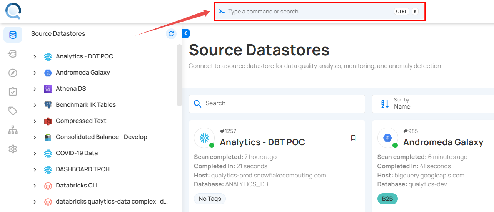
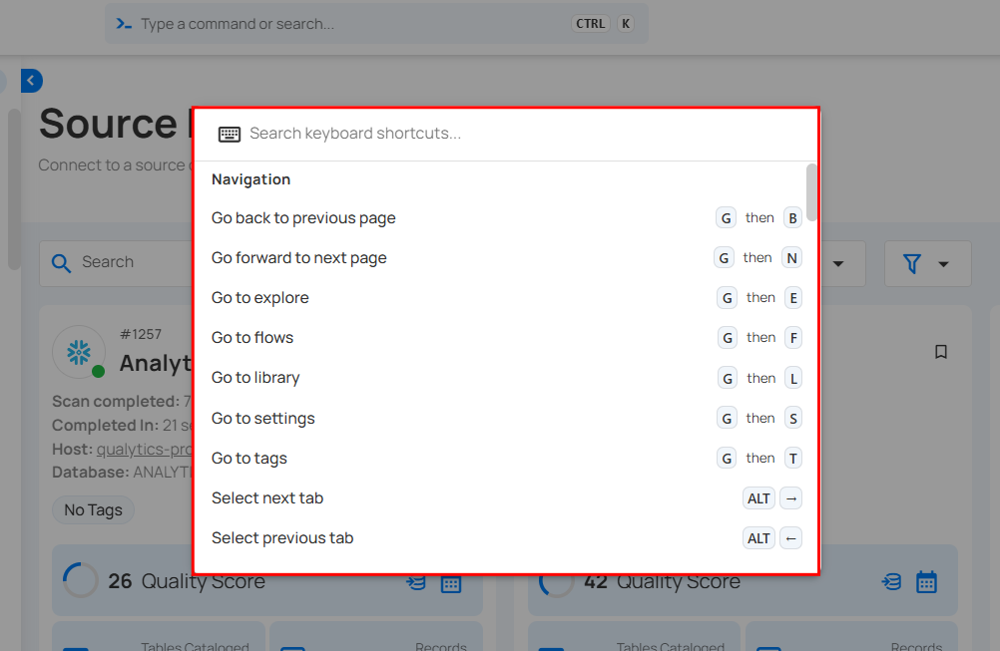

# Keyboard Shortcuts

Qualytics offers a comprehensive set of keyboard shortcuts to reduce mouse usage and accelerate everyday tasks. These shortcuts enable you to navigate the platform, run operations, manage checks, and update entities directly from the keyboard.

Let’s get started 🚀

**Step 1:** Log in to your Qualytics account and click on the **Search** bar at the top of the dashboard.

Alternatively, you can press **Ctrl + K** on Windows/Linux or **⌘ + K** on macOS to open the Search bar directly.

A popup window will appear, presenting various search options.

**Step 2:** Click on **Search Keyboard Shortcuts** to see all the shortcuts in one place.

A window will appear, displaying a comprehensive list of all shortcuts organized by category.

**Step 3:** You can now either search for a specific shortcut or scroll through the list to see all available options.

Qualytics supports a wide range of keyboard shortcut categories, including but not limited to:

| No. | Shortcut Category |
|-----|--------------------|
| 1.   | [Navigation](#navigation) |
| 2.  | [Anomaly](#anomaly) |
| 3.   | [Check](#check) |
| 4.   | [Checks](#checks) |
| 5.   | [Container](#container) |
| 6.   | [Datastore](#datastore) |
| 7.   | [Enrichment](#enrichment) |
| 8.   | [Field](#field) |
| 9.   | [Flow](#flow) |
| 10.  | [Flow Execution](#flow-execution) |
| 11.  | [Interface](#interface) |
| 12.  | [Operations](#operations) |
| 13.  | [Search](#search) |
| 14.  | [Tags](#tags) |
| 15.  | [Template](#template) |

The table below shows the available shortcuts and the keys you can use to perform actions with your keyboard:

### Search

The Search Shortcuts allow you to quickly find datastores, containers, fields, and even view the complete list of shortcuts without navigating through menus.

| Action                          | Windows/Linux | macOS        |
|---------------------------------------------|---------------|--------------|
| Search datastores, containers, and fields   | Ctrl + ↑ + F  | ⌘ + ↑ + F  |
| Search keyboard shortcuts                   | Ctrl + /      | ⌘ + /      |

### Navigation

The Navigation Shortcuts make it easy to move between pages, switch tabs, and access core areas of the Qualytics platform efficiently.

| Action                           | Windows/Linux | macOS        |
|---------------------------------------------|---------------|--------------|
| Go back to previous page                    | G then B      | G then B     |
| Go forward to next page                     | G then N      | G then N     |
| Go to explore                               | G then E      | G then E     |
| Go to flows                                 | G then F      | G then F     |
| Go to library                               | G then L      | G then L     |
| Go to settings                              | G then S      | G then S     |
| Go to tags                                  | G then T      | G then T     |
| Select next tab                             | Alt + →       | ⌥ + →   |
| Select previous tab                         | Alt + ←       | ⌥ + ←   |

### Anomaly

The Anomaly Shortcuts provide quick actions for archiving, deleting, or tagging anomalies, helping you manage data issues faster.

| Action                           | Windows/Linux | macOS        |
|---------------------------------------------|---------------|--------------|
| Archive anomaly                             | Ctrl + E      | ⌘ + E      |
| Assign tags                                 | A then T      | A then T     |
| Delete anomaly                              | Ctrl + Del    | ⌘ + Del    |

### Check

The Check Shortcuts give you instant access to actions like editing, archiving, tagging, or favoriting checks directly from the keyboard.

| Action                            | Windows/Linux | macOS        |
|---------------------------------------------|---------------|--------------|
| Archive check                               | Ctrl + E      | ⌘ + E      |
| Assign tags                                 | A then T      | A then T     |
| Delete check                                | Ctrl + Del    | ⌘ + Del    |
| Edit check                                  | E             | E            |
| Mark as favorite                            | Alt + F       | ⌥ + F   |

### Checks

The Checks Shortcuts are focused on creating new checks, whether from scratch or from templates, to speed up your validation process.

| Action                          | Windows/Linux   | macOS          |
|---------------------------------------------|-----------------|----------------|
| Add multiple checks from template           | Ctrl + Shift + C| ⌘ + Shift + C|
| Add new check from template                 | Shift + C       | Shift + C      |
| Add new check                               | C               | C              |

### Container

The Container Shortcuts let you manage containers efficiently by assigning tags, editing, deleting, or marking them as favorites.

| Action                        | Windows/Linux | macOS        |
|---------------------------------------------|---------------|--------------|
| Assign tags                                 | A then T      | A then T     |
| Delete container                            | Ctrl + Del    | ⌘ + Del    |
| Mark as favorite                            | Alt + F       | ⌥ + F   |
| Open container settings                     | E             | E            |

### Datastore

The Datastore Shortcuts simplify datastore management, allowing you to quickly assign tags, edit, delete, or favorite a datastore.

| Action                          | Windows/Linux | macOS        |
|---------------------------------------------|---------------|--------------|
| Assign tags                                 | A then T      | A then T     |
| Delete datastore                            | Ctrl + Del    | ⌘ + Del    |
| Edit datastore                              | E             | E            |
| Mark as favorite                            | Alt + F       | ⌥ + F   |

### Enrichment

The Enrichment Shortcuts provide fast access to edit or delete enrichment configurations without leaving the keyboard.

| Action                          | Windows/Linux | macOS        |
|---------------------------------------------|---------------|--------------|
| Delete enrichment                           | Ctrl + Del    | ⌘ + Del    |
| Edit enrichment                             | E             | E            |

### Field

The Field Shortcuts help you manage fields by assigning tags, editing details, or deleting computed fields directly from the keyboard.

| Action                          | Windows/Linux | macOS        |
|---------------------------------------------|---------------|--------------|
| Assign tags                                 | A then T      | A then T     |
| Delete computed field                       | Ctrl + Del    | ⌘ + Del    |
| Edit field                                  | E             | E            |

### Flow

The Flow Shortcuts allow you to clone, delete, execute, or publish flows efficiently, reducing time spent in menus.

| Action                        | Windows/Linux | macOS        |
|---------------------------------------------|---------------|--------------|
| Clone flow                                  | Ctrl + D      | ⌘ + D      |
| Delete flow                                 | Ctrl + Del    | ⌘ + Del    |
| Execute flow                                | Ctrl + Enter  | ⌘ + Enter  |
| Publish flow                                | P             | P            |

### Flow Execution

The Flow Execution Shortcuts are designed for quick deletion of flow execution records to keep your workspace clean.

| Action                          | Windows/Linux | macOS        |
|---------------------------------------------|---------------|--------------|
| Delete flow execution                       | Ctrl + Del    | ⌘ + Del    |

### Interface

The Interface Shortcuts let you control the look and feel of the platform, such as collapsing the sidebar or switching themes.

| Action                           | Windows/Linux   | macOS          |
|---------------------------------------------|-----------------|----------------|
| Collapse navigation sidebar                 | Ctrl + B        | ⌘ + B        |
| Switch theme                                | Ctrl + Shift + L| ⌘ + Shift + L|

### Operations

The Operations Shortcuts provide fast commands for running catalog, export, materialize, profile, and scan operations on datastores.

| Action                          | Windows/Linux | macOS        |
|---------------------------------------------|---------------|--------------|
| Run catalog operation                       | R then C      | R then C     |
| Run export operation                        | R then E      | R then E     |
| Run materialize operation                   | R then M      | R then M     |
| Run profile operation                       | R then P      | R then P     |
| Run scan operation                          | R then S      | R then S     |

### Tags

The Tags Shortcuts let you quickly add new tags to classify and organize your data assets.

| Action                       | Windows/Linux | macOS        |
|---------------------------------------------|---------------|--------------|
| Add new tag                                 | T             | T            |

### Template

The Template Shortcuts cover editing and archiving templates, helping you maintain reusable patterns with ease.

| Action                           | Windows/Linux | macOS        |
|---------------------------------------------|---------------|--------------|
| Archive template                            | Ctrl + E      | ⌘ + E      |
| Edit template                               | E             | E            |
