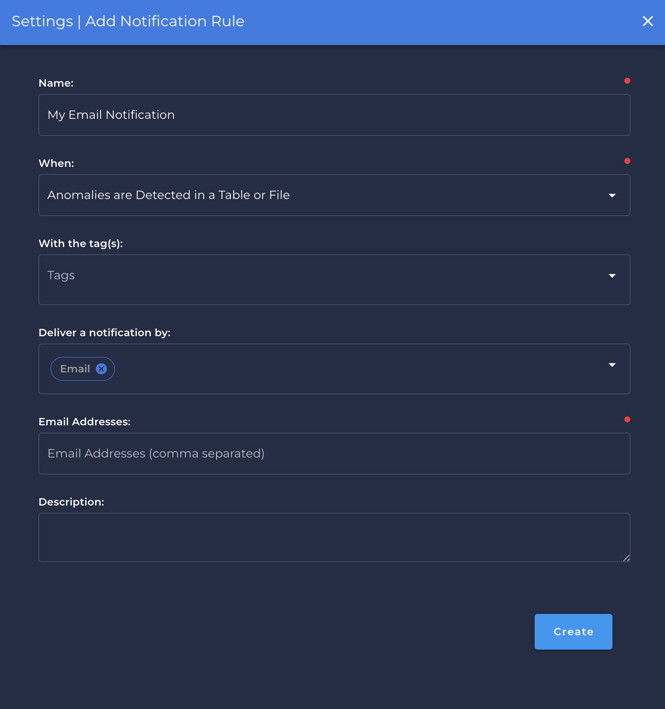

# Email

## Steps to setup Email

---

{: style="width:550px;"}

### `Name` <spam id='required'>`required`</spam>

* The notification name to be created in Qualytics App.

### `When` <spam id='required'>`required`</spam>

* Is `When` the notification will be triggered:
    * `An Operation Completes`.
    * `Anomalies are Detected in a Table or File`.
    * `An Anomaly is Detected`.
    * `Freshness SLA Violation`.

### `With the Tags` 
* Is the tag that will be show during the notification.   
!!! info
    You can create any tags if necessary to be shown during the notification.

### `Deliver a notification by`
* You can select multiple services for the same `Notification` category.

### `Email Addresses` <spam id='required'>`required`</spam>
* You can add the `email` of the group or a person who will receive the email notification. If you have more than one, you sould separate by comma.

```text
    boss@corporation.com, vice-president@corporation.com, dataengineering@corporation.com
```

### `Description`
* You can add a detailed description of why this notification is being created or some additional information.
