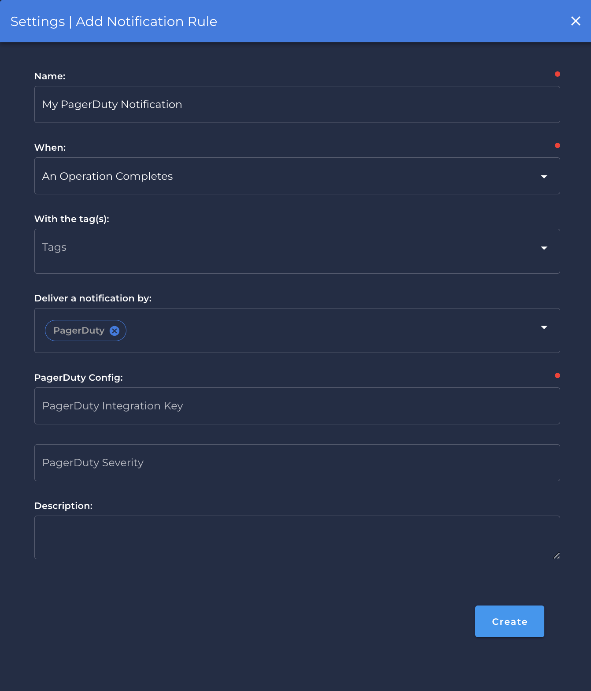

# PagerDuty

## Steps to setup PagerDuty

---

{: style="width:550px;"}

### `Name` <spam id='required'>`required`</spam>

* The notification name to be created in Qualytics App.

### `When` <spam id='required'>`required`</spam>

* Is `When` the notification will be triggered:
    * `An Operation Completes`.
    * `Anomalies are Detected in a Table or File`.
    * `An Anomaly is Detected`.
    * `Freshness SLA Violation`.

### `With the Tags` 
* Is the tag that will be show during the notification.   
!!! info
    You can create any tags if necessary to be shown during the notification.

### `Deliver a notification by`
* You can select multiple services for the same `Notification` category.

### `PagerDuty Config` 
* Is the Pagerduty informations that links directly to the communication server.

    #### PagerDuty integration key <spam id='required'>`required`</spam>
    #### PagerDuty Severity <spam id='required'>`required`</spam>

!!! info
    You can check [here](https://support.pagerduty.com/docs/services-and-integrations) in the official documentation how to create or how to find the PagerDuty necessary information.

### `Description`
* You can add a detailed description of why this notification is being created or some additional information.
