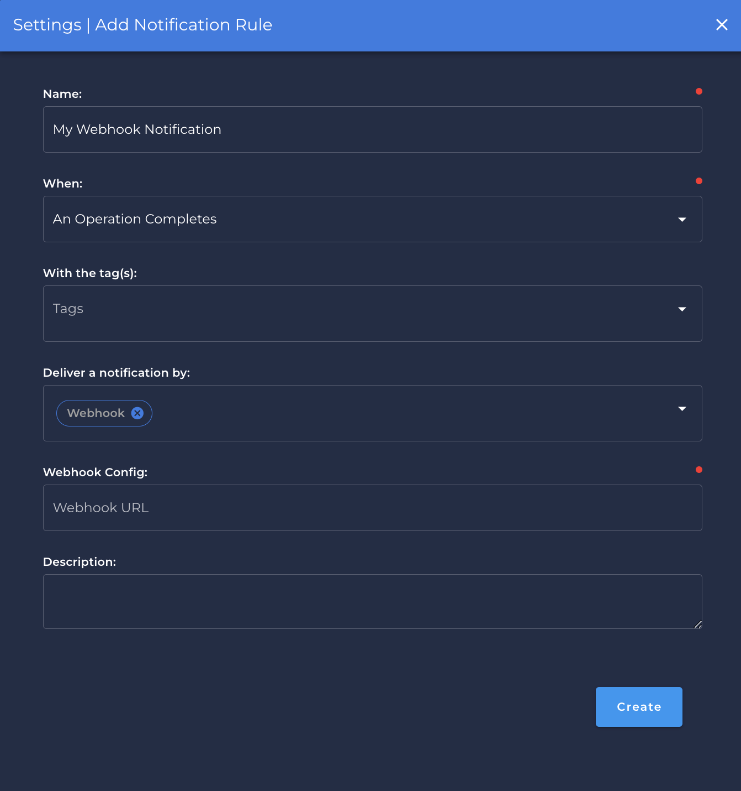

# Webhook

## Steps to setup Webhook Notifications

---

{: style="width:550px;"}

### `Name` <spam id='required'>`required`</spam>

* freetext name of the Notification

### `When` <spam id='required'>`required`</spam>

* when the notification will be triggered:
    * `An Operation Completes`.
    * `Anomalies are Detected in a Table or File`.
    * `An Anomaly is Detected`.
    * `Freshness SLA Violation`.

### `With the Tags` <spam id='required'>`required`</spam>
* tags that will drive the notification from an anomaly   
!!! info
    Refer to the tags page to add / edit tags and checks page for association of tags to checks / anomalies.

### `Deliver a notification by` <spam id='required'>`required`</spam>
* Service to be utilized for the notification

### `Webhook` <spam id='required'>`required`</spam>
* The Webhook URL that links directly to your channel.

!!! info
    Check the official documentation of target system to find on how to create or configure the webhook URL.

### `Description` <spam id='required'>`optional`</spam>
* Payload / description of the notification
