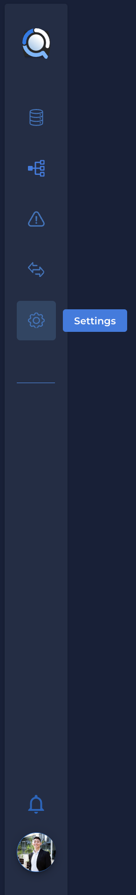
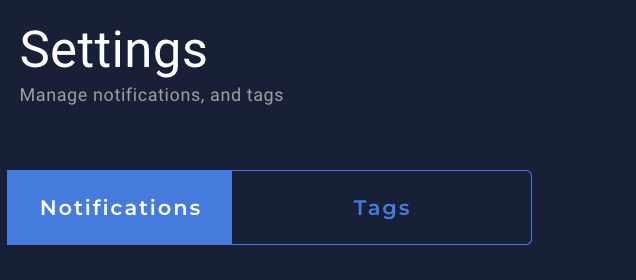
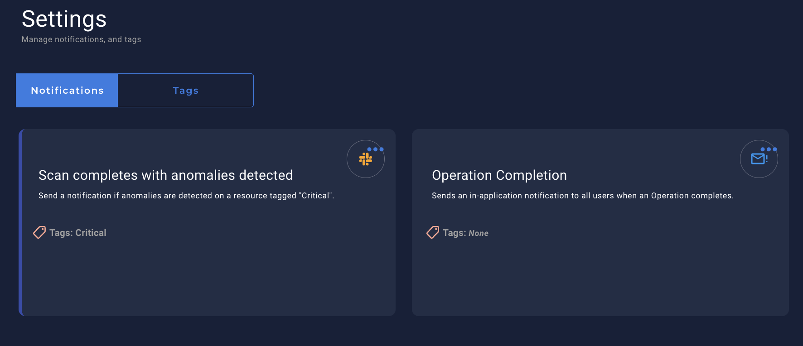
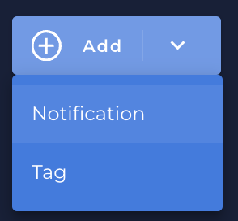
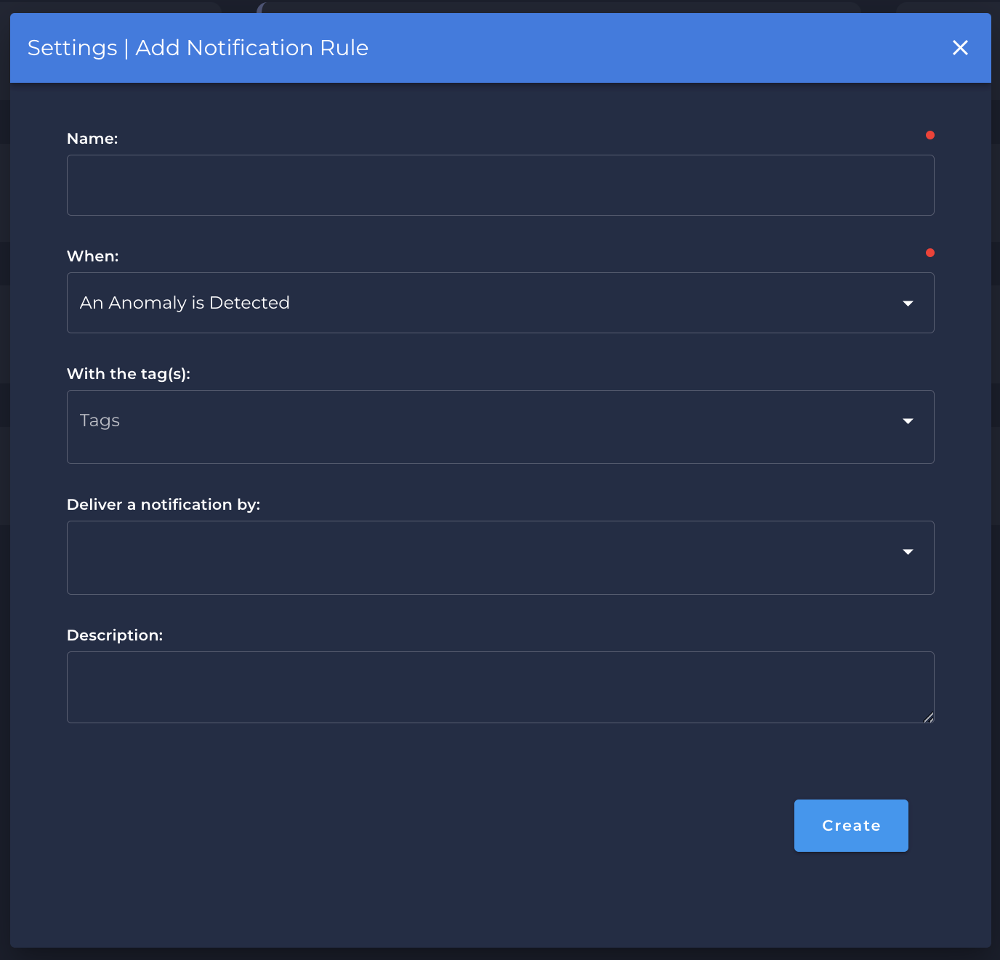

# What is Notification?

* The notification configuration allows you to manage and add notifications

---

* You can find the `Notification` section clicking in `Settings` in the menu bar:
    - {: style="height:450px"}

* Once clicked in `Settings` you can see the `Notification` tab:
    - {: style="width:230px"}

* You can see all the `notifications` that you created or `add` a new one:
    - {: style="width:530px"}

---

# Create a Notification

* In the right top of the `Notification` screen, you can see `Add` button.
    - {: style="width:130px"}

* Once you have clicked to add a new `Notification` a new screen will show up to you:
    - 

    * `Name` is the name of your notification.
    * `When` is the moment the notification will be triggered:
        * `An Operation Completes`.
        * `Anomalies are Detected in a Table or File`.
        * `An Anomaly is Detected`.
        * `Freshness SLA Violation`.
    * `With the Tags` is the tag that will be show during the notification.
    * `Deliver a notification by` is the service that you can setup to send the notification message. They can be by:
        * `Email`.
        * `Http Action`.
        * `Microsoft Teams`.
        * `PagerDuty`.
        * `Slack`.
        * `Webhook`.