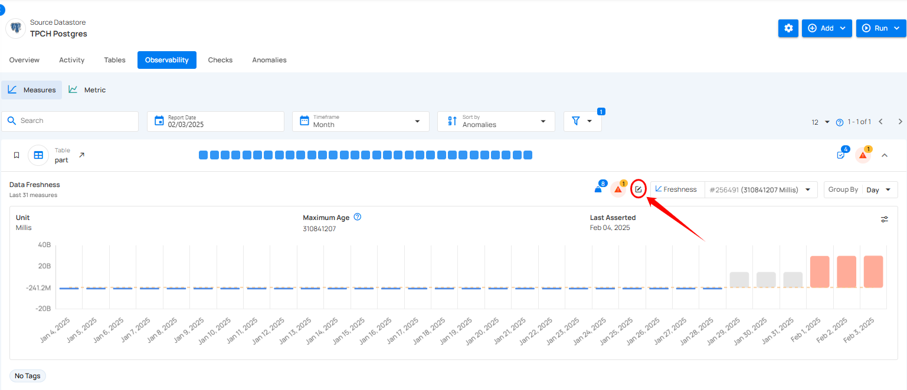
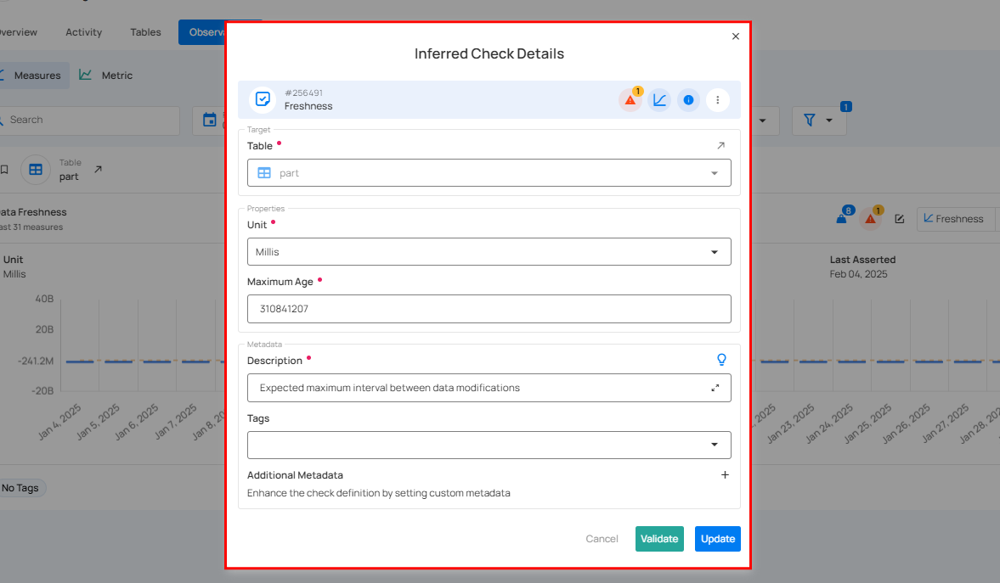
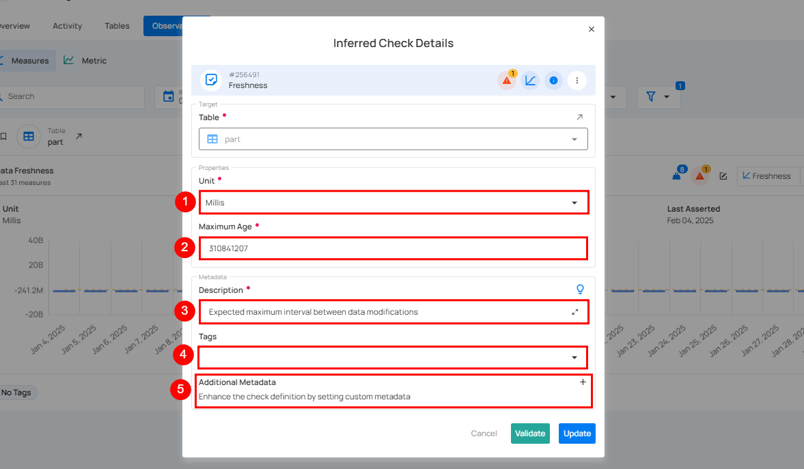
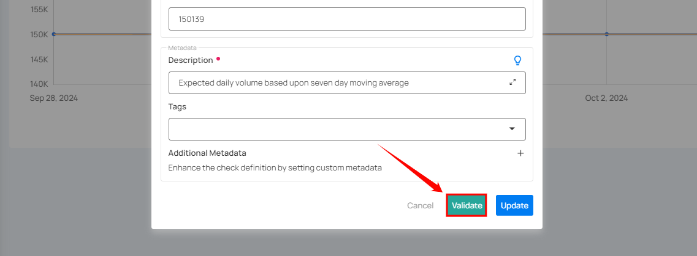
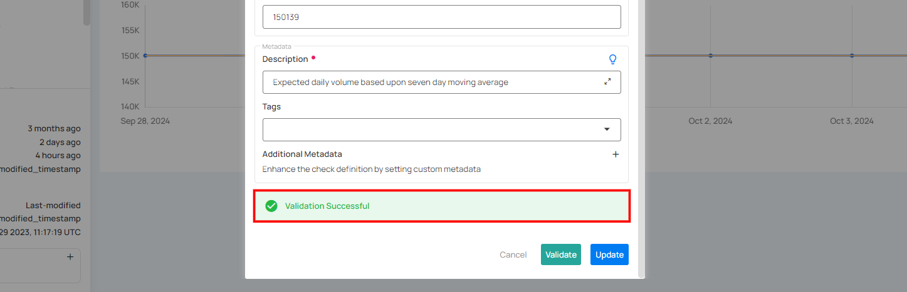
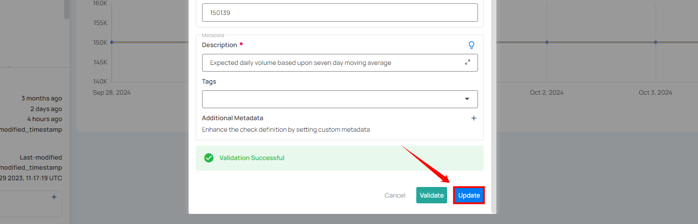

# Edit Check

Editing a Check enables users to modify settings such as the unit of measurement, maximum age, description, and metadata. Additionally, they can add tags to streamline organization and retrieval.

**Step 1:** Click the edit icon to modify the check.

A modal window will appear with the check details.

**Step 2:** Modify the check details as needed based on your preferences:

|     No. |                       Field |                           Description |
| :---- | :---- | :---- |
|     1. |                  Unit | Edit the unit of measurement for the freshness check, such as milliseconds (Millis), Minutes, Hours etc. |
|     2. |           Maximum Age | Edit the maximum allowed age (in the specified unit) for data to be considered fresh. |
|    3. |           Description | Edit the **Description** to better explain what the check does. |
|    4. |           Tags | Edit the **Tags** to organize and easily find the check later. |
|    5. |          Additional Metadata(Optional) | Edit the **Additional Metadata** section to add any new custom details for more context. |

**Step 3:** Once you have edited the check details, then click on the **Validate** button. This will perform a validation operation on the check without saving it. The validation allows you to verify that the logic and parameters defined for the check are correct.

If the validation is successful, a green message saying **"Validation Successful"** will appear.

**Step 4:** Once you have a successful validation, click the **"Update"** button. The system will update the changes you've made to the check, including changes to the properties, description, tags, or additional metadata.

After clicking on the Update button, your check is successfully updated.