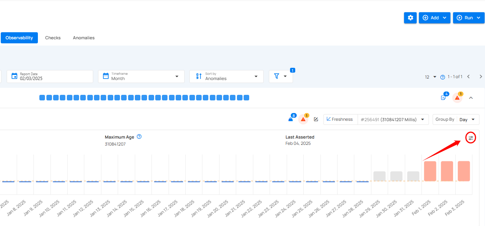
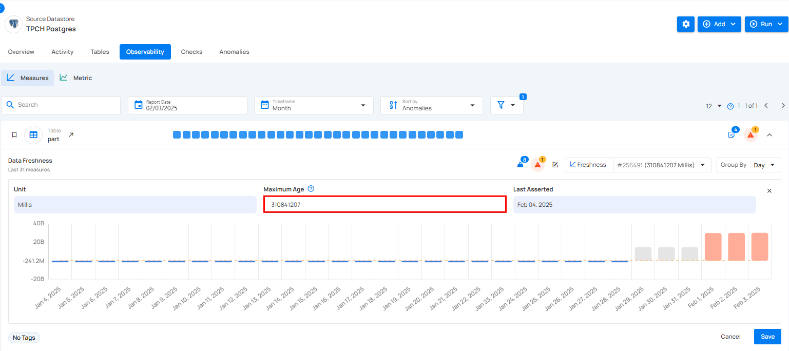
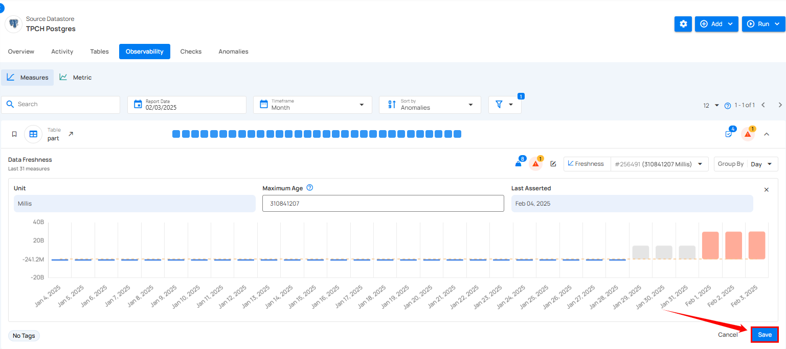

# Edit Maximum Age

**Maximum Age** sets the limit for how long data can remain unchanged before it’s flagged as outdated. This ensures your data stays fresh and reliable for decision-making.

**Step 1:** Click the **Edit Maximum Age** button on the right side of the graph.

**Step 2:** After clicking **Edit Maximum Age**, the field becomes editable, allowing you to modify the maximum age value.

**Step 3:** Once you've updated the **maximum age** values, click **Save** to apply the changes.

After clicking on the Save button, a success flash message will appear.