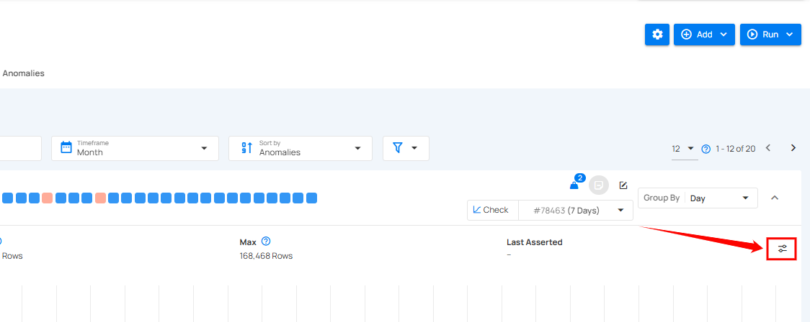

# Edit Threshold

Edit thresholds to set specific row count limits for your data checks. By defining minimum and maximum values, you ensure alerts are triggered when data goes beyond the expected range. This helps you monitor unusual changes in data volume. It gives you better control over tracking your data's behavior.

!!! note
    When editing the threshold, only the min and max values can be modified.

**Step 1:** Click the **Edit Thresholds** button on the right side of the graph.

**Step 2:** After clicking **Edit Thresholds**, you enter the editing mode where the **Min** and **Max** values become editable, allowing you to input new row count limits.

**Step 3:** Once you've updated the **Min** and **Max** values, click **Save** to apply the changes and update the thresholds.

After clicking on the Save button, your threshold is successfully updated.