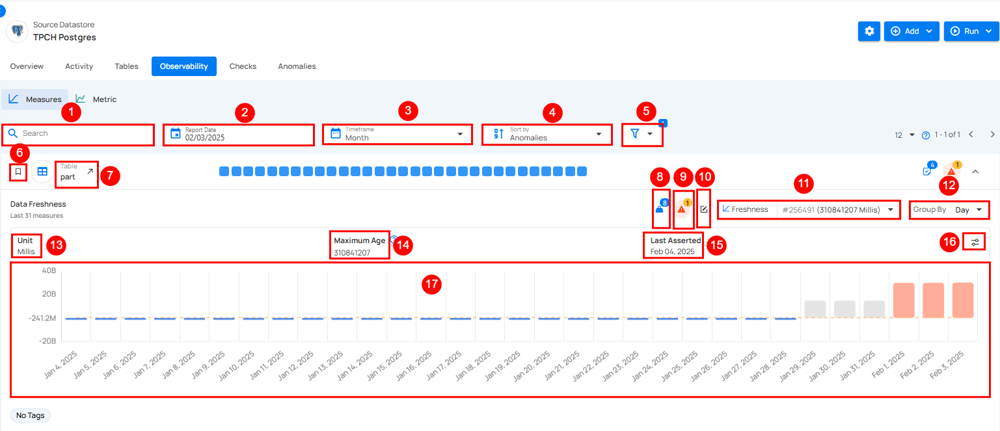

# Freshness

This measures the timeliness of data by monitoring when new data was last added or updated. It helps ensure that data remains up-to-date and relevant for decision-making. Users can view timestamp values in a clear date and time format, making it easier to analyze data freshness while maintaining millisecond-level precision in the background. If data updates are delayed or missing, it may indicate pipeline failures, system lag, or unexpected data source changes. Regular freshness checks prevent outdated information from impacting analytics, reporting, or automated workflows.

|     No. |                Field  |                         Description |
| :---- | :---- | :---- |
|      1. |           **Search Bar** | This feature helps users quickly find specific identifiers or names in the data. |
|      2. |          **Report Date** | **Report Date** lets users pick a specific date to view data trends for that day. |
|      3. |         **Timeframe** | The **time frame** option lets users choose a period (week, month, quarter, or year.) to view data trends. |
|      4. |         **Sort By** | **Sort By** option helps users organize data by criteria like Anomalies, Checks, Created Date, Name, or Last Scanned for quick access. |
|      5. |         **Filters** | The filter lets users easily refine results by choosing specific tags or tables to view. |
|      6. |        **Favorite** | Mark this as a favorite for quick access and easy monitoring in the future. |
|      7. |        **Table** | Displays the name of the selected table being analyzed. |
|      8. |       **Weight** | Weight shows how important a check is for finding anomalies and sending alerts. |
|    9. |    **Anomaly Detection** | Represents active anomalies detected in the data. |
|    10. |      **Edit Check** | Edit the check to modify settings, or add tags for better customization. |
|    11. |     **Freshness (# ID)** | Each freshness check is assigned a unique identifier, corresponding to the specified time period it monitors (e.g., 1 Day for the customer table). This identifier facilitates precise tracking and management within the system. |
|    12. |     **Group By** | Users can also Group By specific intervals, such as day, week to observe trends over different periods. |
|    13. |     **Unit** | The unit used to measure data freshness, shown in milliseconds. |
|    14. |     **Maximum Age** | Displays the maximum recorded age of data in milliseconds. |
|    15. |     **Last Asserted** | Shows the latest date when the data was validated or checked. |
|     16. |     **Edit Maximum Age** | Edit **Maximum Age** lets users set custom limits for data freshness, allowing control over when alerts are triggered based on the age of the data. |
|     17. |   **Graph Visualization** |  Graph illustrates consistent data patterns over time, with sudden anomalies marked by spikes in red. It reflects changes in data freshness and highlights when the data was last updated. |

!!! note
    For more information please refer to the [**Freshness Check**](../checks/freshness-check.md) documentation..