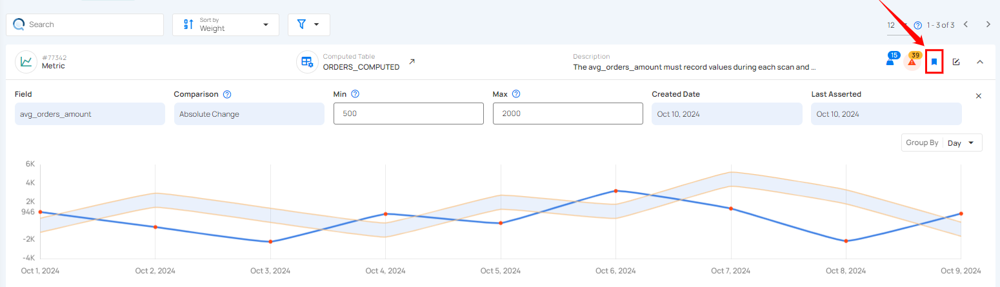

# Mark Check as Favorite

Marking a Metric Check as a favorite allows you to easily access important checks quickly. This feature helps you prioritize and manage the checks you frequently use, making data monitoring more efficient.

Click on the bookmark icon to mark the Metric Check as a favorite.

After clicking on the bookmark icon your check is successfully marked as a favorite.

To unmark a check, simply click on the bookmark icon of the marked check. This will remove it from your favorites.

