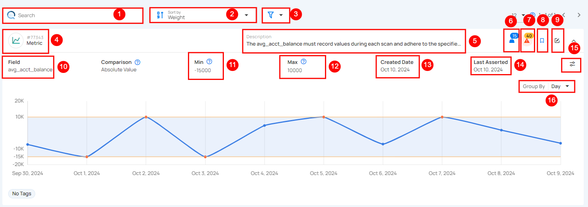

# Metric

Metric track changes in data over time to ensure accuracy and reliability. They check specific fields against set limits to identify when values, like averages, go beyond expected ranges. With scheduled scans, Metrics automatically log and analyze these data points, making it easy for users to spot any issues. This functionality enhances users' understanding of data patterns, ensuring high quality and dependability. With Metrics, managing and monitoring data becomes straightforward and efficient.

| No | Field | Description |
| :---- | :---- | :---- |
| 1 | Search   | The search bar helps users find specific metrics or data by entering an identifier or description. |
| 2 | Sort By  |  Sort By allows users to organize data by **Weight, Anomalies,** or **Created Date** for easier analysis and prioritization. |
| 3 | Filter | Filter lets users refine data by **Tags** or **Tables**. Use **Apply** to filter or **Clear** to reset. |
| 4 |  Metric(ID) | Represents the tracked data metric with a unique **ID**. |
| 5 |  Description  |  A brief label or note about the metric, in this case, it's labeled as **test**. |
| 6 |  Weight | Weight shows how important a check is for finding anomalies and sending alerts. |
| 7 | Anomalies  |  Anomalies show unexpected changes or issues in the data that need attention. |
| 8 |  Favorite | Mark this as a favorite for quick access and easy monitoring in the future. |
| 9 | Edit Checks  |  Edit the check to modify settings, or add tags for better customization and monitoring. |
| 10 |  Field | This refers to the specific field being measured, here the **max_value,** which tracks the highest value observed for the metric. |
| 11 |  Min  | This indicates the minimum value for the metric, which is set to **1**. If not defined, no lower limit is applied. |
| 12 | Max | This field shows the maximum threshold for the metric, set at **8**. Exceeding this may indicate an issue or anomaly. |
| 13 | Created Date | This field shows when the metric was first set up, in this case, **June 18, 2024.** |
| 14 |  Last Asserted |  Last Asserted field shows the last time the metric was checked, in this case **July 25, 2024.** |
| 15 | Edit Threshold | Edit Threshold lets users set custom limits for alerts, helping them control when they’re notified about changes in data. |
| 16 | Group By  | This option lets users group data by periods like **Day,** **Week,** or **Month**. In this example, it's set to **Day.**  |

# Comparisons

When you [add a metric](https://userguide.qualytics.io/checks/metric-check/) check, you can choose from three comparison options:

* Absolute Change  
* Absolute Value  
* Percentage Change

These options help define how the system will evaluate your data during scan operations on the datastore.

Once a scan is run, the system analyzes the data based on the selected comparison type. For example, Absolute Change will look for significant differences between scans, Absolute Value checks if the data falls within a predefined range, and Percentage Change identifies shifts in data as a percentage.

Based on the chosen comparison type, the system flags any deviations from the defined thresholds. These deviations are then visually represented on a chart, displaying how the metric has fluctuated over time between scans. If the data crosses the upper or lower limits during any scan, the system will highlight this in the chart for further analysis.

**1. Absolute Change:** The Absolute Change comparison checks how much a numeric field's value has changed between scans. If the change exceeds a set limit (Min/Max), it flags this as an anomaly.

**2. Absolute Value:** The Absolute Value comparison checks whether a numeric field's value falls within a defined range (between Min and Max) during each scan. If the value goes beyond this range, it identifies it as an anomaly.

**3. Percentage Change:** The Percentage Change comparison monitors how much a numeric field's value has shifted in percentage terms. If the change surpasses the set percentage threshold between scans, it triggers an anomaly.

## Minimum Measurements for Chart Rendering

To display metric charts in the UI, a minimum number of measurements must be recorded. If the required number of measurements is not met, the chart remains empty even though some measurements exist.

* **Absolute Value:** Requires at least 2 measurements to render.

* **Absolute Change:** Requires at least 3 measurements to render.

* **Percentage Change:** Requires at least 3 measurements to render.

These thresholds ensure meaningful visual representation by preventing incomplete or misleading chart data.