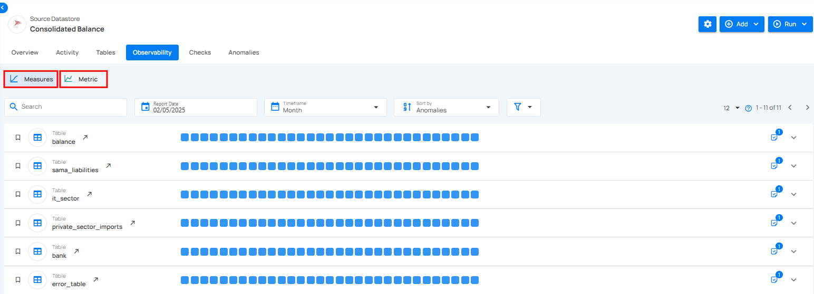

# Observability

Observability helps users track changes in data volume and quality over time, ensuring data accuracy and integrity. Within the Source Datastore section, the Observability tab provides visibility into observability metrics across tables or files within a specific datastore. It introduces two main categories: **Measures** and **Metric Checks**. Measures include **Volumetric Checks**, which monitor fluctuations in row counts, and **Freshness Tracking**, which ensures data is updated on time. **Metric Checks** focus on specific fields and offer deeper insights derived from scan operations. These tools work together to help detect anomalies early and maintain the reliability of your data assets.

Let’s get started 🚀

## Navigation

**Step 1:** Log in to your Qualytics account and select the datastore from the left menu that you want to monitor.

**Step 2:** Click on the **“Observability”** from the Navigation tab.

Observability metrics for tables of the selected source datastore are shown, enabling you to view their detailed insights.

## Observability Categories

Observability in data checks is divided into two key categories: **Measures** and **Metric Checks**. Measures focus on overall data trends and include **Volumetric Checks**, which monitor data volume to identify trends and anomalies, and **Freshness Tracking**, which tracks when data was last added or updated to ensure timeliness. **Metric Checks**, on the other hand, analyze specific data attributes, providing detailed insights into data quality.

### Measure

Measures focus on monitoring overall data trends to ensure consistency and reliability.

!!! note
    For more information regarding measures please refer to the [measure documentation](../observability/measures.md).

### Metric

Metrics track changes in data over time to ensure accuracy and reliability.

!!! note
    For more information regarding metric please refer to the [metric documentation](../observability/metric-check.md).