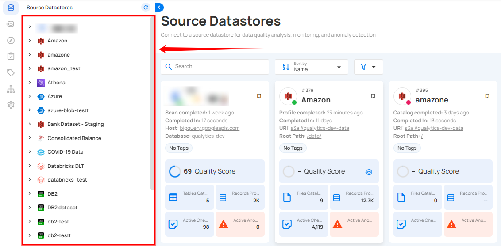
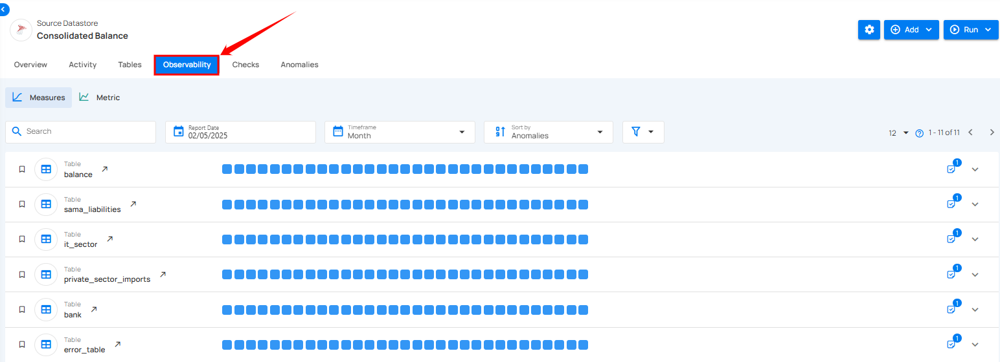

# Observability

Observability helps users track changes in data volume and quality over time, ensuring data accuracy and integrity. Within the Source Datastore section, the Observability tab provides visibility into observability metrics across tables or files within a specific datastore. It introduces two main categories: 

- **Measures** 
- **Metric Checks**

Measures include **Volumetric Checks**, which monitor fluctuations in row counts, and **Freshness Tracking**, which ensures data is updated on time. 

**Metric Checks** focus on specific fields and offer deeper insights derived from scan operations. These tools work together to help detect anomalies early and maintain the reliability of your data assets.

Let’s get started 🚀

## Why We Need Observability

Observability is critical in tracking and understanding data behavior, providing insights into how data is moving, evolving, and being processed. By implementing observability, you can monitor key metrics like data volume, freshness, and quality across your systems. It helps you quickly detect anomalies, spot issues early, and ensure data integrity over time.

## How It Works

Observability in Qualytics is designed to give you a continuous, automated view of your data health. Here’s how it works:

- **Automated Checks**: The system automatically runs once every hour at the 30-minute mark to check the container volumes in your data stores.
  
- **Volume Tracking**: Once volume tracking is enabled, no manual intervention is required. The system calculates data volume automatically.
  
- **Measurement Frequency**: The observability job runs 48 times a day to keep data up-to-date, and each measurement is time-stamped according to UTC.
  
- **Efficient Monitoring**: The system skips redundant checks for containers that have already been measured, thus optimizing the process.

## Use Case: Understanding Automatic Volume Tracking

### Scenario

A data operations team needs to monitor table volumes daily to detect unexpected data spikes or drops. They want to understand how Qualytics automatically tracks volume without requiring constant manual intervention.

### Common Questions

**Q**: How is data volume calculated? Do I need to run profiles or scans daily?  
**Ans**: Data volume is calculated automatically by the observability job once volume tracking is enabled. No manual profiling or scanning is required.

### How It Works:

- The observability job runs 24 times per day (every 30 minutes)
- On each run, it checks whether a container has already been measured for "today" (UTC time)
- If not measured yet, it records the container's volume
- If already measured for that day, it skips the measurement
- The first daily measurement typically occurs around 00:30 UTC (the first run after midnight UTC)

### Setup Requirements

- **Initial Cataloging**: Ensure tables are cataloged in Qualytics
- **Enable Volume Tracking**: Turn on volume tracking for the specific container
- **Automatic Monitoring**: The observability job handles all subsequent measurements

No additional profiling or scanning operations are needed after the initial setup.

### Time Zone Considerations

The observability system currently operates on UTC time for daily volume calculations. This means:

- Daily volume resets occur at midnight UTC
- Volume measurements begin at 00:30 UTC
- The UI displays daily totals in UTC time

!!! note 
    "Local Time Display"  
    The UI currently displays observability data in UTC. If you notice date discrepancies (for example, a scan performed on September 17 showing observability data starting September 18), this is due to UTC time zone differences.

### Benefits

- **Zero Maintenance**: Automatic checks every 30 minutes without manual intervention
- **Consistent Monitoring**: Regular measurements throughout the day ensure comprehensive coverage
- **Early Detection**: Quickly identify volume anomalies or data pipeline issues
- **Efficient Processing**: Smart skip logic prevents redundant measurements

### Configuration

To enable automatic volume tracking:

1. Navigate to your datastore settings
2. Select the container you want to monitor
3. Enable Volume Tracking
4. The Observability job runs automatically every hour at minute 30.

## Navigation

**Step 1:** Log in to your Qualytics account and select the datastore from the left menu that you want to monitor.

**Step 2:** Click on the **“Observability”** from the Navigation tab.

Observability metrics for tables of the selected source datastore are shown, enabling you to view their detailed insights.

## Observability Categories

Observability in data checks is divided into two key categories: **Measures** and **Metric Checks**. Measures focus on overall data trends and include **Volumetric Checks**, which monitor data volume to identify trends and anomalies, and **Freshness Tracking**, which tracks when data was last added or updated to ensure timeliness. **Metric Checks**, on the other hand, analyze specific data attributes, providing detailed insights into data quality.

### Measure

Measures focus on monitoring overall data trends to ensure consistency and reliability.

!!! note
    For more information regarding measures please refer to the [measure documentation](../observability/measures.md).

### Metric

Metrics track changes in data over time to ensure accuracy and reliability.

!!! note
    For more information regarding metric please refer to the [metric documentation](../observability/metric-check.md).