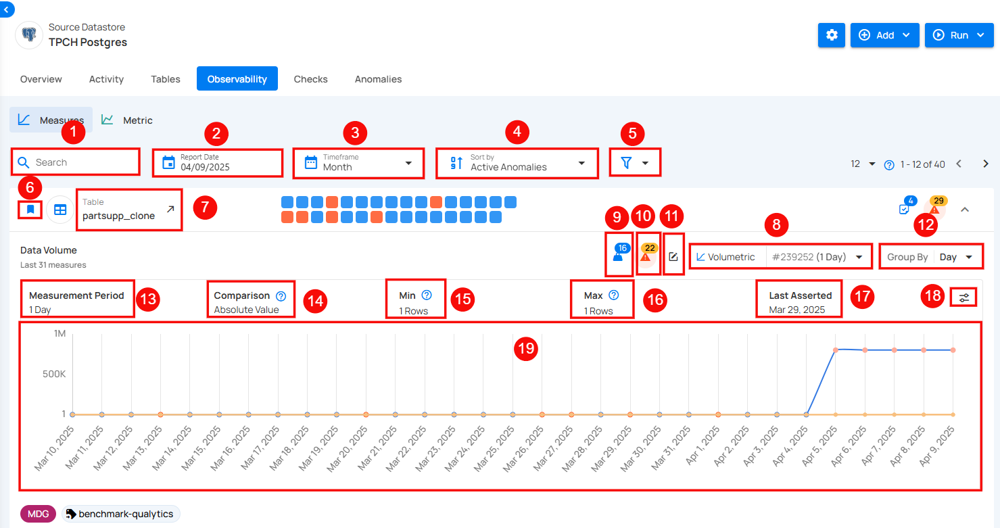
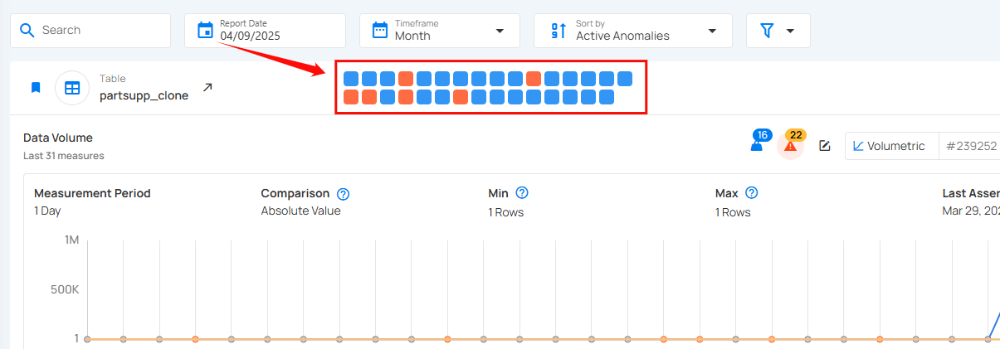
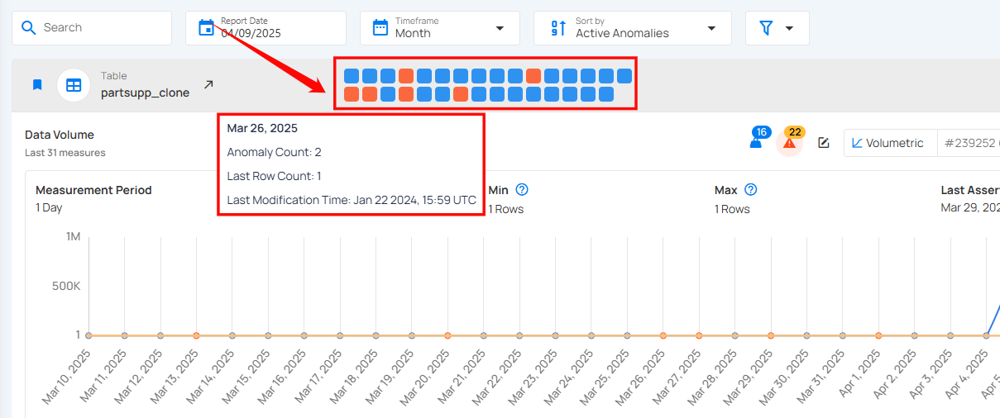

# Volumetric

Volumetric checks help monitor data volumes over time to keep data accurate and reliable. They automatically count rows in a table and spot any unusual changes, like problems with data loading. This makes it easier to catch issues early and keep everything running smoothly. Volumetric checks also let you track data over different time periods, like daily or weekly. The system sets limits based on past data, and if the row count goes above or below those limits, an anomaly alert is triggered.

| No | Field | Description |
| :---- | :---- | :---- |
| 1 | Search  | This feature helps users quickly find specific identifiers or names in the data. |
| 2 | Report Date | **Report Date** lets users pick a specific date to view data trends for that day. |
| 3 | Time Frame | The **time frame** option lets users choose a period (week, month, quarter, or year) to view data trends. |
| 4 | Sort By |  **Sort By** option helps users organize data by criteria like Volumetrics Count, Name, or Last Scanned for quick access. |
| 5 |  Filter | The filter lets users easily refine results by choosing specific tags or tables to view. |
| 6 |  Favorite | Mark this as a favorite for quick access and easy monitoring in the future. |
| 7 | Table | Displays the table for which the volumetric check is being performed (e.g., customer_view, nation). Each table has its own Volumetric Check. |
| 8 | Check (# ID) | Each check is assigned a unique identifier, followed by the time period it applies to (e.g., 1 Day for the customer table). This ID helps in tracking the specific check in the system. |
| 9 | Weight | Weight shows how important a check is for finding anomalies and sending alerts. |
| 10 | Anomaly Detection | The Volumetric Check detects anomalies when row counts exceed set min or max thresholds, triggering an alert for sudden changes. |
| 11 | Edit Checks | Edit the check to modify settings, or add tags for better customization and monitoring. |
| 12 | Group By  | Users can also Group By specific intervals, such as day, week, or month, to observe trends over different periods. |
| 13 |  Measurement Period  | Defines the time period over which the volumetric check is evaluated. It can be customized to 1 day, week, or other timeframes. |
| 14 |  Comparison  | These indicate the type of comparison used, indicating the "Absolute Value" method. |
| 15 |  Min Values  | These indicate the minimum thresholds for the row count of the table being checked (e.g., 150,139 Rows). |
| 16 |  Max Values | These indicate the maximum thresholds for the row count of the table being checked. |
| 17 |  Last Asserted | This shows the date the last check was asserted, which is the last time the system evaluated the Volumetric Check (e.g., Oct 02, 2024). |
| 18 | Edit Threshold | Edit Threshold lets users set custom limits for alerts, helping them control when they’re notified about changes in data. |
| 19 | Graph Visualization | The graph provides a visual representation of the row count trends. It shows fluctuations in data volume over the selected period. This visual allows users to quickly identify any irregularities or anomalies. |

## Observability Heatmap

The heatmap provides a visual overview of data anomalies by day, using color codes for quick understanding:

- **Blue square**: Blue squares represent days with no anomalies, meaning data stayed within the expected range.
- **Orange square**: Orange squares indicate days where data exceeded the minimum or maximum threshold range but didn’t qualify as a critical anomaly.
- **Red square**: Red squares highlight days with anomalies, signaling significant deviations from expected values that need further investigation.

By hovering over each square, you can view additional details for that specific day, including the **date**, **anomaly count**, **last row count**, and **last modification time** allowing you to easily pinpoint and analyze data issues over time.