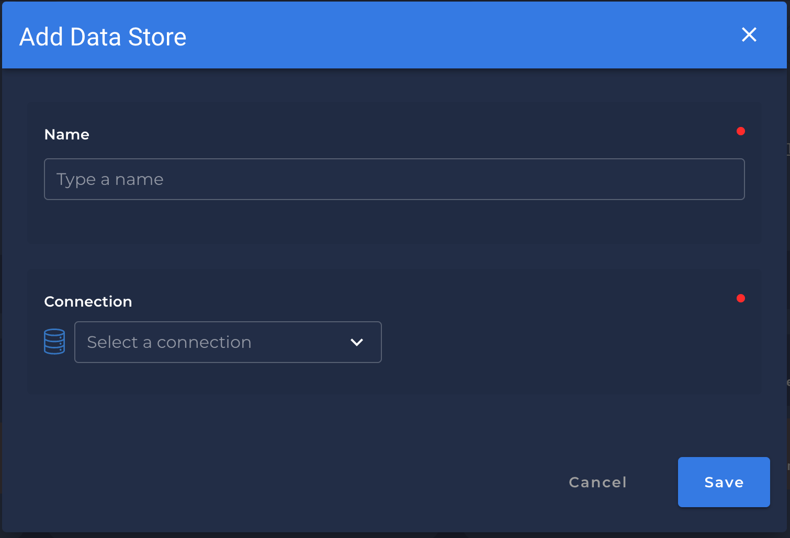
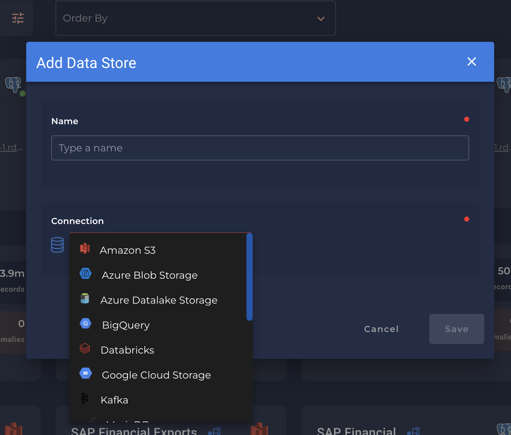
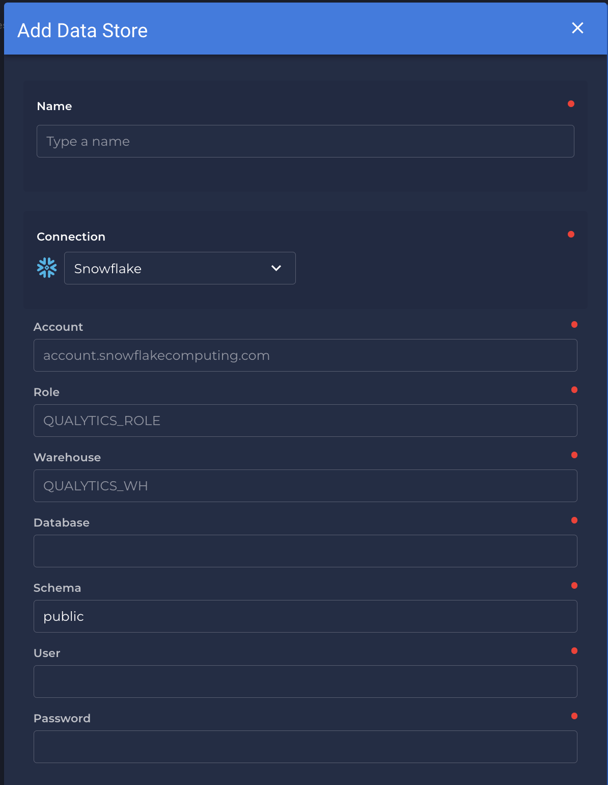
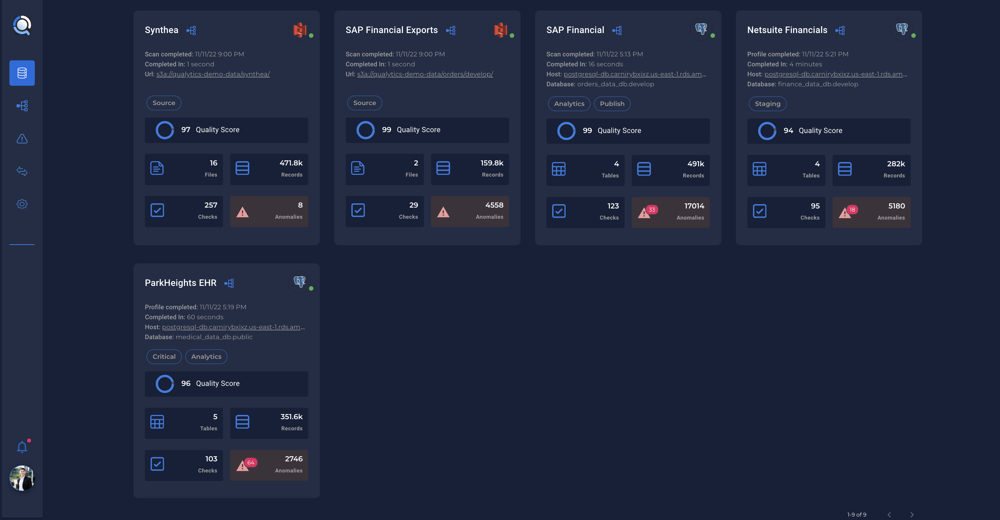
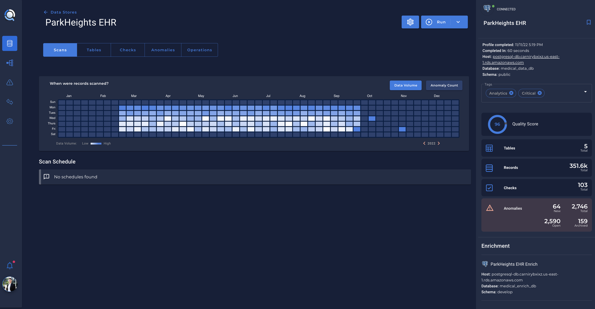
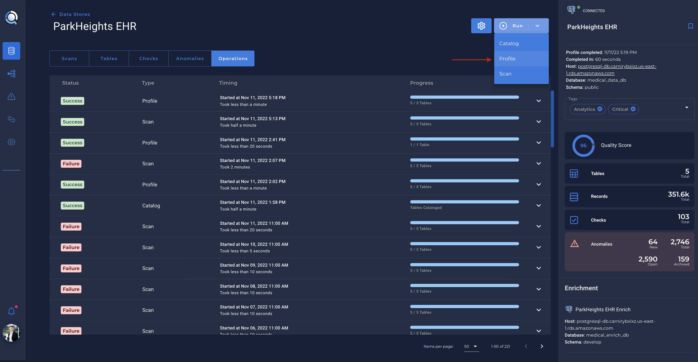

# What is a Data Store?

* A `Data Store` can be any Apache Spark-compatible data source, such as:
    1. Traditional `RDBMS`.
    2. Raw files (`CSV`, `XLSX`, `JSON`, `Avro`, `Parquet`) on:
        2.1 AWS S3.
        2.2 Azure Blob Storage.
        2.3 GCP Cloud Storage.
        2.4 streaming data such as Kafka.
*  A `Data Store` is a medium holding structured data. Qualytics supports Spark-compatible Data Stores via the conceptual layers depicted below

    

---
# Configuration

* The first step of configuring a Qualytics instance is to Add New Data Store:

    {: style="width:450px"}

    !!! info
        * A data store can be any Apache Spark-compatible data source:

            1. traditional RDBMS,
            2. raw files (`CSV`, `XLSX`, `JSON`, `Avro`, `Parquet` etc...) on :
                3. `AWS S3`.
                4. `Azure Blob Storage`.
                5. `GCP Cloud Storage`
                6. Streaming data such as `Kafka`.

    {: style="width:450px"}

# Credentials
* Configuring a data store will require the user to enter configuration credentials dependent upon each data store. Here is an example of a Snowflake data store being added:

    {: style="width:450px"}

* When a data store is added, it’ll be populated in the home screen along with other data stores:

    

* Clicking into a data store will guide the user through the capabilities and operations of the platform.
When a user configures a data store for the first time, they’ll see an empty Scan tab.

    

# Running a Catalog of the Data Store
* The first operation of Catalog will automatically kick off. The user can see this through the Operations tab.
    * This operation typically takes a short amount of time to complete.
    * After this is completed, they’ll need to run a Profile operation (under Run > Profile) to generate metadata and infer data quality checks.

    
